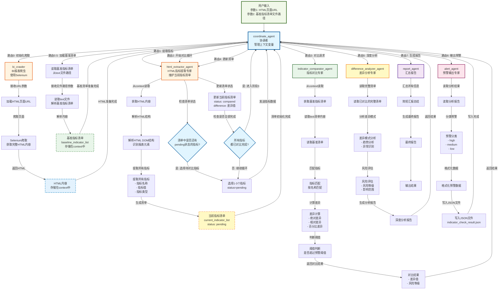
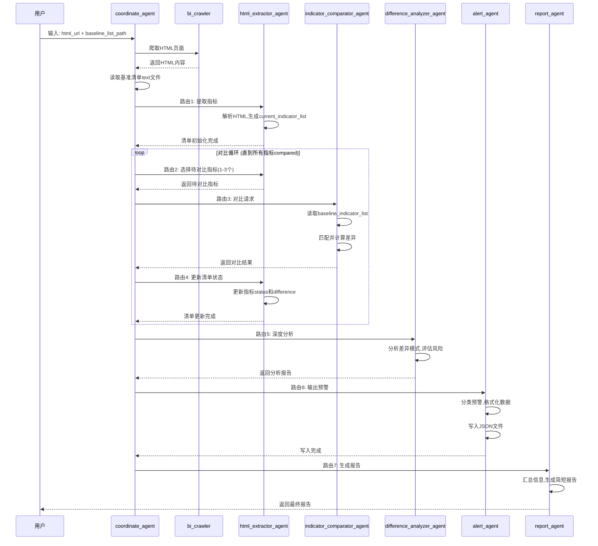

# 指标核查工作流 (Indicator Verification Workflow)

## 概述

该工作流用于自动化BI报表指标核查，通过爬取BI页面数据并与基准指标清单对比，识别差异并生成预警。

## 入口参数

| 参数 | 类型 | 说明 |
|------|------|------|
| `html_url` | string | BI报表页面URL，通过爬虫获取HTML内容 |
| `baseline_list_path` | string | 基准指标清单文件路径（text格式） |

## 工作流血缘图



## 时序图



## Agent角色说明

| Agent | 阶段 | 职责 |
|-------|------|------|
| `coordinate_agent` | 全程 | 协调者，管理工作流路由和上下文变量 |
| `html_extractor_agent` | 阶段1 | 从HTML提取指标，维护当前指标清单 |
| `indicator_comparator_agent` | 阶段2 | 读取基准清单，对比指标差异 |
| `difference_analyzer_agent` | 阶段3 | 深度分析差异模式，评估风险 |
| `alert_agent` | 阶段4 | 生成预警，写入JSON文件 |
| `report_agent` | 阶段5 | 生成简短汇报总结 |

## 基准指标清单格式

text文件，CSV格式，示例：

```csv
指标名称,指标值,指标类型,单位,时间范围
门诊人次,838723,门诊指标,人次,2025-11
专家挂号人次,117250,门诊指标,人次,2025-11
出科人次,23993,住院指标,人次,2025-11
```

## 使用方法

### 命令行运行

```bash
cd agents
python workflow_indicator_verification.py "https://hxdmc.wchscu.cn/bi/sso?..." "baseline_indicators.txt"
```

### Python代码调用

```python
from workflow_indicator_verification import IndicatorVerificationWorkflow

# 创建工作流
workflow = IndicatorVerificationWorkflow(
    html_url="https://hxdmc.wchscu.cn/bi/sso?proc=1&action=viewer&...",
    baseline_list_path="baseline_indicators.txt",
    output_dir="."
)

# 运行
result = workflow.run()

# 查看结果
print(f"成功: {result['success']}")
print(f"报告: {result['report']}")
print(f"预警文件: {result['alert_file']}")
```

## 输出文件

| 文件 | 说明 |
|------|------|
| `indicator_check_result.json` | 预警结果JSON文件 |
| `bi_screenshot.png` | 页面截图 |

## 预警输出格式

```json
{
    "check_time": "2026-01-16T10:00:00",
    "source_url": "https://...",
    "baseline_file": "baseline.txt",
    "summary": {
        "total_indicators": 100,
        "with_difference": 15,
        "high_risk_count": 2,
        "medium_risk_count": 8,
        "low_risk_count": 5
    },
    "alerts": [
        {
            "level": "high",
            "indicator_name": "门诊人次",
            "current_value": "937949",
            "baseline_value": "838723",
            "difference_percentage": 11.83,
            "message": "指标门诊人次差异超过15%，需立即核查"
        }
    ]
}
```

## 风险等级定义

| 等级 | 条件 | 说明 |
|------|------|------|
| `high` | 差异 >= 15% | 严重预警，需立即处理 |
| `medium` | 5% <= 差异 < 15% | 一般预警，需关注 |
| `low` | 差异 < 5% | 信息提示 |
