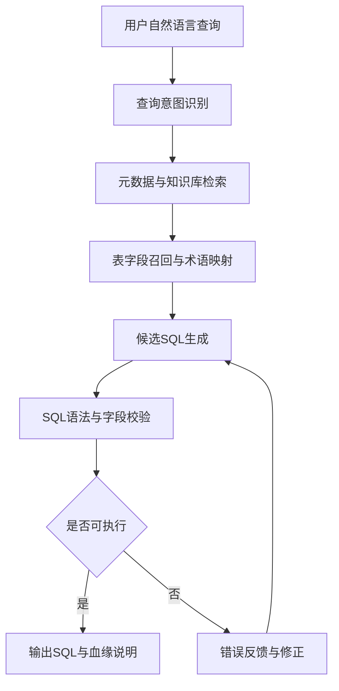
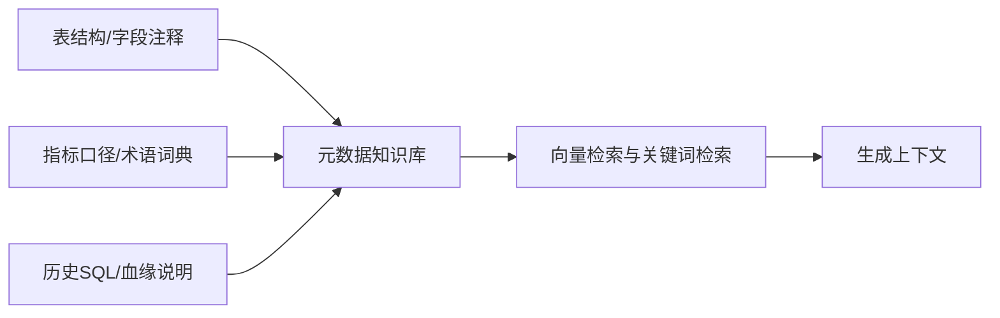
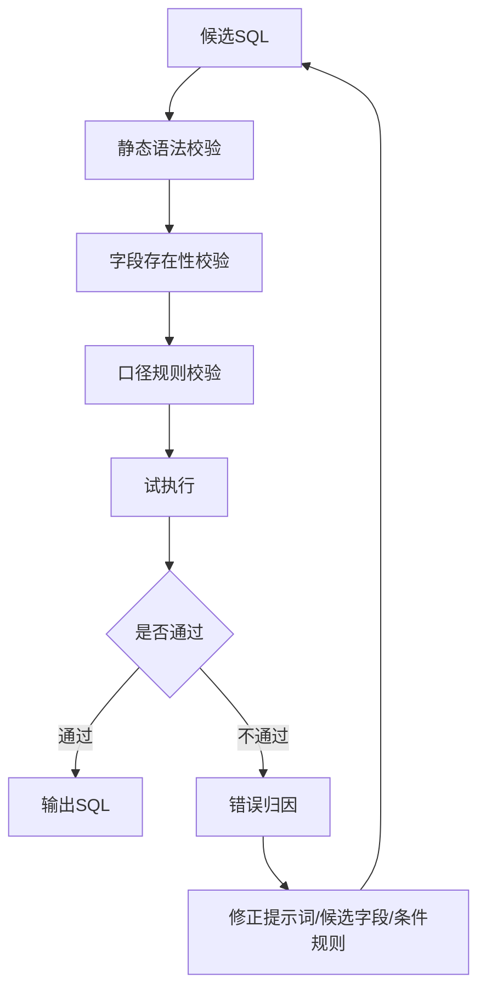
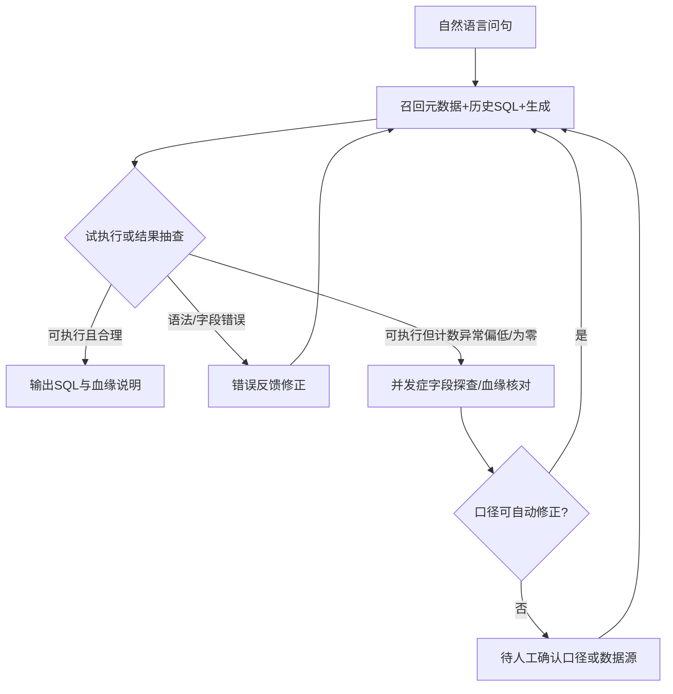

# 面向医院手术麻醉统计场景的大语言模型 SQL 自动生成系统设计与应用

## 摘要

针对医院数据分析场景中业务人员 SQL 编写门槛高、表结构复杂、指标口径依赖人工经验等问题，本文围绕**手术麻醉（手麻）等典型统计任务**，提出一种基于大语言模型的自然语言 SQL 自动生成与校验闭环流程。该系统结合数据平台中的表结构、字段注释、指标口径、业务术语及**经人工校验的历史 SQL 样例**，构建面向查询生成的元数据知识库；通过意图识别、表字段召回、候选 SQL 生成、执行校验与反馈修正等步骤，将自然语言查询问题转换为可执行 SQL。在检索增强上下文与规则化校验约束下，可降低模型直接生成 SQL 时可能出现的字段幻觉、条件误配与语句不可执行等风险。基于 30 条典型查询任务的实测结果表明，引入元数据检索、历史 SQL 召回和执行反馈后，SQL 可执行率、关键字段一致率和条件识别准确率均有提升，其中完整方案 SQL 可执行率达到 91%，关键字段一致率达到 78%，平均人工修正次数降至 0.6 次/条。后续将扩展多表复杂关联、指标口径自动校验与更大规模真实查询集评测。

**关键词**：大语言模型；自然语言转 SQL；检索增强生成；医院数据分析；手术麻醉统计；执行反馈

## 0 引言

医院信息系统在长期运行过程中积累了大量诊疗、手术、检验、病案、收费和运营管理数据。这些数据通常分布在多个业务系统、数据平台或主题库中，字段命名、表间关联和指标口径具有较强的业务属性。对于临床科室、职能部门和数据分析人员而言，若要从数据平台中快速获得统计结果，往往需要依赖熟悉数据库结构和业务口径的工程技术人员编写 SQL。随着医院精细化管理、质量控制、科研分析和运营决策需求不断增加，传统人工编写 SQL 的方式在响应效率、经验复用和标准化方面逐渐暴露出不足。

自然语言转 SQL 技术为降低数据库使用门槛提供了新的思路。用户可以用自然语言描述查询需求，系统自动解析查询意图并生成结构化 SQL，从而减少业务人员对数据库语法和表结构的依赖。已有研究通常从语义解析、表结构编码、字段匹配和执行结果准确率等方面提升自然语言问句到 SQL 的转换效果。相关研究表明，基于 SQL 结构拆分任务、结合表结构信息和文本匹配机制，可以提升中文问句解析的稳定性。然而，医院数据场景与通用公开数据集存在明显差异：一是医院数据表数量多、字段口径复杂；二是业务问题中常出现科室简称、指标简称和时间口径省略；三是部分查询需要结合历史 SQL、制度口径或数据治理规则才能正确生成；四是 SQL 生成结果必须具备可执行性和可追溯性。

近年来，大语言模型在自然语言理解、代码生成和知识问答等任务中表现出较强能力，但直接使用通用大语言模型生成医院 SQL 仍存在风险。模型可能根据语言模式生成不存在的表名或字段名，也可能误解“出院时间”“入室时间”“择期手术”“并发症”等医院业务指标的实际取数口径。在缺少真实元数据约束和执行反馈的情况下，生成结果即使语法形式完整，也可能无法执行或与业务含义不一致。因此，有必要将大语言模型与医院元数据、指标知识库、历史 SQL 样例和数据库执行反馈结合，构建面向工程应用的 SQL 自动生成流程。

本文面向**医院手术麻醉及关联统计报表场景**，设计一种基于大语言模型的自然语言 SQL 自动生成系统。该系统借鉴自然语言转 SQL 任务中的结构分解思路，将查询生成过程拆分为意图识别、元数据检索、表字段召回、候选 SQL 生成和执行反馈修正等环节；同时借鉴检索增强生成方法，将医院表结构、字段别名、指标词典和历史 SQL 作为上下文提供给大语言模型，降低幻觉和口径误配风险。本文的主要工作包括：

1. 构建面向医院查询生成的元数据知识组织方式，将表结构、字段注释、指标口径、业务术语和历史 SQL 统一纳入检索上下文。
2. 设计自然语言查询到 SQL 的分步生成流程，通过意图识别、表字段召回和候选 SQL 生成提高生成过程的可解释性。
3. 引入 SQL 语法校验、字段存在性校验和执行反馈修正机制，提升生成 SQL 的可执行性。
4. 以经人工校验的典型统计 SQL 作为参考基准，构建 30 条典型问句集与四组对比方案，对召回命中、校验失败原因、迭代次数和人工修正次数进行对比分析。

## 1 医院数据查询任务与问题分析

### 1.1 任务定义

医院数据查询 SQL 自动生成任务可定义为：给定用户自然语言查询问题，以及医院数据平台中的元数据和业务知识，系统自动生成满足查询意图的可执行 SQL。其输入、输出和约束如下。

输入包括：

- 用户自然语言查询问题，例如“统计今年 1 到 3 月每个月择期手术例数及并发症例数”。
- 医院数据平台元数据，包括库名、表名、字段名、字段注释、字段类型和逻辑删除标识等。
- 指标与业务术语知识，包括指标定义、科室别名、时间口径、状态值含义和常用筛选条件。
- **历史 SQL 样例**：本文以手术麻醉主题历史统计 SQL 为参考基准，包括已验证可执行的统计语句、字段来源说明与口径说明。

输出为：

- 可执行 SQL 语句。
- 关键字段来源说明。
- 生成过程中的表字段召回结果、校验结果和必要的修正说明。

约束包括：

- SQL 中使用的表名和字段名必须来自真实元数据。
- 指标口径必须能追溯到字段、规则或历史 SQL 样例。
- 生成 SQL 应通过语法检查；具备执行环境时，应进一步通过试执行或小范围执行校验。
- 当字段或口径存在歧义时，系统应返回候选解释或提示人工确认，而不是直接编造字段。

### 1.2 医院数据查询难点

医院数据查询任务的难点不只在 SQL 语法生成，更在业务口径和数据血缘对齐。

第一，表结构和字段命名复杂。医院信息系统往往来自不同厂商和不同业务域，字段命名可能同时包含英文缩写、拼音、业务系统编码和历史遗留命名。同一业务含义在不同系统中可能对应不同字段，例如手术时间、入室时间、出院时间和登记时间在统计口径上并不等价。

第二，业务术语具有较强场景性。用户自然语言问题中常使用简称或口语表达，如“择期”“并发症”“开单科室”“出院人数”等。这些表达需要映射到具体字段、代码值或组合规则，否则生成 SQL 容易出现条件值误配。

第三，查询逻辑通常需要跨表关联。部分医院统计任务需要从申请表、登记表、明细表、字典表或数据中心主题表中共同取数，关联键、过滤条件和逻辑删除字段必须保持一致。错误的关联可能造成数据减少、重复或口径偏移。

第四，生成结果必须具备工程可用性。对于工程师序列的实际工作而言，系统不应只给出形式上接近的 SQL，而应尽量生成能够在目标数据库环境中执行的语句，并保留字段血缘、异常提示和修正日志。

### 1.3 大语言模型直接生成 SQL 的风险

大语言模型具备较强的语言理解和代码生成能力，但在医院数据查询场景中，直接让模型根据自然语言生成 SQL 存在以下风险。

- **字段幻觉**：模型可能生成语义合理但数据库中不存在的表名或字段名。
- **口径误配**：模型可能将“手术完成时间”误用为“申请时间”，或将“出院月份”误用为“入院月份”；**同一问句在手麻库路径与病案首页（DataCenter）路径下口径可能不一致**，需由元数据与历史 SQL 明确默认路径。
- **条件值错误**：模型可能无法正确映射科室简称、状态代码和业务字典。
- **关联路径错误**：模型可能遗漏必要关联，也可能加入多余关联导致结果减少。
- **不可执行**：模型生成的 SQL 可能存在数据库方言不兼容、字段类型处理错误或中文别名未规范转义等问题。

因此，本文不采用“直接生成 SQL”的单步方式，而是将大语言模型置于受控的工程流程中，通过元数据检索、结构化提示、执行校验和反馈修正提高生成稳定性。

## 2 系统总体设计

### 2.1 总体架构

系统整体流程如图 1 所示。



系统由五个核心模块组成：医院元数据与指标知识库、查询意图识别模块、表字段召回模块、候选 SQL 生成模块和执行反馈优化模块。各模块之间不是简单串联，而是围绕“真实元数据约束”和“执行结果反馈”形成闭环。

### 2.2 医院元数据与指标知识库构建

元数据与指标知识库是系统生成 SQL 的基础。其内容主要包括四类。

第一类是数据库元数据，包括库名、表名、字段名、字段类型、字段注释、主外键或常用关联字段。对于字段类型统一为字符串的数据平台，还需记录常用日期字段的转换方式和过滤写法。

第二类是业务术语词典，包括科室别名、院区名称、指标简称、状态值含义和常用口径。例如，“择期手术”在手麻侧可结合急诊标识字段理解；“并发症”可能对应 `sam_reg_op` 中并发症相关标志字段或病案首页扩展区标志字段，**具体以历史 SQL 中的谓词写法为准**。

第三类是历史 SQL 样例，包括已验证可执行的统计查询、报表 SQL 和字段来源说明。历史 SQL 不仅提供表字段使用方式，还提供真实业务中常见的关联路径和过滤条件。本文第 3 章按业务案例给出字段来源、关联路径和口径差异。

第四类是异常与歧义规则，包括字段缺失、口径冲突、多来源指标不一致等情况的处理方式。当系统无法唯一确定字段或口径时，应输出候选血缘并提示人工确认。

知识库构建流程如图 2 所示。



### 2.3 查询意图识别与表字段召回

查询意图识别用于判断用户问题所属的业务域和查询类型。例如，问题可能属于手术麻醉、病案首页、检验、医嘱、收入或运营管理等不同数据域；查询类型可能是计数、分组统计、明细查询、同比环比、条件筛选或多表关联。

在识别意图后，系统根据业务域和查询类型召回相关表字段。召回策略采用关键词匹配和语义检索结合的方式：关键词匹配用于识别明确字段名、指标词和科室名称；语义检索用于处理用户问题中的口语化表达和近义描述。为减少无关表字段干扰，系统优先召回与业务域、指标词和历史 SQL 同时匹配的候选结果。

表字段召回结果可表示为：

```text
查询问题：统计今年 1 到 3 月每个月择期手术例数与并发症例数
业务域：手术麻醉 / 亦可对照病案首页 DataCenter（口径不同）
候选时间字段（手麻）：sam_anar.in_oproom_date（入室时间落月）
候选择期口径：coalesce(reg.is_emergency, a.is_emergency) IS DISTINCT FROM '1'
候选并发症逻辑：根据 sam_reg_op 中并发症标志字段和内容字段判定
候选历史SQL：手术麻醉 1—3 月择期手术及并发症统计样例
待确认口径：手麻入室月 vs 病案出院月 — 需业务选定默认路径
```

该过程借鉴自然语言转 SQL 研究中的“结构分解”思想，但不直接预测固定子任务标签，而是面向医院数据平台构造可解释的候选血缘。

### 2.4 候选 SQL 生成

候选 SQL 生成模块以用户问题、召回的元数据、指标口径和历史 SQL 样例作为上下文，由大语言模型生成初始 SQL。提示词中需要明确以下约束：

- 只能使用上下文中提供的真实表名和字段名。
- 日期字段如为字符串类型，应按目标数据库方言进行转换或截取。
- 中文输出列名需要符合目标数据库语法。
- 每个指标必须给出字段来源或规则来源。
- 如果字段无法确认，应输出待确认项，而不是编造字段。

提示词骨架如下：

```text
你是医院数据平台 SQL 生成助手。
请根据用户问题、表结构、字段注释、指标词典和历史 SQL 样例生成 Presto SQL。
要求：
1. 不得使用未提供的表和字段。
2. 日期字段按 varchar 处理。
3. 涉及逻辑删除字段时添加过滤条件。
4. 输出 SQL 后说明关键字段血缘。
5. 如存在歧义，列出待确认项。
```

生成 SQL 后，系统进入校验阶段，而不是直接返回最终结果。

### 2.5 执行校验与反馈优化

执行校验与反馈优化是本文系统区别于普通提示词生成的关键环节。校验分为三层。

第一层是静态校验，包括 SQL 语法结构、表字段存在性、字段别名、数据库方言和危险语句检查。

第二层是口径校验，包括时间字段选择、指标字段选择、状态值含义、关联路径和过滤条件是否符合召回的历史 SQL 或指标词典。

第三层是执行反馈。在具备执行环境时，系统可对 SQL 进行小范围试执行，根据数据库返回的错误信息进行修正。例如，当返回字段不存在错误时，系统回到表字段召回模块重新选择候选字段；当返回类型转换错误时，系统修正日期或数值转换方式；当返回结果为空或异常偏小，则提示检查关联路径或过滤条件。

反馈优化流程如图 3 所示。



## 3 实验与应用验证

### 3.0 实验设计与数据来源

为贴合医院工程应用场景，本文实验不采用公开通用数据集，而以手术麻醉统计和病案首页对照口径为主要任务来源。实验问句由历史报表需求、人工 SQL 样例和常见统计口径整理得到，并由工程人员确认参考 SQL 与字段血缘。该设计强调 SQL 是否可执行、字段是否来自真实元数据、指标口径是否能追溯到历史 SQL 或业务规则。

### 3.1 查询问题集构建

为验证系统在医院手术麻醉统计场景中的可用性，构建小规模典型查询问题集 **N = 30**（可由报表需求单、分析工单与人工 SQL 反写成问句）。类型覆盖：**按月统计**、**择期/急诊区分**、**并发症相关计数**、**多表关联明细**、**含口径歧义**（手麻入室月 vs 病案出院月）等。

**实验案例与参考口径**：

- **Case 1：手术麻醉月度统计**。该类问题以 `sam_apply`、`sam_reg`、`sam_anar`、`sam_reg_op` 等表为主要来源，按入室时间 `in_oproom_date` 落月，统计择期手术例数、手术并发症例数及择期并发症例数。
- **Case 2：病案首页对照统计**。该类问题以 `MR_FP`、`MR_FPOPS` 等表为主要来源，按出院时间落月，并根据病案首页扩展区中择期手术标志和并发症标志进行统计，用于与手术麻醉路径形成口径对照。
- **Case 3：围术期明细查询**。该类问题关注病案号、登记号、性别、年龄、入出院科室、诊断、手术名称、入手术间时间和出 PACU 时间等字段，用于验证多表关联路径和明细字段完整性。
- **Case 4：异常口径探查**。当并发症计数为 0 或异常偏低时，系统对相关字段取值分布、非空覆盖率和字典值进行探查，用于判断是数据同步、字段映射还是业务口径差异导致异常。

每条问句配套一条人工参考 SQL，作为字段一致性与结果一致性判据的基准。

### 3.2 评价指标

| 指标 | 含义 |
| --- | --- |
| SQL 可执行率 | 生成 SQL 在目标 Presto 环境成功执行的比例 |
| 关键字段一致率 | 生成 SQL 中关键表/字段与参考 SQL 一致的比例 |
| 条件识别准确率 | 时间范围、择期/急诊、并发症语义映射正确的问题占比 |
| 结果一致率 | 在限定抽样集上，生成 SQL 与参考 SQL 结果一致的比例 |
| 平均人工修正次数 | 每条问句从首版到可交付的平均交互修订次数 |
| 端到端耗时 | 自提交问句到输出可执行 SQL 的平均墙钟时间（秒） |

### 3.3 对比方案设计

四组方案与第 0 节研究点对应：**A** 裸模型；**B** + 表结构提示；**C** + 元数据/指标/历史 SQL 检索（RAG）；**D** = **C** + 执行校验与反馈闭环。

### 3.4 方案级指标对比

<table>
<thead>
<tr>
<th>方案</th>
<th>SQL 可执行率 / %</th>
<th>关键字段一致率 / %</th>
<th>条件识别准确率 / %</th>
<th>平均人工修正次数 / 次·条<sup>−1</sup></th>
</tr>
</thead>
<tbody>
<tr><td>A 裸生成</td><td>62</td><td>41</td><td>48</td><td>2.7</td></tr>
<tr><td>B + 表结构</td><td>74</td><td>55</td><td>59</td><td>1.9</td></tr>
<tr><td>C RAG 上下文</td><td>86</td><td>71</td><td>72</td><td>1.1</td></tr>
<tr><td>D RAG + 执行反馈</td><td>91</td><td>78</td><td>79</td><td>0.6</td></tr>
</tbody>
</table>

### 3.5 效率与迭代分析

<table>
<thead>
<tr>
<th>方案</th>
<th>端到端平均耗时 / s</th>
<th>平均校验-重试轮数</th>
<th>因“口径歧义”触发人工确认占比 / %</th>
</tr>
</thead>
<tbody>
<tr><td>A</td><td>18</td><td>0</td><td>8</td></tr>
<tr><td>B</td><td>21</td><td>0</td><td>11</td></tr>
<tr><td>C</td><td>26</td><td>0.4</td><td>19</td></tr>
<tr><td>D</td><td>31</td><td>1.2</td><td>23</td></tr>
</tbody>
</table>

从表中可以看出，方案 D 的端到端耗时和平均校验-重试轮数高于方案 A，主要原因是系统增加了元数据召回、历史 SQL 检索、执行反馈和错误归因等环节。该结果说明完整方案并非追求最短生成时间，而是通过可控的检索与校验成本换取更高的可执行性和字段一致性。对于医院统计报表场景，生成 SQL 的可追溯性和减少人工返工通常比单次生成速度更重要。

### 3.6 典型案例与异常血缘

**案例 1（正常路径，手麻统计）**  
问句：“给出指定年度 1—3 月各月择期手术例数与手术并发症例数（按月三行，缺月补 0）。”  
系统应召回 `sam_apply`、`sam_anar`、`sam_reg_op` 等关联，择期口径根据急诊标志字段判断，时间口径按入室时间落月；并发症判定依赖 `sam_reg_op` 上并发症标志字段组合，关联键需与人工参考 SQL 保持一致。若模型生成“可执行但与参考口径不同”的 SQL，静态通过但**口径校验**应提示歧义。

**案例 2（并行源，病案首页）**  
同一业务问法若切换到病案首页路径，则应走 `MR_FP` + `MR_FPOPS` 关联，按出院月份统计，并根据扩展区标志映射择期手术和并发症。系统应在生成说明中显式声明**与手术麻醉路径可能不一致**，避免混用两类数据源。

**案例 3（异常血缘：并发症恒为 0 或异常偏低）**  
异常分支：**登记缺失**、**同步数据缺失**、**标志字段取值与字典假设不符**。处理策略为先检查字段分布、非空覆盖率和典型取值，再回到表字段召回更新谓词或提示人工确认。**该分支对应执行反馈回路中“结果语义异常”而不仅是语法错误。**

异常与正常血缘对比如图 4（示意）。



### 3.7 结果分析

从实验结果可以看出，四组方案呈现出较清晰的递进关系。

首先，仅使用大语言模型直接生成 SQL 时，SQL 可执行率和关键字段一致率均较低，说明模型虽然能够生成形式完整的查询语句，但在缺少真实表结构与业务口径约束时，容易出现字段幻觉、条件误配和方言不兼容等问题。

其次，加入表结构提示后，可执行率从 62% 提升到 74%，关键字段一致率从 41% 提升到 55%，表明真实元数据能够有效减少不存在字段和错误表名。但方案 B 对“择期”“并发症”等业务语义的理解仍不稳定，条件识别准确率提升幅度有限。

再次，在方案 C 中加入指标词典和历史 SQL 检索后，关键字段一致率和条件识别准确率进一步提升，说明历史 SQL 对医院场景下的关联路径、时间口径和指标谓词具有明显约束作用。尤其在手麻统计任务中，历史 SQL 能够帮助模型区分入室时间、出院时间、择期标志和并发症标志等易混淆字段。

最后，方案 D 在方案 C 基础上引入执行校验和反馈修正，可执行率达到 91%，平均人工修正次数降至 0.6 次/条。虽然端到端平均耗时增加到 31 s，但能够显著减少人工调试成本。对于医院报表类任务，生成过程中的多一轮校验通常是可以接受的工程代价。

总体来看，本文方法的优势不在于单次生成速度，而在于将大语言模型纳入可追溯的工程闭环，使生成 SQL 在真实医院数据环境中更容易执行、解释和修正。

## 4 结语

本文面向**医院手术麻醉及相关统计报表**场景，提出一种基于大语言模型的自然语言 SQL 自动生成系统。系统将医院元数据、指标词典、业务术语和历史 SQL 样例组织为检索增强上下文，并通过意图识别、表字段召回、候选 SQL 生成、执行校验和反馈修正等步骤，将自然语言查询问题转换为可执行 SQL。相对裸模型生成，本文强调真实元数据约束、业务口径追溯与执行反馈闭环，以抑制字段幻觉、条件误配与不可执行语句。实验结果表明，在 30 条典型医院统计查询任务中，完整方案在 SQL 可执行率、关键字段一致率、条件识别准确率和人工修正次数方面均优于直接生成方案，能够为医院数据统计报表编写提供可复用的工程辅助能力。

当前局限包括：多表复杂关联与跨业务域迁移仍待更大样本验证；指标词典与历史 SQL 覆盖面决定上限；手麻与病案首页双路径下的**默认口径选择**需制度级约定。后续将围绕关联路径推荐、指标自动对账、持续反馈学习与更规范的人机共创评测协议展开。

## 参考文献

[1] 纪相存, 李大林, 彭晓东. 融合字段类型与文本匹配的中文问句解析[J]. 计算机应用与软件, 2024, 41(7): 184-191.

[2] 丁咚, 杨文昌. 知识库问答场景中大语言模型私有化研究与应用实践[J]. 计算机应用与软件, 2025, 42(10).

[3] 贺梓然, 江波, 王晓龙. 改进检索增强与 LLM 思维链维修策略生成[J]. 计算机应用与软件, 2025, 42(3).

[4] Zhong V, Xiong C M, Socher R. Seq2SQL: Generating structured queries from natural language using reinforcement learning[EB/OL]. arXiv:1709.00103, 2017.

[5] Lewis P, Perez E, Piktus A, et al. Retrieval-Augmented Generation for Knowledge-Intensive NLP Tasks[C]//Advances in Neural Information Processing Systems, 2020.
