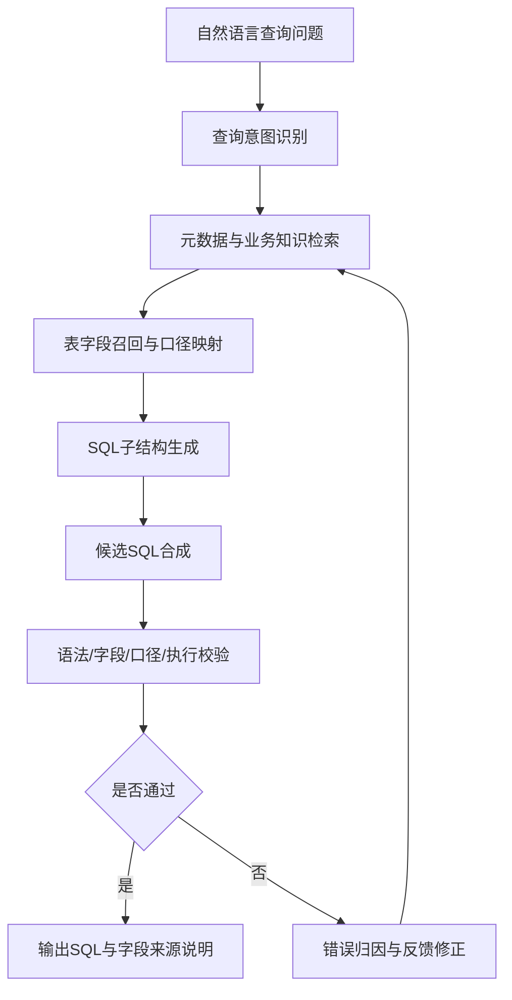
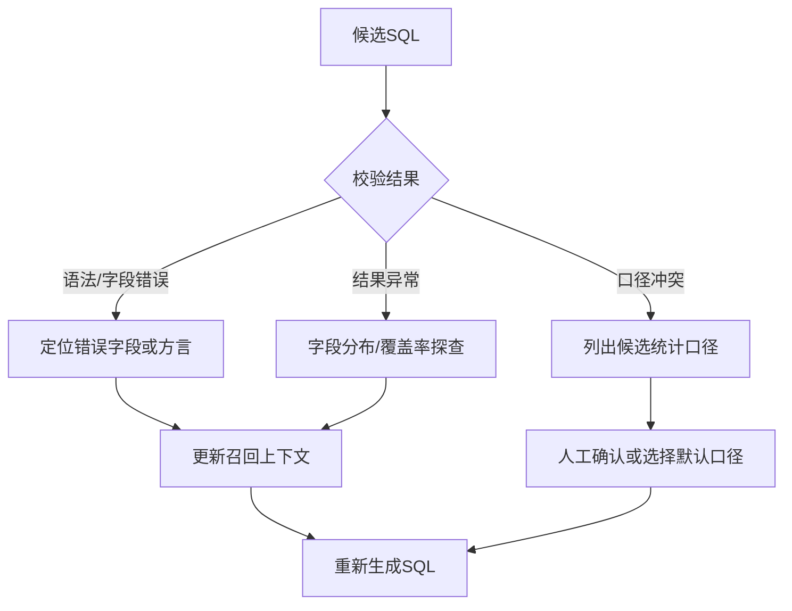

# 面向医院统计口径的元数据增强 RAG-Text2SQL 生成与反馈校验方法

## 摘要

针对医院数据分析场景中业务人员 SQL 编写门槛高、数据表结构复杂、指标口径依赖人工经验等问题，提出一种面向医院统计口径的元数据增强 RAG-Text2SQL 生成与反馈校验方法。该方法将医院数据平台中的表结构、字段注释、业务术语、指标口径和历史统计 SQL 组织为领域知识库，通过查询意图识别、元数据召回、SQL 子结构生成、执行校验和错误反馈修正等步骤，将自然语言统计需求转换为可执行 SQL。与直接使用大语言模型生成 SQL 不同，本文方法在生成前引入领域元数据约束，在生成中按 SQL 结构拆分任务，在生成后通过语法、字段、口径和执行结果进行多层校验，从而降低字段幻觉、关联路径错误和口径误配风险。基于 30 条医院手术麻醉及病案首页相关统计查询任务的实测结果表明，完整方案 SQL 可执行率达到 91%，关键字段一致率达到 78%，条件识别准确率达到 79%，平均人工修正次数降至 0.6 次/条。实验结果说明，元数据增强、历史 SQL 检索和执行反馈闭环能够提升大语言模型在医院统计 SQL 生成任务中的工程可用性。

**关键词**：大语言模型；Text2SQL；检索增强生成；医院数据分析；元数据；执行反馈

## 0 引言

医院信息系统在长期运行过程中积累了大量诊疗、手术、病案、检验、收费和运营管理数据。这些数据通常分布在多个业务系统、数据平台或主题库中，字段命名、表间关联和指标口径具有明显的业务属性。临床科室、职能部门和数据分析人员在提出统计需求时，往往只能用自然语言描述问题，而实际取数仍依赖工程技术人员理解表结构、字段含义和业务口径后手工编写 SQL。随着医院精细化管理、质量控制和科研分析需求增加，人工编写 SQL 的方式在响应效率、经验复用和口径一致性方面逐渐暴露出不足。

自然语言转 SQL（Text2SQL/NL2SQL）技术为降低数据库使用门槛提供了新的思路。已有研究通常从语义解析、表结构编码、字段匹配、SQL 结构拆分和执行准确率等方面提升自然语言问句到 SQL 的转换效果。融合字段类型与文本匹配的中文问句解析方法表明，将表结构信息与条件值匹配机制引入模型可以提升中文问句解析效果；RNSQL 等研究进一步指出，多表连接场景中仅提升 SQL 子句匹配准确率仍然不够，SQL 句法结构和数据库模式组织方式也会影响最终生成质量。

医院统计查询与通用公开数据集存在明显差异。一方面，医院业务数据表多、字段命名复杂，手术时间、入室时间、出院时间、申请时间等字段在统计口径上并不等价；另一方面，“择期手术”“并发症”“出 PACU”“病案首页”等术语具有较强领域语义，同一指标还可能在手术麻醉路径和病案首页路径下形成不同统计口径。若直接调用大语言模型生成 SQL，模型可能生成不存在字段、错误关联路径或语义上看似合理但口径不一致的查询语句。

为解决上述问题，本文提出一种面向医院统计口径的元数据增强 RAG-Text2SQL 生成与反馈校验方法。该方法借鉴 Text2SQL 研究中的 SQL 结构分解思想，将自然语言查询生成过程拆分为意图识别、表字段召回、SQL 子结构生成和执行校验等环节；同时借鉴检索增强生成方法，将医院元数据、指标词典、字段别名和历史 SQL 样例作为上下文提供给大语言模型；最后通过错误归因与反馈修正机制提升生成 SQL 的可执行性和可追溯性。本文主要贡献如下：

1. 构建面向医院统计查询的元数据知识库组织方式，将表结构、字段注释、指标口径、业务术语和历史 SQL 样例统一纳入检索上下文。
2. 提出元数据增强 RAG-Text2SQL 生成流程，将 SQL 生成拆分为意图识别、表字段召回、SQL 子结构生成和候选 SQL 合成。
3. 设计语法、字段、口径和执行结果四类校验规则，并基于错误归因进行反馈修正。
4. 基于 30 条医院统计查询任务构建对比实验，分析裸模型、表结构提示、RAG 上下文和执行反馈闭环四种方案的效果差异。

## 1 医院统计查询任务与问题分析

### 1.1 任务定义

医院统计场景下的 Text2SQL 任务可定义为：给定自然语言查询问题、医院数据平台元数据和业务知识库，系统自动生成满足查询意图、符合目标数据库方言并可追溯指标口径的 SQL。形式化表示为：

```text
SQL = F(Q, S, K, H)
```

其中，`Q` 表示用户自然语言查询问题，`S` 表示数据库模式信息，包括表名、字段名、字段类型、字段注释和常用关联键；`K` 表示领域知识，包括业务术语、指标口径、字典值、科室别名和时间口径；`H` 表示历史 SQL 样例及其字段来源说明；`F` 表示由检索、生成、校验和反馈组成的转换过程。

输入包括：

- 自然语言查询问题，例如“统计今年 1 到 3 月每个月择期手术例数及并发症例数”。
- 数据库元数据，包括库名、表名、字段名、字段注释、字段类型、逻辑删除标识和常用关联键。
- 指标与业务术语知识，包括指标定义、科室别名、状态值含义、时间口径和常用筛选条件。
- 历史 SQL 样例，包括已验证可执行的统计语句、字段来源说明和口径说明。

输出包括：

- 目标数据库方言下的可执行 SQL。
- 关键表字段来源说明。
- 表字段召回结果、口径判断结果、执行校验结果和必要的修正说明。

### 1.2 医院统计查询难点

医院统计 SQL 生成的难点不仅在语法生成，更在业务语义、字段血缘和口径一致性。

第一，表结构和字段命名复杂。不同业务系统形成的数据表往往采用不同命名规则，同一业务含义可能在不同系统中对应不同字段。例如，手术统计可按入室时间、手术完成时间或出院时间落月，不同选择会导致统计结果不一致。

第二，业务术语需要标准化映射。用户常使用“择期”“并发症”“出 PACU”“病案首页”等口语化或领域化表达，这些表达需要映射到具体字段、字典值或组合规则，否则 SQL 条件容易出现语义误配。

第三，多表关联路径容易出错。医院统计任务常涉及申请表、登记表、手术明细表、麻醉记录表和病案首页表等多源数据。错误的关联键或多余关联可能导致结果重复、遗漏或异常偏小。

第四，生成结果必须具备工程可用性。医院数据统计不仅要求 SQL 语法正确，还要求字段真实存在、口径可追溯、结果可解释。当系统无法唯一确定字段或口径时，应提示人工确认，而不是生成不可追溯的结果。

### 1.3 直接生成 SQL 的风险

大语言模型具备较强的语言理解和代码生成能力，但在医院统计场景中直接生成 SQL 存在以下风险：

- **字段幻觉**：生成语义合理但数据库中不存在的表名或字段名。
- **口径幻觉**：将入室时间、出院时间、申请时间等不同口径混用。
- **条件误配**：无法正确映射择期、急诊、并发症、科室简称等条件值。
- **关联路径错误**：遗漏必要关联或加入错误关联，导致统计结果偏移。
- **执行不可用**：SQL 方言、字段类型转换或中文别名处理不符合目标数据库要求。

因此，本文不采用“自然语言问题直接输入大模型并返回 SQL”的单步方式，而是将大语言模型置于受控的元数据增强和执行反馈流程中。

## 2 元数据增强 RAG-Text2SQL 方法

### 2.1 总体流程

本文方法整体流程如图 1 所示。



流程中，元数据和业务知识用于约束模型生成范围，SQL 子结构生成用于降低复杂 SQL 一次性生成的不稳定性，执行反馈用于发现静态校验无法识别的类型错误、空结果和口径异常。

### 2.2 元数据知识库组织

元数据知识库由四类条目构成。

| 条目类型 | 主要内容 | 作用 |
| --- | --- | --- |
| 表字段条目 | 表名、字段名、字段类型、字段注释、逻辑删除标识 | 约束 SQL 中可使用的真实表字段 |
| 指标口径条目 | 指标名称、统计对象、时间口径、筛选条件、分组维度 | 约束指标语义和统计规则 |
| 历史 SQL 条目 | 自然语言需求、参考 SQL、关键字段、关联路径 | 提供真实业务查询模板 |
| 异常规则条目 | 字段缺失、口径冲突、结果为空、异常偏低等处理规则 | 支持错误归因和人工确认 |

知识库构建时，对表字段条目采用关键词索引，对业务术语和历史 SQL 条目采用向量检索与关键词检索结合的方式。这样既能处理明确字段名，也能处理用户问句中的口语化表达。

### 2.3 表字段召回与口径映射

给定用户问题 `Q`，系统首先识别业务域和查询类型，再从元数据知识库中召回候选表字段。候选项综合考虑关键词匹配、语义相似度和历史 SQL 命中情况，召回得分定义为：

```text
Score(c) = α · Score_key(c, Q) + β · Score_sem(c, Q) + γ · Score_hist(c, Q)
```

其中，`Score_key` 表示关键词匹配分，`Score_sem` 表示语义相似度分，`Score_hist` 表示候选字段或表在历史 SQL 中的命中分；`α`、`β`、`γ` 为权重参数。对医院统计任务，历史 SQL 命中分用于增强已验证关联路径和指标口径的优先级。

以“统计今年 1 到 3 月每个月择期手术例数与并发症例数”为例，系统召回结果可表示为：

```text
业务域：手术麻醉统计
查询类型：按月份分组计数
候选时间字段：入室时间、出院时间、手术完成时间
候选择期口径：急诊标志不为急诊
候选并发症口径：手术明细中的并发症标志或内容字段
待确认项：按手术麻醉入室时间统计，还是按病案首页出院时间统计
```

该过程对应参考论文中的“字段类型与文本匹配”骨架，但在医院场景中转写为“元数据、业务术语和历史 SQL 的联合召回”。

### 2.4 SQL 子结构生成

为降低复杂 SQL 直接生成的不稳定性，本文将 SQL 生成拆分为若干子结构：

| 子结构 | 生成内容 | 校验要点 |
| --- | --- | --- |
| SELECT | 输出字段、聚合指标、中文别名 | 指标字段是否来自召回结果 |
| FROM/JOIN | 主表、关联表、关联键 | 多表关联路径是否与参考口径一致 |
| WHERE | 时间范围、状态条件、逻辑删除条件 | 条件值和时间字段是否匹配 |
| GROUP BY | 分组字段，如月份、科室、病区 | 是否与查询粒度一致 |
| ORDER BY | 排序字段 | 是否影响结果解释 |

候选 SQL 生成时，提示词中显式限制模型只能使用检索上下文中的表名、字段名和业务规则；当关键字段存在多个候选时，模型应输出待确认项，而不是直接编造字段。

### 2.5 执行校验与错误反馈

候选 SQL 生成后，系统进行四层校验。

| 校验层级 | 校验内容 | 典型错误 | 反馈策略 |
| --- | --- | --- | --- |
| 语法校验 | SQL 结构、方言、别名 | 语法错误、函数不兼容 | 修正 SQL 模板或方言写法 |
| 字段校验 | 表名、字段名、字段类型 | 字段不存在、类型转换错误 | 重新召回字段或调整转换方式 |
| 口径校验 | 时间字段、指标字段、筛选条件 | 入室时间与出院时间混用 | 返回候选口径并提示确认 |
| 结果校验 | 空结果、异常偏低、重复计数 | 关联路径错误、数据覆盖不足 | 进行字段分布和关联覆盖率探查 |

错误反馈流程如图 2 所示。



该过程对应检索增强与思维链类研究中的“错误归因—上下文更新—再次生成”骨架，是本文区别于普通提示词生成的关键环节。

## 3 实验与应用验证

### 3.1 问题集构建

为验证方法在医院统计场景中的可用性，本文构建 30 条典型查询任务。问题来源包括历史报表需求、人工 SQL 样例和常见统计口径，由工程人员确认参考 SQL 与字段来源。问题类型构成如表 1 所示。

| 类型 | 数量 | 示例任务 |
| --- | ---: | --- |
| 月度统计 | 8 | 按月份统计择期手术例数、并发症例数 |
| 科室/病区分组 | 6 | 按科室统计手术或出院相关指标 |
| 并发症相关统计 | 6 | 统计手术并发症例数及组合指标 |
| 多表明细查询 | 5 | 查询围术期患者、手术、科室和时间明细 |
| 口径歧义问题 | 5 | 入室时间与出院时间、手术路径与病案首页路径选择 |
| 合计 | 30 | - |

### 3.2 实验案例与参考口径

本文将实验任务抽象为四类案例。

| 案例 | 自然语言问题 | 关键召回字段或路径 | 参考口径 | 校验重点 |
| --- | --- | --- | --- | --- |
| Case 1 手术麻醉月度统计 | 统计 1—3 月择期手术例数与并发症例数 | 手术申请、麻醉记录、手术明细 | 按入室时间落月，急诊标志判断择期 | 时间字段、择期条件、并发症字段 |
| Case 2 病案首页对照统计 | 按出院月份统计择期手术与并发症 | 病案首页、手术明细、扩展区标志 | 按出院时间落月，按手术序号映射标志 | 数据源口径与手术麻醉路径差异 |
| Case 3 围术期明细查询 | 查询患者围术期明细字段 | 患者登记、科室、诊断、手术、PACU 时间 | 多表关联形成明细结果 | 关联路径和字段完整性 |
| Case 4 异常口径探查 | 并发症计数为 0 或异常偏低时排查原因 | 并发症标志字段、内容字段、覆盖率 | 先查字段分布与覆盖率，再修正谓词 | 结果异常归因 |

### 3.3 评价指标

本文采用以下评价指标：

| 指标 | 含义 |
| --- | --- |
| SQL 可执行率 | 生成 SQL 能在目标数据库环境中成功执行的比例 |
| 关键字段一致率 | 生成 SQL 中关键表字段与人工参考 SQL 一致的比例 |
| 条件识别准确率 | 时间范围、择期/急诊、并发症等条件识别正确的比例 |
| 结果一致率 | 生成 SQL 与参考 SQL 在抽样验证范围内结果一致的比例 |
| 平均人工修正次数 | 每条 SQL 从首版到可交付所需的平均人工修正次数 |
| 端到端耗时 | 从提交自然语言问题到输出可执行 SQL 的平均时间 |

### 3.4 对比方案

实验设置四组方案进行对比。

| 方案 | 输入上下文 | 目的 |
| --- | --- | --- |
| A 裸生成 | 仅自然语言问题 | 验证直接使用大语言模型生成 SQL 的风险 |
| B + 表结构 | 自然语言问题 + 表字段结构 | 验证元数据约束对字段幻觉的抑制作用 |
| C RAG 上下文 | 自然语言问题 + 元数据 + 指标词典 + 历史 SQL | 验证领域知识检索对口径映射的作用 |
| D RAG + 执行反馈 | 方案 C + 语法/字段/口径/结果校验 | 验证反馈闭环对可执行性和修正次数的影响 |

### 3.5 方案级结果

<table>
<thead>
<tr>
<th>方案</th>
<th>SQL 可执行率 / %</th>
<th>关键字段一致率 / %</th>
<th>条件识别准确率 / %</th>
<th>平均人工修正次数 / 次·条<sup>−1</sup></th>
</tr>
</thead>
<tbody>
<tr><td>A 裸生成</td><td>62</td><td>41</td><td>48</td><td>2.7</td></tr>
<tr><td>B + 表结构</td><td>74</td><td>55</td><td>59</td><td>1.9</td></tr>
<tr><td>C RAG 上下文</td><td>86</td><td>71</td><td>72</td><td>1.1</td></tr>
<tr><td>D RAG + 执行反馈</td><td>91</td><td>78</td><td>79</td><td>0.6</td></tr>
</tbody>
</table>

从表中可以看出，加入表结构后，SQL 可执行率由 62% 提升至 74%，说明真实元数据能够有效降低不存在字段和错误表名问题。加入指标词典和历史 SQL 检索后，关键字段一致率和条件识别准确率进一步提升，表明领域知识对统计口径映射具有明显作用。完整方案在执行反馈闭环支持下，可执行率达到 91%，平均人工修正次数降至 0.6 次/条。

### 3.6 效率与迭代分析

<table>
<thead>
<tr>
<th>方案</th>
<th>端到端平均耗时 / s</th>
<th>平均校验-重试轮数</th>
<th>因“口径歧义”触发人工确认占比 / %</th>
</tr>
</thead>
<tbody>
<tr><td>A</td><td>18</td><td>0</td><td>8</td></tr>
<tr><td>B</td><td>21</td><td>0</td><td>11</td></tr>
<tr><td>C</td><td>26</td><td>0.4</td><td>19</td></tr>
<tr><td>D</td><td>31</td><td>1.2</td><td>23</td></tr>
</tbody>
</table>

方案 D 的平均耗时高于方案 A，主要原因是系统增加了检索、校验和错误反馈环节。但对于医院统计任务，SQL 可执行性、口径一致性和减少人工返工通常比单次生成速度更重要。因此，完整方案体现出以适度计算和校验成本换取工程可靠性的特点。

### 3.7 错误类型分析

在实验过程中，常见错误可归纳为五类。

| 错误类型 | 主要表现 | 处理方式 |
| --- | --- | --- |
| 字段不存在 | 模型生成未收录字段 | 回到元数据召回重新选择字段 |
| 时间口径错误 | 入室时间、出院时间、申请时间混用 | 根据指标口径条目提示候选口径 |
| 条件值错误 | 择期、急诊、并发症标志映射不正确 | 使用业务术语词典和历史 SQL 修正谓词 |
| 关联路径错误 | 多表关联键错误或遗漏关联 | 依据历史 SQL 关联路径修正 JOIN |
| 方言和类型错误 | 日期截取、类型转换、别名写法不兼容 | 根据目标数据库方言重写表达式 |

该错误分布说明，医院统计 SQL 生成的主要难点并非单纯语法生成，而是字段、口径和关联路径的综合对齐。

### 3.8 典型案例分析

以“统计指定年度 1—3 月每月择期手术例数与手术并发症例数”为例，系统首先识别其属于手术麻醉月度统计任务，查询粒度为月份，指标包括择期手术例数和并发症例数。随后系统召回手术申请、麻醉记录和手术明细相关字段，将入室时间作为默认落月字段，将急诊标志用于判断择期，将并发症标志字段和内容字段用于判断并发症。若生成 SQL 能够执行但结果异常偏低，则系统进一步检查并发症相关字段取值分布和关联覆盖率，以判断是字段映射错误、数据同步缺失还是业务口径差异。

该案例体现了本文方法的三个特点：第一，使用历史 SQL 和元数据约束生成范围；第二，按 SQL 子结构生成并校验关联路径；第三，将执行结果异常纳入反馈回路，而不仅处理语法错误。

## 4 结语

本文面向医院统计口径复杂、数据表结构多源和人工 SQL 编写成本高的问题，提出一种元数据增强 RAG-Text2SQL 生成与反馈校验方法。该方法将医院元数据、指标口径、业务术语和历史 SQL 样例组织为检索增强上下文，并通过 SQL 子结构生成、四层校验和错误反馈修正机制，将自然语言统计需求转换为可执行 SQL。基于 30 条医院统计查询任务的实验结果表明，完整方案在 SQL 可执行率、关键字段一致率、条件识别准确率和人工修正次数方面均优于直接生成方案。

当前研究仍存在一定局限。首先，实验问题集规模仍较小，后续需扩展到更多业务域和更复杂的跨系统查询；其次，指标词典和历史 SQL 的覆盖度会影响生成效果；再次，动态知识库更新和跨业务域迁移仍需进一步研究。后续将围绕多表关联路径自动推荐、指标口径自动对账、动态知识库持续更新和人机协同反馈学习开展进一步工作。

## 参考文献

[1] 纪相存, 李大林, 彭晓东. 融合字段类型与文本匹配的中文问句解析[J]. 计算机应用与软件, 2024, 41(7): 184-191.

[2] 帖军, 范子琪, 孙罛, 等. RNSQL: 融合逆规范化的 Text2SQL 生成[J]. 计算机应用与软件, 2025, 42(9): 31-37, 86.

[3] 丁咚, 杨文昌. 知识库问答场景中大语言模型私有化研究与应用实践[J]. 计算机应用与软件, 2025, 42(10): 133-138, 162.

[4] 贺梓然, 江波, 王晓龙. 改进检索增强与 LLM 思维链维修策略生成[J]. 计算机应用与软件, 2025, 42(3): 1-6, 83.

[5] 王向, 李艳超, 张晓明. 一种基于路径选择的多模态领域知识问答方法[J]. 计算机应用与软件, 2025, 42(4): 189-200, 244.

[6] 张龙飞, 宋扬, 白庆春. 面向动态知识库的多教师知识问答模型[J]. 计算机应用与软件, 2026, 43(2): 204-213.

[7] 白培发, 黄宗浩, 王奕. 大模型在智慧医院的应用研究综述[J]. 计算机应用与软件, 2024, 41(7): 1-5, 19.

[8] Zhong V, Xiong C, Socher R. Seq2SQL: Generating structured queries from natural language using reinforcement learning[EB/OL]. arXiv:1709.00103, 2017.

[9] Yu T, Zhang R, Yang K, et al. Spider: A large-scale human-labeled dataset for complex and cross-domain semantic parsing and text-to-SQL task[C]//Proceedings of the 2018 Conference on Empirical Methods in Natural Language Processing. 2018: 3911-3921.

[10] Guo J, Zhan Z, Gao Y, et al. Towards complex text-to-SQL in cross-domain database with intermediate representation[C]//Proceedings of the 57th Annual Meeting of the Association for Computational Linguistics. 2019: 4524-4535.

[11] Bogin B, Berant J, Gardner M. Representing schema structure with graph neural networks for text-to-SQL parsing[C]//Proceedings of the 57th Annual Meeting of the Association for Computational Linguistics. 2019: 4560-4565.

[12] Wang B, Shin R, Liu X, et al. RAT-SQL: Relation-aware schema encoding and linking for text-to-SQL parsers[C]//Proceedings of the 58th Annual Meeting of the Association for Computational Linguistics. 2020: 7567-7578.

[13] Scholak T, Schucher N, Bahdanau D. PICARD: Parsing incrementally for constrained auto-regressive decoding from language models[C]//Proceedings of the 2021 Conference on Empirical Methods in Natural Language Processing. 2021: 9895-9901.

[14] Pourreza M, Rafiei D. DIN-SQL: Decomposed in-context learning of text-to-SQL with self-correction[C]//Advances in Neural Information Processing Systems. 2023.

[15] Lewis P, Perez E, Piktus A, et al. Retrieval-Augmented Generation for Knowledge-Intensive NLP Tasks[C]//Advances in Neural Information Processing Systems. 2020, 33: 9459-9474.

[16] Chang Y, Wang X, Wang J, et al. A survey on evaluation of large language models[J]. ACM Transactions on Intelligent Systems and Technology, 2024, 15(3): 1-45.

[17] Finardi P, Avila L, Castaldoni R, et al. The chronicles of RAG: The retriever, the chunk and the generator[EB/OL]. arXiv:2401.07883, 2024.

[18] Ng K K Y, Matsuba I, Zhang P C. RAG in healthcare: A novel framework for improving communication and decision-making by addressing LLM limitations[J]. NEJM AI, 2025, 2(1): AIra2400380.
