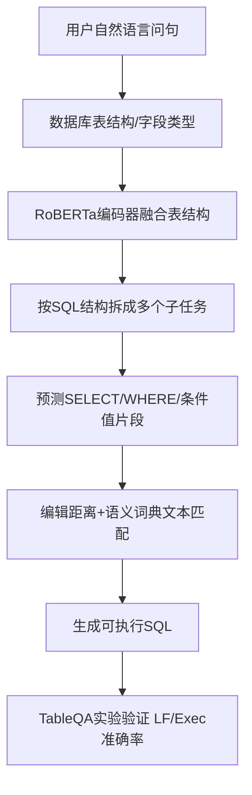
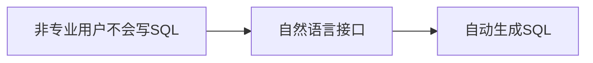
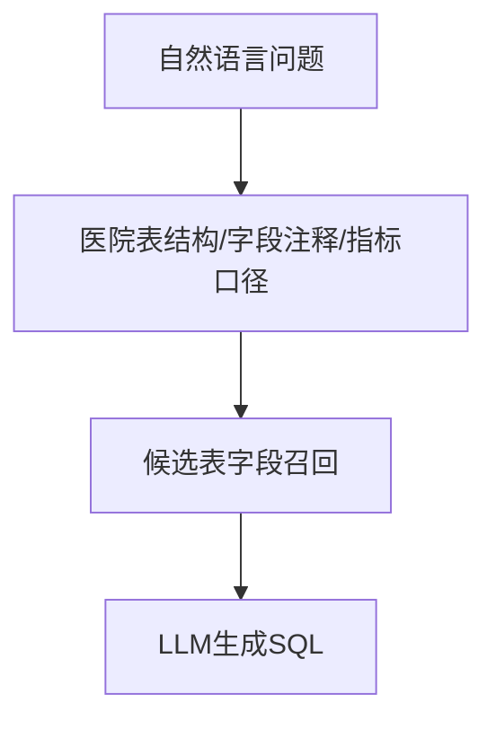
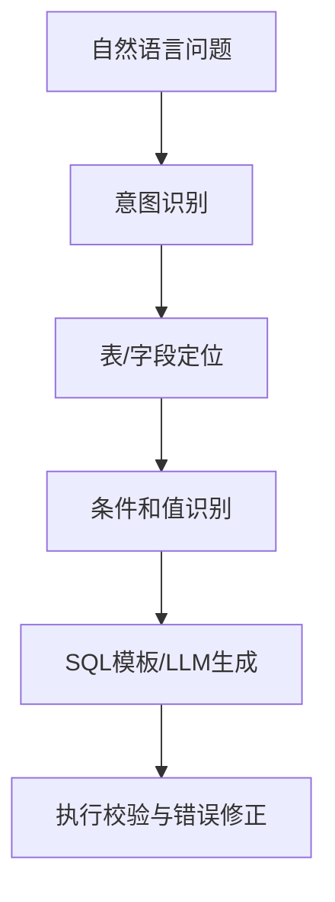
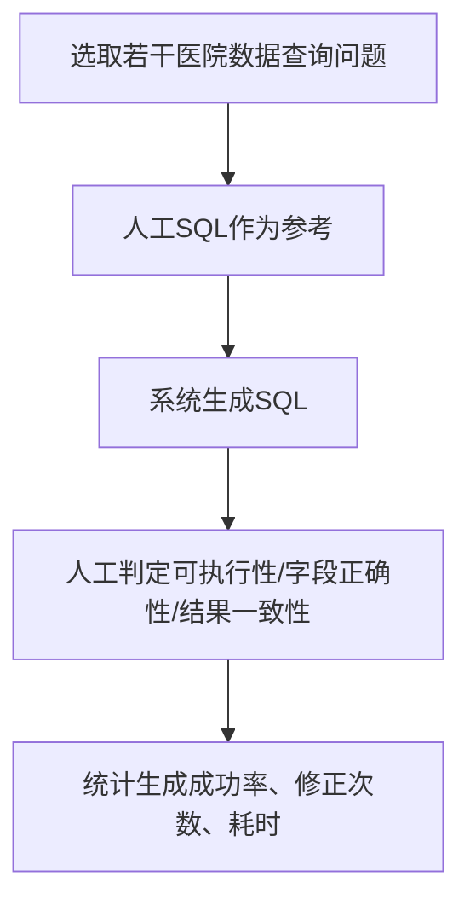

# 计算机应用与软件 NL2SQL/RAG 间接骨架分析

## 参考论文

- 主临帖：`参考论文/计算机应用与软件_融合字段类型与文本匹配的中文问句解析_2024_07.pdf`
- 辅助骨架：`参考论文/计算机应用与软件_知识库问答场景中大语言模型私有化研究与应用实践_2025_10.pdf`
- 辅助骨架：`参考论文/计算机应用与软件_改进检索增强与LLM思维链维修策略生成_2025_03.pdf`

## 主临帖论文骨架

题名：融合字段类型与文本匹配的中文问句解析。

核心血缘：



文章明线：

1. 问题提出：数据库查询门槛高，自然语言转 SQL 可降低使用门槛。
2. 现有不足：传统语法树/词典泛化弱；神经网络方法没有充分利用表结构；中文 TableQA 中问句可能不直接包含真实条件值。
3. 方法设计：基于 SQL 结构拆分任务，融合字段类型信息，用文本匹配修正条件值。
4. 实验验证：在 TableQA 上与 SQLNet、SQLova、X-SQL、M-SQL 等比较。
5. 消融证明：字段类型、文本匹配、条件值标注分别带来贡献。
6. 局限收束：当前主要处理单表普通问句，后续扩展多表与时序问题。

## 可迁移的间接骨架

### 骨架 1：门槛降低骨架

原文骨架：



迁移写法：


适合写在引言第一段，说明工程价值。

### 骨架 2：领域信息增强骨架

原文是“字段类型信息增强编码器”，可转写为“医院元数据/指标词典增强大模型”：



这里不要照搬字段类型分隔符，可以写成“元数据检索、字段别名、业务术语映射、示例 SQL 提示”。

### 骨架 3：结构分解骨架

原文把 SQL 拆成 `SELECT`、`WHERE`、聚合函数、条件值等子任务。你的文章可拆成：



这比直接写“让大模型生成 SQL”更像工程论文，也更适合当前实验不多。

### 骨架 4：条件值纠偏骨架

原文难点是“南航”要匹配到“南方航空”。医院场景可写：


可举例：出院时间、手术完成时间、择期手术、并发症字段、科室别名等。

### 骨架 5：轻实验验证骨架

原文用公开数据集和多模型对比。你当前实验不多，可改成小规模工程验证：



最少可做 20-50 个真实或脱敏问题，不必一开始追求大型公开基准。

### 骨架 6：消融/对比骨架

原文消融：去掉 RoBERTa、字段类型、文本匹配、条件值标注。

你的可替换为：

| 对比项 | 目的 |
|---|---|
| 仅 LLM 直接生成 SQL | 证明裸模型不稳 |
| LLM + 表结构提示 | 证明元数据有效 |
| LLM + 字段/指标词典 | 证明医院术语映射有效 |
| LLM + 执行反馈修正 | 证明可执行性提升 |

## 你的论文临帖骨架

建议题名：

> 基于大语言模型的医院数据查询 SQL 自动生成系统设计与应用

建议目录：

```text
0 引言
1 医院数据查询任务与问题分析
2 系统总体设计
  2.1 医院元数据与指标知识组织
  2.2 自然语言查询意图识别
  2.3 表字段召回与 SQL 生成
  2.4 SQL 执行校验与反馈优化
3 实验与应用验证
  3.1 数据与问题集构建
  3.2 评价指标
  3.3 总体效果
  3.4 对比与消融分析
4 结语
```

## 多篇骨架是否更靠谱

更靠谱，但要分主次。

- 主临帖用 NL2SQL 论文：决定“问题-方法-实验”的主结构。
- RAG/LLM 私有化论文：补“垂直领域知识库、私有化、安全合规、资源约束”的写法。
- 改进 RAG+思维链论文：补“意图识别、分层路由、多查询检索、上下文压缩、分步推理”的流程写法。

不要同时临太多，否则文章会散。建议采用“1 主 2 辅”：主骨架保持 NL2SQL，辅骨架只借 RAG 和工程部署表达。
