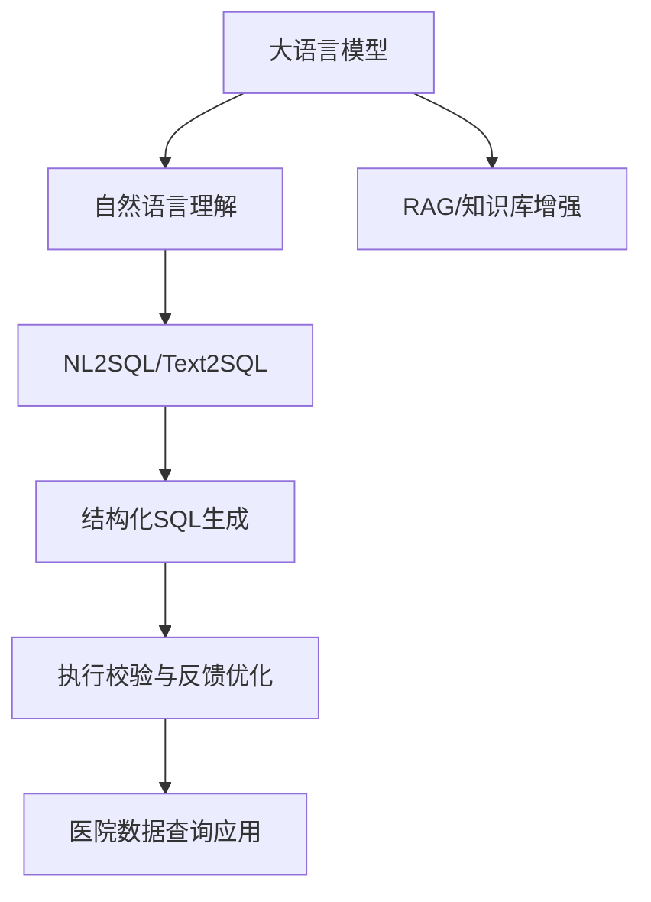
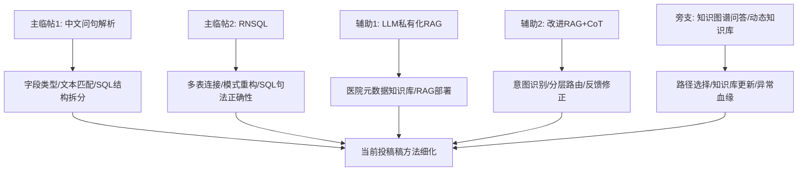

# 计算机应用与软件：专利相近论文下载清单

## 专利方向血缘

依据项目时间线中已记录的专利主题，当前论文选题对应的技术主线为：

筛选原则：优先选择《计算机应用与软件》中与 **Text2SQL/NL2SQL、数据库问句解析、RAG、大语言模型问答、结构化知识问答、动态知识库** 相关的文章，用作投稿版论文的间接骨架参考。

## 已下载论文

| 序号 | 论文 | 年期 | DOI | 与专利/投稿稿的血缘匹配 |
| --- | --- | --- | --- | --- |
| 1 | 融合字段类型与文本匹配的中文问句解析 | 2024(7) | 10.3969/j.issn.1000-386x.2024.07.028 | 主骨架：自然语言问句 → 表结构/字段类型 → SQL 子任务拆分 → 条件值匹配 → 实验验证 |
| 2 | RNSQL: 融合逆规范化的 Text2SQL 生成 | 2025(9) | 10.3969/j.issn.1000-386x.2025.09.005 | 最贴近新增骨架：Text2SQL、多表连接、SQL 句法正确性、数据库模式重构 |
| 3 | 知识库问答场景中大语言模型私有化研究与应用实践 | 2025(10) | 10.3969/j.issn.1000-386x.2025.10.018 | 辅助骨架：大语言模型私有化、RAG、本地知识库、量化部署、垂直领域应用 |
| 4 | 改进检索增强与 LLM 思维链维修策略生成 | 2025(3) | 10.3969/j.issn.1000-386x.2025.03.001 | 辅助骨架：意图识别、分层路由、多查询检索、上下文压缩、思维链生成 |
| 5 | 一种基于路径选择的多模态领域知识问答方法 | 2025(4) | 10.3969/j.issn.1000-386x.2025.04.028 | 旁支骨架：自然语言问题 → 实体/谓词识别 → 路径选择 → 结构化知识问答 |
| 6 | 面向动态知识库的多教师知识问答模型 | 2026(2) | 10.3969/j.issn.1000-386x.2026.02.027 | 旁支骨架：动态知识库、增量学习、多教师蒸馏，适合补“知识库持续更新”局限与展望 |

## 未成功下载但建议保留为可检索参考

| 论文 | 年期 | DOI | 原因 |
| --- | --- | --- | --- |
| 基于检索增强生成技术的规章制度问答大语言模型的构建 | 2025(7) | 10.3969/j.issn.1000-386x.2025.07.026 | 页面可访问摘要，但官网未暴露 `citation_pdf_url`，按 DOI 直连 PDF 返回空内容；可后续手工从官网页面或数据库下载 |

## 一笔一划临帖建议

最建议优先细读：**RNSQL** 与 **融合字段类型与文本匹配的中文问句解析**。前者补当前稿的多表 SQL 生成与句法正确性，后者补中文 NL2SQL 的主实验骨架。
