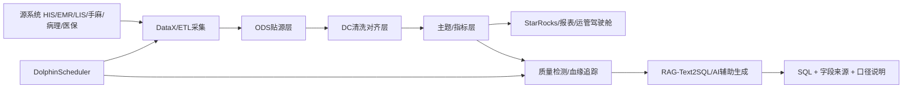
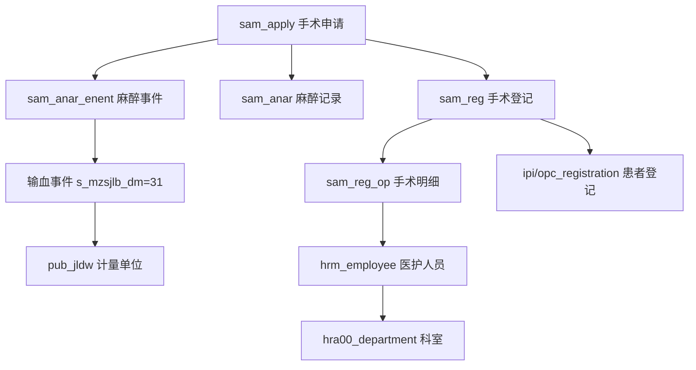
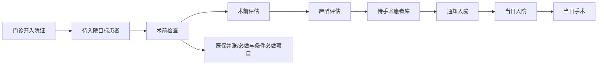
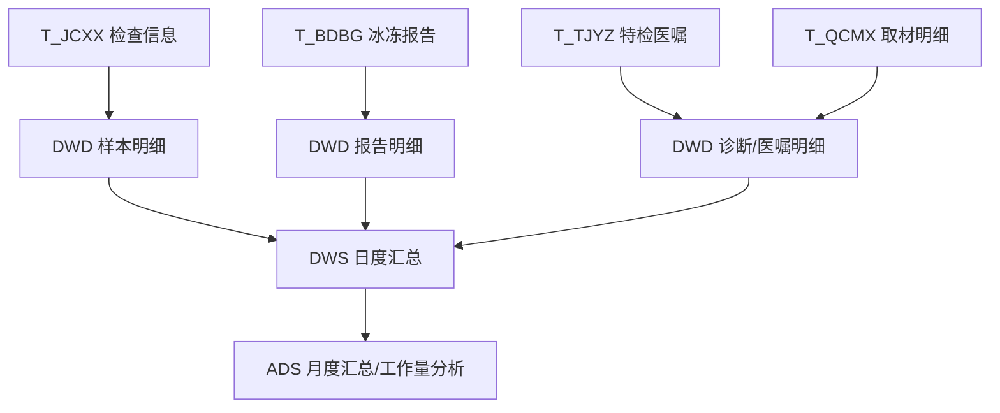
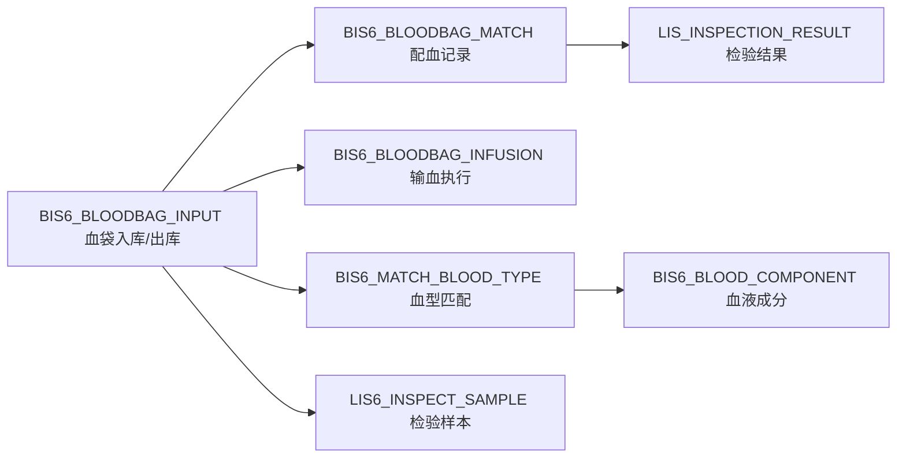
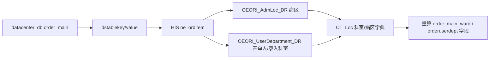
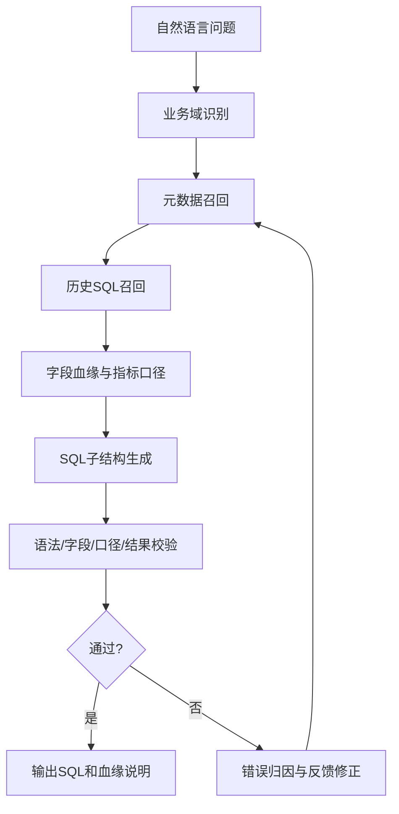
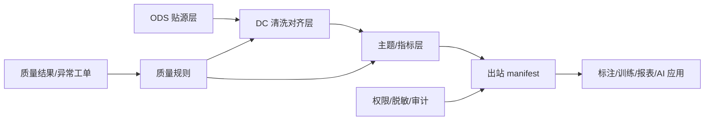

# 数据血缘技术在医院大数据治理与智能 SQL 生成中的应用

## PPT 说明

- 学习材料来源：`医保政策及DRG付费机制讨论.pdf`、`医院信息化建设复盘与规划.pdf`、`智能纪要：当日入院当日手术项目复盘 2026年3月20日.pdf`、`智能纪要：医保业务问题分析与未来规划 2026年4月17日.pdf`
- 项目实践来源：仓库内 `.trace`、手麻/病理/输血/DC/LIS 等 SQL 与数据治理方案稿

---

## 第 1 页：标题页

**数据血缘技术在医院大数据治理与智能 SQL 生成中的应用**

副标题：结合医保 DRG、医院信息化建设、当日入院当日手术与当前 SQL 生成项目实践

汇报关键词：  
数据血缘、医保贯标、DRG、DolphinScheduler、DataX、Presto、StarRocks、RAG-Text2SQL、数据质量、业务闭环

---

## 第 2 页：为什么现在要讲数据血缘

**从课程和项目复盘看，医院信息化的核心问题不是「有没有数据」，而是「数据从哪里来、怎么算、能不能解释」。**

课程与纪要中反复出现几类问题：

- 医保和 DRG 要求数据真实、完整、及时
- 医院运营驾驶舱不能只展示数字，要能解释指标口径
- 当日入院当日手术依赖多部门流程贯通，单点系统难以支撑
- 医保智能审核、扣款申诉、报错解释都需要证据链
- 大数据和 AI 要发挥作用，前提是主数据、编码、口径和血缘清楚

一句话：**数据血缘是从「做出一张报表」走向「解释一个业务事实」的基础技术。**

---

## 第 3 页：课程学习内容提炼（医保政策及 DRG）

**医保政策及 DRG 课程给数据血缘提出了三类要求。**

1. **标准血缘**
   - 医保贯标统一诊断、手术操作、药品、服务项目、耗材等编码
   - 院内字段必须能映射到国家医保标准
   - 不同编码体系之间要有映射关系（如临床诊断、医保诊断、病案首页诊断）

2. **支付血缘**
   - 医保支付、DRG/DIP 分组、结算清单依赖费用、诊断、手术、耗材、药品等字段
   - 一笔费用要能追溯到医嘱、执行、收费、结算和医保上传

3. **监管血缘**
   - 医保智能审核通过知识库和规则库筛选疑点数据
   - 医院申诉时要能组织审核记录、接口数据、病历佐证和政策依据

---

## 第 3.5 页：DRG/DIP 付费血缘：从诊疗行为到点数结算

**DRG/DIP 不是单纯的医保结算规则，而是一套把诊疗过程、资源消耗、质量评价和支付结果连起来的分类血缘。**

课程中可提炼出一条关键链路：

```text
患者诊疗过程
  → 主要诊断/其他诊断/主要手术操作/费用明细
    → DRG/DIP 分组
      → 点数 × 点值 × 调整系数
        → 医院可获得总费用
          → 结余/亏损/质量评价
```

讲解要点：

- DRG/DIP 是分类工具，把临床过程相似、资源消耗相近的病例放到同一组
- 支付标准不再简单按项目累加，而是与分组点数、点值、医疗机构调整系数相关
- 医院实际获得的是「医保基金 + 患者自付」合计后的固定支付标准
- 当实际费用超过支付标准时形成亏损，低于支付标准时形成结余
- 低风险组死亡率等质量评价也依赖 DRG 分组血缘

对应到数据血缘技术：**诊断、手术、费用、病案首页、医保上传和 DRG 结果必须能互相追溯，否则无法解释亏损、结余和质量异常。**

---

## 第 4 页：医院信息化复盘中的血缘思想

**信息化建设复盘强调「以终为始」，这本质上就是业务血缘倒推。**

典型逻辑：

```text
管理目标
  → 产品形态
    → 指标卡片
      → 指标分子分母
        → 数据来源
          → 系统接口
            → 字段和口径
```

例如手术室运营管理：

```text
提升手术室综合效率
  → 手术资源看板
    → 手术间利用率、接台时间、停台情况
      → 手麻排程、手术登记、麻醉记录、病案首页
        → 手术间、入室时间、出室时间、手术开始结束时间
```

**数据血缘要回答**：这个指标为什么这么算，谁负责，哪里能改，异常在哪里。

---

## 第 4.5 页：信息化产品交付血缘：从指标卡到策略沙盘

医院信息化建设复盘中强调，系统不能只做一次性展示，而要形成可迭代、可干预、可复盘的产品交付链路。

```text
管理目标
  → 指标卡片
    → 历史回顾 / 实时监测 / 未来预测
      → 资源中台
        → 策略沙盘 / 数字孪生推演
          → 干预动作
            → 结果回流与模型修正
```

结合课程内容，可将运营驾驶舱拆成三类血缘：

- **历史回顾血缘**：过去发生了什么，指标与同期、环比、基线如何比较
- **实时监测血缘**：当前资源、患者、流程堵点在哪里
- **未来预测血缘**：未来一周、一月可能发生什么，能否提前干预

资源中台的血缘对象包括：患者、人力、空间、设备、床位、诊间、手术间等。策略沙盘则支持两种推演：

- **资源导向**：现有资源如何分配达到最优
- **结果导向**：目标结果确定后，反推需要多少资源与排班

落地方式：**成熟一个指标卡上线一个指标卡**，不要等所有大平台做完才交付。每个指标卡都应说明来源表、字段、口径、刷新频率和责任人。

---

## 第 5 页：当前项目的大数据技术方案

结合仓库内记录，整体技术方案可概括为：



项目内已形成的实践类型：

- **DataX**：调度日、上月区间、同比环比等批处理口径（见 `.trace` 中病理/输血/LIS 等「线上改」记录）
- **DolphinScheduler**：业务日期参数、任务编排（方案稿与 `.trace` 一致）
- **Presto/Trino**：跨库查询、Oracle/多 catalog 口径适配（手麻、病理、DC 医嘱等 SQL）
- **StarRocks**：报表结果落地与高性能查询（输血等报表建表语句）
- **`.trace`**：按需求记录血缘时间线
- **RAG-Text2SQL**：元数据 + 历史 SQL + 校验闭环（见 `z-间接骨架/` 修订稿）

---

## 第 6 页：数据血缘的五个层次

**医院场景的数据血缘不能只停留在表到表，还要覆盖业务、字段、规则和异常。**

| 层次 | 说明 | 项目例子 |
|------|------|----------|
| 业务血缘 | 业务目标如何拆成指标 | 当日入院当日手术、手术室效率、医保审核 |
| 表级血缘 | 哪些源表进入结果表 | 手麻 `sam_apply → sam_anar → sam_reg_op` |
| 字段血缘 | 指标字段来自哪张表哪列 | 统计按入室时间、出院时间还是手术开始时间 |
| 规则血缘 | 条件、字典、口径如何形成 | 择期/急诊、医保诊断、DRG 分组 |
| 异常血缘 | 数据异常如何定位 | 空结果、重复计数、字段不存在、更新时间滞后 |

---

## 第 7 页：案例一：手麻用血查询的血缘

当前项目中手麻用血查询体现典型的跨表业务血缘。



要点：

- 输血信息可来自麻醉事件表，而非单独「血制品目录」
- 血液制品类型可结合 `event_text` 等解析
- 单位通过 `pub_jldw` 等字典解析
- 患者、科室、医生、手术间来自不同主数据或业务表

血缘价值：**某类用血统计异常时，可定位是事件分类、事件正文、单位字典，还是手术申请主链路。**

相关文件（示例）：`手麻/手麻输血明细_Oracle转Presto.sql`、`手麻/手麻_手术用血查询_涉及表_数据质量时效_Presto.sql`

---

## 第 7.5 页：当日入院当日手术流程血缘

当日入院当日手术项目体现的是「流程血缘」：不是单表取数，而是患者从门诊到入院、检查、评估、手术的全链路状态变化。



课程中提到的关键业务设计：

- **三个准入**：从病种、患者条件和流程可行性上筛选适合对象
- **六个前移**：术前检查、评估、文书、麻醉评估、手术申请等前移
- 为患者增加「当日住院」「当日手术」标签，形成患者管理模块
- 术前检查状态、麻醉评估补开检查、护理状态查看等需要系统支撑
- 术前检查分为必做和条件必做，但当前系统对条件项识别仍有难点

血缘价值：**当患者无法按计划当日手术时，可以定位是检查未完成、评估未通过、医保并账问题、医嘱库未同步，还是排程/床位/手术间资源问题。**

---

## 第 8 页：案例二：病理主题数据血缘

病理主题设计中体现数据仓库分层血缘（见 `病理/病理主题数据架构设计方案.md`）。



要点：

- 工作量核心口径常与「登记次数」等字段绑定
- 收到日期、报告日期、报告医生、取材医生等决定统计口径
- 质量检测可用最大业务时间或 `lastupdatedttm` 判断链路新鲜度
- 多院区病理涉及主院区、上锦、天府等数据源对齐（与 DataX 排查 SQL 一致）

---

## 第 9 页：案例三：输血数据血缘

输血项目已整理字段级血缘（见 `输血科报表主题数据架构设计方案.md`、`输血/输血SQL字段血缘关系汇总.md`）。



可讲重点：

- 一袋血从入库、配血、出库、输血执行到收费形成链路
- 时效性可检查：入库时间 < 出库时间 < 输血时间（业务规则血缘）
- 出库量、输血量、收费量不一致时沿血缘逐层排查

---

## 第 9.5 页：案例四：DC/HIS 医嘱字段回源血缘

当前项目中 `order_main` 病区与开单人科室的修正，是一个典型的「结果表字段不可信时回源重算」案例。



可讲重点：

- DC 结果表字段如果口径不满足管理需求，可以回源 HIS 业务字段重算
- 病区字段不只看 DC 已有结果，而是通过 `OEORI_AdmLoc_DR → CT_Loc` 还原
- 开单人科室通过 `OEORI_UserDepartment_DR → CT_Loc` 独立补充
- 多院区场景下，需要分别处理 HID0101/HID0103/HID0117/HID0120 等 catalog 或库前缀

血缘价值：**同名指标在 DC 表、HIS 源表和业务展示层不一致时，可以用回源血缘说明哪个字段更符合管理口径。**

---

## 第 10 页：医保 DRG 场景下的数据血缘

医保和 DRG 的数据血缘强调**证据链**。

```text
诊疗行为
  → 医嘱/执行/病历记录
    → 收费项目/药品/耗材
      → 医保编码映射
        → 结算清单/医保上传
          → 智能审核/DRG分组
            → 扣款/申诉/监管反馈
```

与《医保业务问题分析与未来规划》纪要对齐的要点：

- 认定需在文书或报告留痕，否则面临合规风险
- 药品支付需符合说明书及医保限定；超说明书不予支付
- 临床诊断与医保诊断（简化 ICD-10）并存，需映射与口径管理
- 智能审核针对清算数据 + 知识库/规则库；申诉需审核记录与佐证材料
- 监管前移要求上传数据真实、完整、及时

---

## 第 10.5 页：医保监管与服务闭环血缘

医保业务学习材料中有两条很重要的血缘：一条是监管血缘，另一条是服务血缘。

### 监管血缘

```text
费用清单/医嘱/病历
  → 医保编码/目录/限定支付条件
    → 规则库/知识库审核
      → 疑点数据
        → 扣款/申诉/整改
          → 规则更新
```

常见监管风险点可转为规则血缘：

- 按日收费超过住院天数
- 按小时收费超过 24 小时
- 重复收费、分解收费、分解处方
- 分解住院、挂床、过度诊疗、超量开药
- 不属于医保支付范围却纳入医保支付
- 收费项目与手术记录、治疗记录无对应描述

### 服务血缘

```text
患者报错/业务诉求
  → 错误码/接口返回/政策规则
    → 大白话解释
      → 后续指引/截图流转/人工处理
        → 问题归档与知识库更新
```

可落地方向：

- 门特认定线上化
- 特药业务线上提交材料
- 外伤业务线上办理
- 医保报错提示统一成「原因 + 下一步指引」
- 建设医保专户，沉淀医保原始数据、结算清单、审核记录和申诉材料

---

## 第 11 页：数据质量检测也是一种血缘应用

当前项目中病理、LIS、输血、手麻等有「时效/新鲜度」类质量检测 SQL。

核心模式：

```text
业务表
  → MAX(lastupdatedttm 或业务时间)
    → 与 current_date / current_timestamp 比较
      → 输出距今天数 / 滞后秒数
        → 生成质量状态
```

示例阈值（与病理简化版对齐的思路）：0～1 天正常，2～3 天注意，4～7 天告警，>7 天严重；无法解析为数据异常。

血缘价值：判断的不只是「表有没有行」，而是**链路是否在持续更新**；可定位 DataX、调度、源库或字段解析问题。

---

## 第 12 页：RAG-Text2SQL 中的数据血缘

与 `z-间接骨架/基于大语言模型的医院数据查询SQL自动生成系统设计与应用_毛笔临帖修订稿.md` 中的方法一致：SQL 生成受元数据与历史 SQL 约束。



血缘在 AI 侧的四个作用：

- 限制只使用真实表字段，降低字段幻觉
- 复用已验证 JOIN 路径，降低关联错误
- 固化指标口径（如时间字段选择）
- 执行异常时可归因到表、字段或规则

---

## 第 13 页：异常血缘：从「结果不对」到「问题在哪」

| 异常 | 可能血缘位置 | 处理方式 |
|------|----------------|----------|
| 查无数据 | 时间口径、状态条件、院区条件 | 放宽条件逐层探查 |
| 结果偏小 | INNER JOIN 误杀、主键关联错误 | 检查覆盖率 |
| 结果重复 | 一对多 JOIN 未聚合 | 先聚合再关联 |
| 字段不存在 | 表结构与历史 SQL 不一致 | information_schema 检测 |
| 指标不一致 | 业务口径冲突 | 输出候选口径请业务确认 |
| 时效滞后 | 调度/同步/源系统未更新 | 查任务链路与最大更新时间 |

仓库内典型记录（见 `.trace`）：手麻并发症关联键修正；手麻用血去掉不存在血制品表改走事件表；DataX 业务日从 `${month}` 改为 DolphinScheduler 业务日；病理按月对比排查等。

---

## 第 14 页：面向医院大数据平台的血缘建设建议

结合课程与当前项目，建议三步走。

**第一步：把血缘记录下来**

- 每个 SQL 文件注释来源表、关键字段、关联键、时间口径
- 继续用 `.trace` 记录需求时间线与改动血缘
- 核心指标建立：指标名 — 分子分母 — 来源表 — 时间口径 — 过滤条件

**第二步：把血缘自动化**

- `information_schema` 做表/列存在性检测
- `MAX(lastupdatedttm)` 等做时效检测
- 逐步引入 SQL 解析或模板抽取表级、字段级血缘
- 调度任务保留 DataX、DolphinScheduler、StarRocks 任务级血缘

**第三步：让血缘服务 AI 和管理闭环**

- RAG-Text2SQL 生成前召回血缘
- SQL 输出同步字段来源说明
- 执行异常自动定位到表、字段、规则或调度
- 医保、DRG、运营、手术专项形成「指标解释 + 证据链」

---

## 第 14.5 页：血缘治理落地清单：记录、检测、调度、出站、安全

结合当前 AI 数据治理方案，血缘治理不只是 SQL 注释，还应贯穿数据出站和安全闭环。



落地清单：

- **记录**：每个指标保留来源表、字段、关联键、时间口径、过滤条件
- **检测**：表存在性、字段存在性、最新更新时间、主键覆盖率、重复率、空值率
- **调度**：DolphinScheduler 任务参数、DataX 同步源与目标、业务日期、重跑记录
- **出站**：标注或训练数据不得直连生产库，需经 ODS/DC/主题层后出站
- **安全**：出站数据带脱敏状态、授权范围、审计日志和血缘指纹
- **闭环**：质量异常回写规则中心，形成业务问题单或数据缺陷工单

这部分对应当前方案稿中的「ODS → DC → 主题/出站 manifest」和「质量标准 → AI 业务规范挖掘 → 工单闭环」。

---

## 第 15 页：总结页

**数据血缘不是单纯的技术文档，而是医院大数据治理的「解释能力」。**

四句话归纳：

1. **医保和 DRG 要求可追溯**：上传字段、费用、诊断能找到依据
2. **运营管理要求可解释**：指标 = 业务目标 + 口径 + 数据链路
3. **信息化建设要求可落地**：从产品目标倒推指标，再倒推数据源和字段
4. **AI 生成 SQL 要受控**：依赖元数据、历史 SQL 和血缘校验

**最终目标**：每一张报表、每一个指标、每一条 AI 生成 SQL，都能回答三个问题——**数据从哪里来、为什么这样算、异常时查哪里。**

---

## 结束语（可选用）

数据血缘的价值，不只是把表和字段连起来，而是把政策、流程、指标、系统和责任连起来。对医院来说，血缘清楚，数据才可信；数据可信，管理和 AI 才能真正落地。

---

*文档生成用于 PPT 制作；Mermaid 图在支持 Mermaid 的编辑器或 PPT 插件中可直接渲染。*
