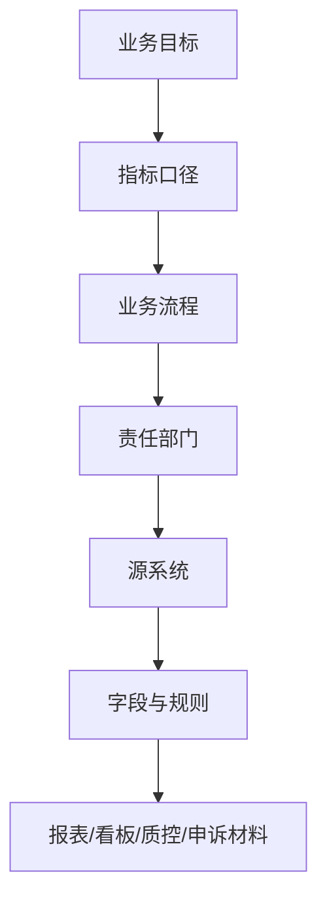
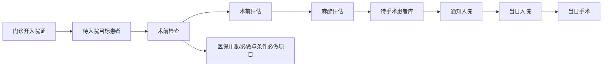
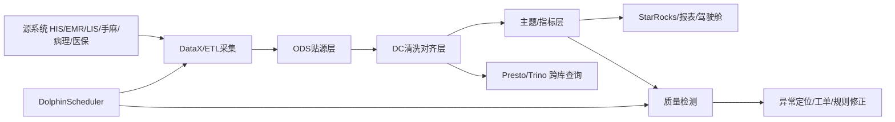
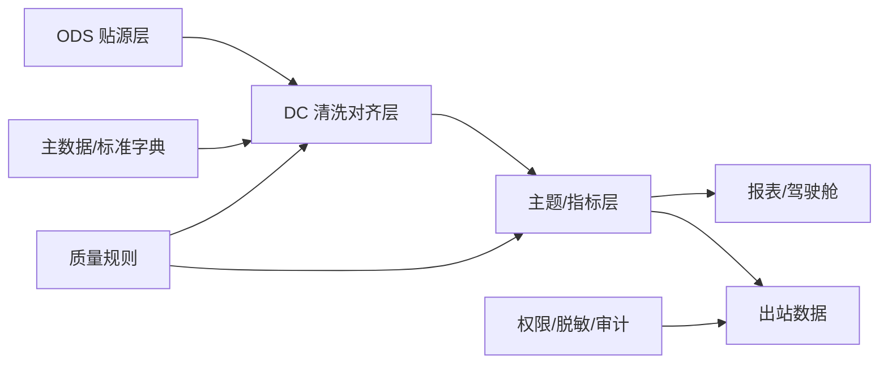

# 以毛笔骨架理解医院数据血缘：业务血缘与技术血缘的起承转合

## PPT 说明

- 学习材料来源：`医保政策及DRG付费机制讨论.pdf`、`医院信息化建设复盘与规划.pdf`、`智能纪要：当日入院当日手术项目复盘 2026年3月20日.pdf`、`智能纪要：医保业务问题分析与未来规划 2026年4月17日.pdf`
- 毛笔理论来源：`z-间接骨架/毛笔书法核心理论：间接骨架与间架结构解析-临摹.txt`
- 项目实践来源：`.trace`、手麻/病理/输血/DC/LIS 等 SQL、质量检测 SQL、DataX/DolphinScheduler/Presto/StarRocks 相关记录
- 本版组织原则：不讲 SQL 生成过程，按**业务血缘**与**技术血缘**组织；用毛笔书法的“骨、肉、筋、血”和“起承转合”解释数据治理。

---

## 第 1 页：标题页

**以毛笔骨架理解医院数据血缘**

副标题：从医保 DRG、运营管理、当日手术与当前大数据项目看业务血缘和技术血缘

关键词：  
业务血缘、技术血缘、数据治理、医保 DRG、运营驾驶舱、DataX、DolphinScheduler、Presto、StarRocks、质量检测、异常闭环

---

## 第 2 页：开场隐喻：数据血缘的“骨、肉、筋、血”

毛笔字不是只看墨迹外形。真正决定字能不能立住的，是隐藏在墨迹背后的用笔路线、受力方向和整体间架。

医院数据也是一样：报表、看板、SQL、指标数字只是外在墨迹；真正决定数据是否可信的，是背后的业务规则、字段来源、系统链路和异常反馈。

| 毛笔理论 | 数据血缘对应 | 医院场景解释 |
|----------|--------------|--------------|
| 骨 | 业务主线、指标口径、政策规则 | 指标为什么这样算 |
| 肉 | 报表、看板、SQL、结果表 | 用户看得到的数据呈现 |
| 筋 | 字段映射、表间关联、流程状态衔接 | 数据从一个环节接到下一个环节 |
| 血 | 调度更新、质量反馈、业务闭环 | 数据是否持续流动、异常能否回流 |
| 间接骨架 | 隐藏在指标背后的字段、时间口径、规则 | 不写清就会导致结果看似合理但不可解释 |
| 间架结构 | 业务层、技术层、治理层的整体布局 | 系统能否稳定支撑管理目标 |

一句话：**数据血缘不是画线，而是让医院数据“有骨、有架、有筋、有血”。**

---

## 第 3 页：起：为什么医院现在必须讲血缘

从四份学习材料看，医院信息化已经从“能取数”进入“必须解释数”的阶段。

```text
医保监管更强
  → 数据必须真实、完整、及时

DRG/DIP 付费
  → 诊断、手术、费用、分组必须可追溯

运营管理转型
  → 指标要从展示走向预测和干预

当日入院当日手术
  → 流程跨门诊、检查、麻醉、入院、手术、医保并账

医保业务线上化
  → 报错、认定、申诉、特药、外伤业务都需要证据链
```

如果没有血缘，数据项目容易停留在三种状态：

- 指标能展示，但没人解释得清
- 系统能上线，但异常时没人定位
- 数据能汇总，但业务部门不敢用、不愿用、用不久

---

## 第 4 页：起：毛笔理论给数据治理的启发

毛笔理论中有两个层次：

- **间接骨架**：单根笔画内部的运笔路线和受力方向
- **间架结构**：所有笔画组合后的空间布局、重心、主次、穿插避让

对应到数据治理：

```text
间接骨架
  → 字段来源、时间口径、状态条件、字典映射、关联键

间架结构
  → 业务目标、指标体系、数据分层、调度链路、治理闭环
```

数据治理不能只“描边”：

- 只做展示页面，是有肉无骨
- 只堆技术组件，是有架无神
- 只写 SQL 不写口径，是笔画散乱
- 只讲业务不落字段，是结构悬空

好的数据血缘，应该像好字一样：**中锋有骨，转折有筋，墨色有肉，整体有气。**

---

## 第 5 页：承：业务血缘是“主笔”

毛笔字中每个字通常有一个主笔。没有主笔，字就散。医院数据项目也一样，必须先确定业务主笔。

本 PPT 的业务主笔是：**医院管理目标如何变成可追溯、可解释、可干预的数据链路。**



业务血缘回答四个问题：

- 这个指标服务哪个管理目标？
- 这个指标的分子、分母、时间口径是什么？
- 数据来自哪个业务流程和哪个系统？
- 结果异常时，应该由哪个环节解释和整改？

---

## 第 6 页：承：医保 DRG 付费血缘

DRG/DIP 是典型的政策血缘、业务血缘和数据血缘叠加场景。

```text
患者诊疗过程
  → 主要诊断 / 其他诊断 / 主要手术操作 / 费用明细
    → DRG/DIP 分组
      → 点数 × 点值 × 调整系数
        → 医院可获得总费用
          → 结余 / 亏损 / 质量评价
```

关键理解：

- DRG/DIP 是分类工具，把临床过程相似、资源消耗相近的病例放到同一组
- 支付标准不再简单按项目累加，而是和分组点数、点值、调整系数相关
- 医院获得的是「医保基金 + 患者自付」合计后的固定支付标准
- 低风险组死亡率等质量评价也依赖 DRG 分组结果

血缘要求：

- 诊断编码要能追溯到病案首页和病历依据
- 手术操作要能追溯到手术记录、手麻记录和病案首页
- 费用结构要能追溯到医嘱、执行、收费和医保上传
- 分组结果要能反向解释亏损、结余和质量异常

---

## 第 7 页：承：医保监管与服务血缘

医保监管关注“钱有没有按规则花出去”，医保服务关注“患者和窗口能不能看懂、办成、少跑路”。两者都依赖血缘。

### 监管血缘

```text
费用清单 / 医嘱 / 病历
  → 医保编码 / 目录 / 限定支付条件
    → 规则库 / 知识库审核
      → 疑点数据
        → 扣款 / 申诉 / 整改
          → 规则更新
```

常见风险点：

- 按日收费超过住院天数
- 按小时收费超过 24 小时
- 重复收费、分解收费、分解处方
- 分解住院、挂床、过度诊疗、超量开药
- 收费项目与手术记录、治疗记录无对应描述

### 服务血缘

```text
患者报错 / 业务诉求
  → 错误码 / 接口返回 / 政策规则
    → 大白话解释
      → 后续指引 / 截图流转 / 人工处理
        → 问题归档与知识库更新
```

血缘落点：门特认定线上化、特药材料提交、外伤业务线上办理、医保报错统一解释、医保专户建设。

---

## 第 8 页：承：当日入院当日手术流程血缘

当日入院当日手术不是一个单点系统功能，而是一条跨部门流程血缘。



业务骨架：

- 三个准入：病种、患者、流程可行性
- 六个前移：检查、评估、文书、麻醉评估、手术申请等前移
- 关键标签：当日住院、当日手术、待手术患者库
- 关键难点：术前检查状态、医嘱库同步、医保并账、条件必做项目

异常血缘：

```text
无法当日手术
  → 检查未完成 / 评估未通过 / 麻醉问题
    → 医保并账问题 / 医嘱库未同步
      → 床位、排程、手术间资源不足
```

---

## 第 9 页：承：运营驾驶舱产品交付血缘

信息化复盘材料强调“以终为始”。从毛笔理论看，这是先定主笔，再安排其他笔画。

```text
管理目标
  → 指标卡片
    → 历史回顾 / 实时监测 / 未来预测
      → 资源中台
        → 策略沙盘 / 数字孪生推演
          → 干预动作
            → 结果回流与模型修正
```

运营驾驶舱不只是看过去，还要看现在和未来：

- **历史回顾**：过去发生了什么，和同期/环比/基线相比如何
- **实时监测**：当前患者、流程、资源堵点在哪里
- **未来预测**：未来一周可能发生什么，能否提前干预

资源中台是业务血缘的“中宫”：

- 患者、人力、空间、设备、床位、诊间、手术间
- 资源导向：现有资源如何分配最优
- 结果导向：目标确定后反推需要多少资源

交付原则：**成熟一个指标卡上线一个指标卡，每个指标卡都必须带来源、口径、刷新频率和责任人。**

---

## 第 10 页：转：技术血缘是“筋骨连接”

业务血缘解决“为什么算、按什么算”，技术血缘解决“从哪里来、怎么流动、哪里断了”。



技术血缘的核心对象：

- **表血缘**：源表、贴源表、清洗表、主题表、结果表
- **字段血缘**：字段来源、转换、字典映射、聚合逻辑
- **调度血缘**：任务参数、业务日期、依赖关系、重跑记录
- **质量血缘**：更新时间、空值、重复、覆盖率、异常结果
- **出站血缘**：脱敏、授权、审计、血缘指纹

---

## 第 11 页：转：DataX + DolphinScheduler 的调度血缘

项目记录中多次出现同一类问题：手工月份、`current_date`、调度日不一致，导致统计月口径错位。

正确的调度血缘应该是：

```text
DolphinScheduler 业务日期
  → ds.biz_date
    → month_range / date_ranges
      → 上月、上上月、去年同期
        → DataX 查询
          → StarRocks 结果表
```

项目内典型记录：

- 病理线上：`$[yyyy-MM-dd] → ds.biz_date → month_range → t_jcxx/mdr_income/pathology → om_bl_report_with_total`
- 输血线上：`$[yyyy-MM-dd] → ds.biz_date → LIS/BIS 时间窗 → 输血专项宽表`
- LIS/实验医学：`ds → date_ranges → lis_inspection_sample / charge / item → transport_is_experimental`

血缘价值：

- 能解释“为什么统计的是上月而不是当月”
- 能定位“调度日错、SQL 日期错、DataX 写入错、结果表没更新”
- 能支持重跑、补数和审计

---

## 第 12 页：转：ODS/DC/主题/出站的分层血缘

分层不是为了好看，而是为了让数据从源系统到应用层逐步变得可解释。



各层职责：

- **ODS**：保留源系统原貌，便于追溯
- **DC**：清洗、对齐、标准化、主数据映射
- **主题层**：按病理、输血、手麻、LIS、医嘱等业务域沉淀指标
- **应用层**：报表、驾驶舱、质控、医保申诉、运营分析
- **出站层**：标注、训练、共享、外部合作时必须带脱敏和审计

毛笔对应：ODS 是原笔，DC 是中锋归正，主题层是结体成字，应用层是整幅作品。

---

## 第 13 页：转：项目案例中的业务 + 技术血缘

### 手麻用血血缘

```text
sam_apply
  → sam_reg / sam_reg_op / sam_anar
    → sam_anar_enent(s_mzsjlb_dm='31')
      → event_text 识别血液制品
        → pub_jldw 解析单位
```

价值：去掉不存在的血制品目录表后，回到真实事件表，避免“看似合理但源头不存在”的血缘断裂。

### 病理主题血缘

```text
t_jcxx / pathology / mdr_income / mdr_peisincome / inventory_del_dets
  → DataX 月度区间
    → 病理主题指标
      → 数据质量检测与月度量对比
```

价值：多院区、多系统、多收入口径可以放到同一主题血缘里解释。

### 输血主题血缘

```text
BIS6_BLOODBAG_INPUT
  → BIS6_BLOODBAG_MATCH
    → BIS6_BLOODBAG_INFUSION
      → LIS_INSPECTION_RESULT / LIS6_INSPECT_SAMPLE
```

价值：一袋血从入库、配血、出库、输血、收费形成全链路。

### DC/HIS 回源血缘

```text
order_main
  → dstablekey/value
    → oe_orditem
      → OEORI_AdmLoc_DR / OEORI_UserDepartment_DR
        → CT_Loc
```

价值：DC 字段不满足管理口径时，可以回源 HIS 重算病区和开单人科室。

---

## 第 14 页：合：异常血缘从哪里开始排

异常不是一句“数据不对”，而是要沿血缘分层拆解。

```text
业务异常
  → 指标异常
    → 字段异常
      → 表/同步异常
        → 调度异常
          → 规则/口径异常
```

| 异常场景 | 起点 | 往下追的血缘 |
|----------|------|--------------|
| DRG 亏损异常 | 支付结果 | 费用结构 → 诊断/手术 → 分组 → 点数点值 |
| 当日手术失败 | 流程状态 | 检查 → 评估 → 麻醉 → 医保并账 → 排程资源 |
| 医保扣款 | 疑点数据 | 收费项目 → 病历依据 → 医保规则 → 申诉材料 |
| 报表不一致 | 指标结果 | 时间口径 → 字段来源 → JOIN 路径 → 调度日期 |
| 数据未更新 | 质量状态 | 结果表 → DataX → DS 调度 → 源表更新时间 |
| 结果偏小 | 指标结果 | INNER JOIN → 主键覆盖率 → 状态条件 → 院区条件 |

异常血缘的目标：**不是先改 SQL，而是先找到断点。**

---

## 第 15 页：合：血缘治理落地清单

从“有文档”到“能治理”，至少要落五类清单。

| 清单 | 内容 | 项目落点 |
|------|------|----------|
| 指标清单 | 指标名、分子分母、时间口径、筛选条件 | 运管、医保、手麻、病理、输血 |
| 字段清单 | 来源表、来源字段、字典映射、转换逻辑 | SQL 注释、字段血缘文档 |
| 调度清单 | DS 参数、DataX 源目标、业务日期、依赖 | `ds.biz_date`、上月区间、重跑 |
| 质量清单 | 更新时间、空值、重复、覆盖率、异常阈值 | 病理/LIS/输血/手麻质量检测 SQL |
| 出站清单 | 脱敏状态、授权范围、审计日志、血缘指纹 | 数据治理方案中的出站域 |

管理机制：

- 每次需求修改，同步更新 `.trace`
- 每个关键 SQL 标注业务血缘和技术血缘
- 每个异常先画血缘再改逻辑
- 每个指标上线前确认口径、来源、刷新频率和责任人
- 每个出站数据保留脱敏、授权、审计与回溯路径

---

## 第 16 页：总结：有骨、有架、有筋、有血

用毛笔理论回看医院数据血缘：

- **骨**：医保政策、DRG 规则、运营目标、流程标准，是数据项目的主笔
- **架**：ODS/DC/主题/应用/出站，是数据平台的间架结构
- **筋**：字段映射、JOIN 关系、流程状态，是不同笔画之间的连接
- **肉**：报表、看板、SQL、质量检测结果，是用户看得见的墨迹
- **血**：调度、更新、异常反馈、业务整改，是系统持续运转的气脉

最终要达到的效果：

```text
每一个指标
  → 知道服务哪个业务目标
  → 知道来自哪些表和字段
  → 知道按什么规则计算
  → 知道异常时查哪个环节
  → 知道谁负责解释和整改
```

结束语：  
**血缘清楚，数据才可信；数据可信，管理才能落地；管理能闭环，技术才真正有价值。**

---

*文档生成用于 PPT 制作；Mermaid 图在支持 Mermaid 的编辑器或 PPT 插件中可直接渲染。*
