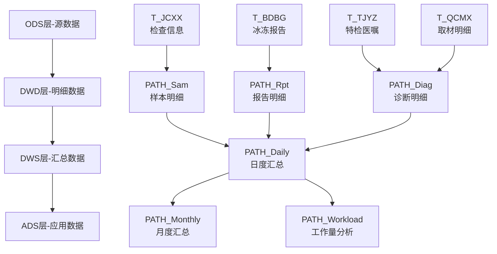

# 病理主题数据架构设计方案

## 1. 概述

### 1.1 方案目标
建立病理科数据仓库主题域，支持病理科工作量统计、质量分析、绩效考核等业务需求，构建以"登记次数"为核心的统一工作量指标体系。

### 1.2 业务范围
- 样本检测管理
- 报告签发流程
- 工作量统计分析
- 质量控制监测
- 绩效考核支撑

### 1.3 设计原则
- **统一计量**：所有工作量按"登记次数"统一计算
- **数据驱动**：基于真实业务数据进行指标设计
- **可扩展性**：支持未来业务发展和指标扩展
- **标准化**：符合医院数据治理规范

## 2. 源系统表结构

### 2.1 核心业务表

#### 2.1.1 T_JCXX (检查信息表)
**功能**：病理检查核心信息表，记录从样本接收到报告签发的完整流程

| 字段名 | 字段类型 | 字段说明 | 备注 |
|--------|---------|----------|------|
| F_BLH | VARCHAR(20) | 病理号 | 主键 |
| F_BRBH | VARCHAR(40) | 病人编号 | 就诊卡号 |
| F_XM | VARCHAR(20) | 姓名 | |
| F_SDRQ | VARCHAR(20) | 收到日期 | 工作量统计关键字段 |
| F_JSY | VARCHAR(20) | 接收员 | |
| F_BGYS | VARCHAR(20) | 报告医生 | 工作量统计关键字段 |
| F_SHYS | VARCHAR(20) | 审核医生 | |
| F_BGRQ | VARCHAR(20) | 报告日期 | 工作量统计关键字段 |
| F_BGZT | VARCHAR(10) | 报告状态 | 已登记/已取材/已包埋/已制片/报告延期/已写报告/已审核 |
| F_CKZS | INT | 材块总数 | 和取材的工作量有关 |

#### 2.1.2 T_BDBG (冰冻报告表)
**功能**：冰冻报告专用表，记录冰冻病理报告信息

| 字段名 | 字段类型 | 字段说明 | 备注 |
|--------|---------|----------|------|
| F_ID | INT | 主键 | 递增+1 |
| F_BLH | VARCHAR(20) | 病理号 | 关联主表 |
| F_BD_BGYS | VARCHAR(30) | 冰冻报告医生 | 工作量统计关键字段 |
| F_BD_BGRQ | VARCHAR(20) | 冰冻报告日期 | 工作量统计关键字段 |
| F_BD_BGZT | VARCHAR(10) | 冰冻报告状态 | |
| F_BDZD | VARCHAR(200) | 冰冻诊断 | |

#### 2.1.3 T_TJYZ (特检医嘱表)
**功能**：特殊检查医嘱表，记录免疫组化等特检项目

| 字段名 | 字段类型 | 字段说明 | 备注 |
|--------|---------|----------|------|
| F_ID | INT | 主键 | |
| F_BLH | VARCHAR(20) | 病理号 | |
| F_TJYZH | VARCHAR(30) | 特检医嘱号 | |
| F_YZLX | VARCHAR(20) | 医嘱类型 | 免疫组化等 |
| F_SQYS | VARCHAR(20) | 申请医生 | |
| F_SQSJ | VARCHAR(20) | 申请时间 | 工作量统计关键字段 |
| F_YZZT | VARCHAR(10) | 医嘱状态 | |

#### 2.1.4 T_QCMX (取材明细表)
**功能**：取材明细信息，记录诊断医生工作

| 字段名 | 字段类型 | 字段说明 | 备注 |
|--------|---------|----------|------|
| F_ID | INT | 主键 | |
| F_BLH | VARCHAR(20) | 病理号 | |
| F_QCYS | VARCHAR(20) | 取材医生 | 工作量统计关键字段 |
| F_QCRQ | VARCHAR(20) | 取材日期 | 工作量统计关键字段 |
| F_ZZMC | VARCHAR(50) | 组织名称 | |

## 3. 数据分层架构

### 3.1 数据分层设计



### 3.2 DWD层设计 (明细数据层)

#### 3.2.1 PATH_Sam (样本明细表)
```sql
CREATE TABLE DC_PATH_Sam (
    PATH_Sam_ID VARCHAR(50) PRIMARY KEY,           -- 样本ID
    PATH_Sam_PatientID VARCHAR(50),                -- 患者ID
    PATH_Sam_VisitID VARCHAR(50),                  -- 就诊ID
    PATH_Sam_SampleNo VARCHAR(50),                 -- 样本编号(病理号)
    PATH_Sam_ReceiveDate DATE,                     -- 接收日期
    PATH_Sam_ReceiveTime TIME,                     -- 接收时间
    PATH_Sam_Receiver VARCHAR(50),                 -- 接收员
    PATH_Sam_SampleType VARCHAR(50),               -- 样本类型
    PATH_Sam_Status VARCHAR(20),                   -- 样本状态
    PATH_Sam_IsDeleted TINYINT DEFAULT 0,          -- 删除标识
    PATH_Sam_CreateTime DATETIME DEFAULT NOW(),    -- 创建时间
    PATH_Sam_UpdateTime DATETIME DEFAULT NOW()     -- 更新时间
);
```

#### 3.2.2 PATH_Rpt (报告明细表)
```sql
CREATE TABLE DC_PATH_Rpt (
    PATH_Rpt_ID VARCHAR(50) PRIMARY KEY,           -- 报告ID
    PATH_Rpt_SampleID VARCHAR(50),                 -- 样本ID
    PATH_Rpt_Type VARCHAR(20),                     -- 报告类型(冰冻/常规/免疫组化)
    PATH_Rpt_ReportDoctor VARCHAR(50),             -- 报告医生
    PATH_Rpt_ReportDate DATE,                      -- 报告日期
    PATH_Rpt_ReportTime TIME,                      -- 报告时间
    PATH_Rpt_ReportStatus VARCHAR(20),             -- 报告状态
    PATH_Rpt_Diagnosis TEXT,                       -- 诊断内容
    PATH_Rpt_IsDeleted TINYINT DEFAULT 0,          -- 删除标识
    PATH_Rpt_CreateTime DATETIME DEFAULT NOW(),    -- 创建时间
    PATH_Rpt_UpdateTime DATETIME DEFAULT NOW()     -- 更新时间
);
```

#### 3.2.3 PATH_Diag (诊断明细表)
```sql
CREATE TABLE DC_PATH_Diag (
    PATH_Diag_ID VARCHAR(50) PRIMARY KEY,          -- 诊断ID
    PATH_Diag_SampleID VARCHAR(50),                -- 样本ID
    PATH_Diag_Type VARCHAR(20),                    -- 诊断类型
    PATH_Diag_Doctor VARCHAR(50),                  -- 诊断医生
    PATH_Diag_Date DATE,                           -- 诊断日期
    PATH_Diag_Time TIME,                           -- 诊断时间
    PATH_Diag_Content TEXT,                        -- 诊断内容
    PATH_Diag_IsDeleted TINYINT DEFAULT 0,         -- 删除标识
    PATH_Diag_CreateTime DATETIME DEFAULT NOW(),   -- 创建时间
    PATH_Diag_UpdateTime DATETIME DEFAULT NOW()    -- 更新时间
);
```

### 3.3 DWS层设计 (汇总数据层)

#### 3.3.1 日度工作量汇总表
```sql
CREATE TABLE DC_PATH_DailyWorkload (
    统计日期 DATE PRIMARY KEY,
    
    -- 各类工作量（登记次数）
    送检工作量 INT DEFAULT 0,                      -- 每个样本登记 = 1个工作量
    冰冻签发工作量 INT DEFAULT 0,                  -- 每个冰冻报告签发 = 1个工作量
    常规签发工作量 INT DEFAULT 0,                  -- 每个常规报告签发 = 1个工作量
    免疫组化签发工作量 INT DEFAULT 0,              -- 每个免疫组化报告签发 = 1个工作量
    诊断医生工作量 INT DEFAULT 0,                  -- 每个诊断登记 = 1个工作量
    
    -- 总工作量
    总工作量 INT DEFAULT 0,                        -- 上述5项加总
    
    -- 统计时间
    更新时间 DATETIME DEFAULT NOW()
);
```

## 4. 月度工作量指标设计

### 4.1 统一工作量计算原则

**核心原则**：登记了就是1个工作量，不区分复杂度，只计算登记次数

### 4.2 工作量分类及计算规则

#### 4.2.1 送检工作量
- **计算逻辑**：每个样本登记 = 1个工作量
- **数据来源**：`PATH_Sam` 表
- **统计字段**：`COUNT(DISTINCT PATH_Sam_ID)`
- **过滤条件**：`PATH_Sam_IsDeleted = 0`
- **业务含义**：反映病理科样本接收处理能力

#### 4.2.2 冰冻签发工作量  
- **计算逻辑**：每个冰冻报告签发 = 1个工作量
- **数据来源**：`PATH_Rpt` 表
- **统计字段**：`COUNT(DISTINCT PATH_Rpt_ID)`
- **过滤条件**：`PATH_Rpt_Type = '冰冻' AND PATH_Rpt_ReportStatus = '已签发'`
- **业务含义**：反映冰冻病理快速诊断能力

#### 4.2.3 常规签发工作量
- **计算逻辑**：每个常规报告签发 = 1个工作量  
- **数据来源**：`PATH_Rpt` 表
- **统计字段**：`COUNT(DISTINCT PATH_Rpt_ID)`
- **过滤条件**：`PATH_Rpt_Type = '常规' AND PATH_Rpt_ReportStatus = '已签发'`
- **业务含义**：反映常规病理诊断工作量

#### 4.2.4 免疫组化签发工作量
- **计算逻辑**：每个免疫组化报告签发 = 1个工作量
- **数据来源**：`PATH_Rpt` 表  
- **统计字段**：`COUNT(DISTINCT PATH_Rpt_ID)`
- **过滤条件**：`PATH_Rpt_Type = '免疫组化' AND PATH_Rpt_ReportStatus = '已签发'`
- **业务含义**：反映特殊染色和免疫组化检测工作量

#### 4.2.5 诊断医生工作量
- **计算逻辑**：每个诊断登记 = 1个工作量
- **数据来源**：`PATH_Diag` 表
- **统计字段**：`COUNT(DISTINCT PATH_Diag_ID)`
- **过滤条件**：`PATH_Diag_IsDeleted = 0`
- **业务含义**：反映医生诊断分析工作量

### 4.3 月度汇总计算SQL

```sql
-- 病理科月度工作量汇总表
CREATE TABLE DC_PATH_MonthlyWorkload AS
SELECT 
    YEAR(统计日期) AS 年份,
    MONTH(统计日期) AS 月份,
    CONCAT(YEAR(统计日期), '-', LPAD(MONTH(统计日期), 2, '0')) AS 年月,
    
    -- 各类工作量（登记次数）
    SUM(送检工作量) AS 送检工作量,
    SUM(冰冻签发工作量) AS 冰冻签发工作量,
    SUM(常规签发工作量) AS 常规签发工作量,
    SUM(免疫组化签发工作量) AS 免疫组化签发工作量,
    SUM(诊断医生工作量) AS 诊断医生工作量,
    
    -- 总工作量（所有类型加总）
    SUM(送检工作量 + 冰冻签发工作量 + 常规签发工作量 + 免疫组化签发工作量 + 诊断医生工作量) AS 总工作量,
    
    -- 工作量结构占比
    ROUND(SUM(送检工作量) * 100.0 / SUM(送检工作量 + 冰冻签发工作量 + 常规签发工作量 + 免疫组化签发工作量 + 诊断医生工作量), 2) AS 送检工作量占比,
    ROUND(SUM(冰冻签发工作量) * 100.0 / SUM(送检工作量 + 冰冻签发工作量 + 常规签发工作量 + 免疫组化签发工作量 + 诊断医生工作量), 2) AS 冰冻签发工作量占比,
    ROUND(SUM(常规签发工作量) * 100.0 / SUM(送检工作量 + 冰冻签发工作量 + 常规签发工作量 + 免疫组化签发工作量 + 诊断医生工作量), 2) AS 常规签发工作量占比,
    ROUND(SUM(免疫组化签发工作量) * 100.0 / SUM(送检工作量 + 冰冻签发工作量 + 常规签发工作量 + 免疫组化签发工作量 + 诊断医生工作量), 2) AS 免疫组化签发工作量占比,
    ROUND(SUM(诊断医生工作量) * 100.0 / SUM(送检工作量 + 冰冻签发工作量 + 常规签发工作量 + 免疫组化签发工作量 + 诊断医生工作量), 2) AS 诊断医生工作量占比,
    
    -- 统计时间
    NOW() AS 更新时间
    
FROM DC_PATH_DailyWorkload  -- 基于日度工作量表汇总
GROUP BY YEAR(统计日期), MONTH(统计日期)
ORDER BY 年份, 月份;
```

### 4.4 月度指标表结构

| 字段名 | 数据类型 | 说明 |
|--------|---------|------|
| 年份 | INT | 统计年份 |
| 月份 | INT | 统计月份 |
| 年月 | VARCHAR(7) | 年月格式(YYYY-MM) |
| 送检工作量 | INT | 月度送检登记次数 |
| 冰冻签发工作量 | INT | 月度冰冻报告签发次数 |
| 常规签发工作量 | INT | 月度常规报告签发次数 |
| 免疫组化签发工作量 | INT | 月度免疫组化报告签发次数 |
| 诊断医生工作量 | INT | 月度诊断登记次数 |
| **总工作量** | **INT** | **月度总工作量（上述5项加总）** |
| 送检工作量占比 | DECIMAL(5,2) | 送检工作量在总工作量中占比(%) |
| 冰冻签发工作量占比 | DECIMAL(5,2) | 冰冻签发工作量占比(%) |
| 常规签发工作量占比 | DECIMAL(5,2) | 常规签发工作量占比(%) |
| 免疫组化签发工作量占比 | DECIMAL(5,2) | 免疫组化签发工作量占比(%) |
| 诊断医生工作量占比 | DECIMAL(5,2) | 诊断医生工作量占比(%) |
| 更新时间 | DATETIME | 数据更新时间 |

## 5. 数据集成方案

### 5.1 日度ETL流程

```sql
-- 日度工作量统计SQL
INSERT INTO DC_PATH_DailyWorkload (
    统计日期,
    送检工作量,
    冰冻签发工作量,
    常规签发工作量,
    免疫组化签发工作量,
    诊断医生工作量,
    总工作量
)
SELECT 
    CURRENT_DATE AS 统计日期,
    
    -- 送检工作量：当日样本登记数
    (SELECT COUNT(DISTINCT s.PATH_Sam_ID) 
     FROM DC_PATH_Sam s 
     WHERE DATE(s.PATH_Sam_ReceiveDate) = CURRENT_DATE 
     AND s.PATH_Sam_IsDeleted = 0) AS 送检工作量,
    
    -- 冰冻签发工作量：当日冰冻报告签发数
    (SELECT COUNT(DISTINCT r.PATH_Rpt_ID) 
     FROM DC_PATH_Rpt r 
     WHERE DATE(r.PATH_Rpt_ReportDate) = CURRENT_DATE 
     AND r.PATH_Rpt_Type = '冰冻' 
     AND r.PATH_Rpt_ReportStatus = '已签发') AS 冰冻签发工作量,
    
    -- 常规签发工作量：当日常规报告签发数
    (SELECT COUNT(DISTINCT r.PATH_Rpt_ID) 
     FROM DC_PATH_Rpt r 
     WHERE DATE(r.PATH_Rpt_ReportDate) = CURRENT_DATE 
     AND r.PATH_Rpt_Type = '常规' 
     AND r.PATH_Rpt_ReportStatus = '已签发') AS 常规签发工作量,
    
    -- 免疫组化签发工作量：当日免疫组化报告签发数
    (SELECT COUNT(DISTINCT r.PATH_Rpt_ID) 
     FROM DC_PATH_Rpt r 
     WHERE DATE(r.PATH_Rpt_ReportDate) = CURRENT_DATE 
     AND r.PATH_Rpt_Type = '免疫组化' 
     AND r.PATH_Rpt_ReportStatus = '已签发') AS 免疫组化签发工作量,
    
    -- 诊断医生工作量：当日诊断登记数
    (SELECT COUNT(DISTINCT d.PATH_Diag_ID) 
     FROM DC_PATH_Diag d 
     WHERE DATE(d.PATH_Diag_Date) = CURRENT_DATE 
     AND d.PATH_Diag_IsDeleted = 0) AS 诊断医生工作量,
    
    -- 总工作量（通过触发器或存储过程计算）
    0 AS 总工作量

ON DUPLICATE KEY UPDATE
    送检工作量 = VALUES(送检工作量),
    冰冻签发工作量 = VALUES(冰冻签发工作量),
    常规签发工作量 = VALUES(常规签发工作量),
    免疫组化签发工作量 = VALUES(免疫组化签发工作量),
    诊断医生工作量 = VALUES(诊断医生工作量),
    总工作量 = VALUES(送检工作量) + VALUES(冰冻签发工作量) + VALUES(常规签发工作量) + VALUES(免疫组化签发工作量) + VALUES(诊断医生工作量),
    更新时间 = NOW();
```

### 5.2 月度汇总流程

```sql
-- 月度工作量汇总存储过程
DELIMITER //
CREATE PROCEDURE sp_PATH_MonthlyWorkloadSummary(IN target_year INT, IN target_month INT)
BEGIN
    -- 删除当月已有数据
    DELETE FROM DC_PATH_MonthlyWorkload 
    WHERE 年份 = target_year AND 月份 = target_month;
    
    -- 插入当月汇总数据
    INSERT INTO DC_PATH_MonthlyWorkload
    SELECT 
        target_year AS 年份,
        target_month AS 月份,
        CONCAT(target_year, '-', LPAD(target_month, 2, '0')) AS 年月,
        SUM(送检工作量) AS 送检工作量,
        SUM(冰冻签发工作量) AS 冰冻签发工作量,
        SUM(常规签发工作量) AS 常规签发工作量,
        SUM(免疫组化签发工作量) AS 免疫组化签发工作量,
        SUM(诊断医生工作量) AS 诊断医生工作量,
        SUM(总工作量) AS 总工作量,
        ROUND(SUM(送检工作量) * 100.0 / SUM(总工作量), 2) AS 送检工作量占比,
        ROUND(SUM(冰冻签发工作量) * 100.0 / SUM(总工作量), 2) AS 冰冻签发工作量占比,
        ROUND(SUM(常规签发工作量) * 100.0 / SUM(总工作量), 2) AS 常规签发工作量占比,
        ROUND(SUM(免疫组化签发工作量) * 100.0 / SUM(总工作量), 2) AS 免疫组化签发工作量占比,
        ROUND(SUM(诊断医生工作量) * 100.0 / SUM(总工作量), 2) AS 诊断医生工作量占比,
        NOW() AS 更新时间
    FROM DC_PATH_DailyWorkload
    WHERE YEAR(统计日期) = target_year 
    AND MONTH(统计日期) = target_month;
    
END //
DELIMITER ;
```

## 6. 应用场景

### 6.1 绩效考核
- **科室绩效**：基于总工作量进行科室业绩评估
- **个人绩效**：基于医生各类工作量进行个人考核
- **工作量对比**：同期工作量对比分析
- **效率分析**：工作量增长趋势分析

### 6.2 管理决策
- **资源配置**：根据工作量分布优化人员配置
- **流程优化**：识别工作量瓶颈环节
- **质量管控**：工作量与质量指标关联分析
- **成本控制**：工作量成本效益分析

### 6.3 运营分析
- **业务监控**：实时监控各类工作量变化
- **预警机制**：工作量异常预警
- **趋势分析**：工作量增长趋势预测
- **对标分析**：与同级医院工作量对比

## 7. 数据质量控制

### 7.1 数据一致性检查
```sql
-- 工作量数据一致性检查
SELECT 
    统计日期,
    送检工作量 + 冰冻签发工作量 + 常规签发工作量 + 免疫组化签发工作量 + 诊断医生工作量 AS 计算总工作量,
    总工作量 AS 记录总工作量,
    CASE 
        WHEN 送检工作量 + 冰冻签发工作量 + 常规签发工作量 + 免疫组化签发工作量 + 诊断医生工作量 = 总工作量 
        THEN '一致' 
        ELSE '不一致' 
    END AS 数据一致性检查
FROM DC_PATH_DailyWorkload
WHERE 统计日期 >= DATE_SUB(NOW(), INTERVAL 30 DAY)
AND 送检工作量 + 冰冻签发工作量 + 常规签发工作量 + 免疫组化签发工作量 + 诊断医生工作量 != 总工作量;
```

### 7.2 异常数据监控
```sql
-- 工作量异常数据监控
SELECT 
    统计日期,
    总工作量,
    LAG(总工作量, 1) OVER (ORDER BY 统计日期) AS 前日工作量,
    ABS(总工作量 - LAG(总工作量, 1) OVER (ORDER BY 统计日期)) AS 变化量,
    CASE 
        WHEN ABS(总工作量 - LAG(总工作量, 1) OVER (ORDER BY 统计日期)) > 
             LAG(总工作量, 1) OVER (ORDER BY 统计日期) * 0.5
        THEN '异常波动'
        ELSE '正常'
    END AS 异常标识
FROM DC_PATH_DailyWorkload
WHERE 统计日期 >= DATE_SUB(NOW(), INTERVAL 30 DAY)
ORDER BY 统计日期 DESC;
```

## 8. 实施计划

### 8.1 第一阶段（数据基础建设）
- **时间**：1-2周
- **内容**：
  - 完成ODS层数据抽取
  - 建立DWD层明细表
  - 建立基础数据质量监控

### 8.2 第二阶段（指标体系建设）
- **时间**：2-3周  
- **内容**：
  - 建立DWS层汇总表
  - 实现日度工作量统计
  - 实现月度工作量汇总

### 8.3 第三阶段（应用服务建设）
- **时间**：3-4周
- **内容**：
  - 开发ADS层应用表
  - 建立BI报表
  - 提供API接口服务

## 9. 关键特点总结

### 9.1 统一计量标准
- **简单直观**：工作量计算逻辑清晰
- **公平合理**：不区分业务复杂度，按登记次数统一计量
- **易于对比**：不同类型工作量可以直接相加比较
- **便于考核**：为绩效考核提供量化依据

### 9.2 数据架构优势
- **分层清晰**：ODS→DWD→DWS→ADS四层架构
- **扩展性强**：支持未来新增工作量类型
- **性能优化**：基于日度汇总的月度统计
- **质量可控**：多层次数据质量检查

### 9.3 业务价值
- **精细化管理**：提供详细的工作量分析维度
- **决策支持**：为管理层提供量化决策依据
- **绩效透明**：建立公开透明的绩效考核体系
- **持续改进**：支持业务流程优化和效率提升 