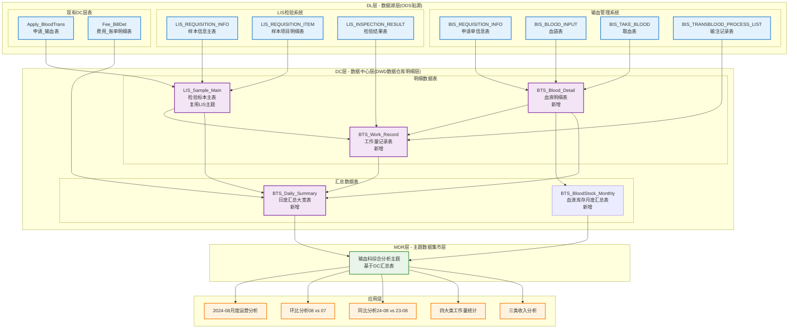
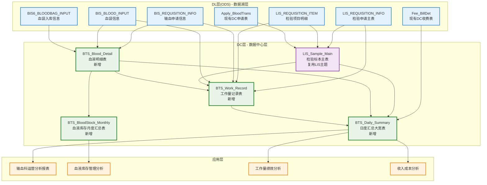

# 输血科报表主题数据架构设计方案

## 一、总体架构概述

基于现有DL -> DC -> MDR的三层架构，针对输血科2024年8月运营分析业务需求设计完整的数据流向，整合LIS检验系统和输血管理系统数据，支持环比同比分析：



### 1.1 数据分层说明

| 数据层级 | 数据类型 | 表名举例 | 数据来源 | 数据特点 |
|---------|----------|----------|----------|----------|
| **DL层(ODS)** | 贴源数据 | BIS_REQUISITION_INFO、LIS_REQUISITION_INFO | 输血+LIS系统直接复制 | 保持源系统原始结构，双系统整合 |
| **DC层-明细** | 明细数据 | BTS_Sample_Main、BTS_Blood_Detail | DL层集成处理 | 标准化字段、多医院统一、原子粒度 |
| **DC层-汇总** | 汇总数据 | BTS_Daily_Summary | DC明细表聚合 | 按维度预聚合，提升查询性能 |
| **MDR层** | 主题数据 | MDR_BTS_Monthly_Summary | DC层数据整合 | 面向月度分析的宽表，支持环比同比 |

### 1.2 核心业务需求

**业务目标**：
- 通过对比输血科2024-08与2024-07（环比）、与2023-08（同比）关键指标
- 评估科室运营效率及成本结构，为优化资源配置和费用管控提供决策支持

**使用人群**：院领导、输血科主任、运营管理组、财务分析组  
**时间粒度**：月度对比分析，包括当月、环比、同比  
**统计范围**：输血科整体运行数据，包含样本处理、检测项目、人工作业、血液收支及物料支出

### 1.3 设计理念对标现有DC架构

通过分析现有`Apply_BloodTrans`等DC表，输血科主题严格遵循以下设计风格：

1. **命名规范一致性**：`BTS_表名_字段名`格式，如`BTS_Sample_Main_SampleID`
2. **字段类型标准化**：ID统一使用VARCHAR(60)，金额使用FLOAT8，时间使用timestamp
3. **数据完整性**：每个事实表都包含完整的维度信息（机构、人员、就诊等）
4. **扩展性设计**：预留扩展字段(ExtStr1-6, ExtNum1-2, ExtDate1-2)
5. **元数据管理**：包含数据来源标识、创建时间、更新时间等字段

### 1.4 核心指标体系

#### 1.4.1 基础指标定义

| 指标类别 | 指标名称 | 指标内涵 | 最小粒度 | 计算方式 | 数据来源 |
|---------|----------|----------|----------|----------|----------|
| **样本数量** | 样本数 | 接收的所有要检测的样本和输血申请 | 单个样本 | COUNT(DISTINCT 样本ID) | 输血+LIS系统统计 |
| **检测项目** | 检测/项目数 | 检测的项目数（详见子项目分类） | 单个检测项目 | 按检验目的明细统计 | 输血+LIS系统统计 |

#### 1.4.2 检测项目明细分类

| 子项目 | 指标内涵 | 计算方式 | 数据来源(LIS项目编码) |
|--------|----------|----------|----------------------|
| **血型检测** | 患者血型检测+献血员血型复查 | 项目计数 | LIS07068、LIS05、LIS0300255、LIS0300114 |
| **抗体筛查** | 患者抗体筛查 | 项目计数 | LIS07073血型单特异性抗体鉴定 |
| **交叉配血** | 根据用血紧急程度选择相应方法配血 | 项目计数 | LIS07156、LIS07157、LIS07153 |
| **直接抗人球蛋白试验** | 直抗检测 | 项目计数 | LIS07079直接抗人球蛋白试验 |
| **疑难样本** | 疑难血型及抗筛阳性鉴定 | 项目计数 | LIS07072、LIS07074、LIS07075、LIS07077 |
| **血小板交叉配血** | 血小板交叉配合试验 | 项目计数 | LIS026801血小板交叉配合试验 |
| **血小板抗体检测** | 血小板特异性和HLA抗体检测 | 项目计数 | LIS026797血小板特异性抗体检测 |
| **抗体效价** | 移植前后患者血型抗体效价检测 | 项目计数 | LIS030072、LIS030073、LIS030075 |
| **Rh分型** | Rh血型系统主要抗原检测 | 项目计数 | LIS028043 Rh分型 |

#### 1.4.3 四大类工作量统计

| 工作量类别 | 指标名称 | 指标内涵 | 最小粒度 | 计算方式 | 数据来源 |
|------------|----------|----------|----------|----------|----------|
| **样本检测工作量** | 样本检测 | 上述检测项目操作总量 | 单次检测操作 | SUM(检测操作次数) | LIS系统操作记录 |
| **临床用血工作量** | 血液预约次数 | 血液预约 | 单次预约 | COUNT(预约记录) | 血站约血系统 |
| | 血液入库(袋) | 血液验收、入库、留样本、存放库位 | 单袋入库 | COUNT(入库袋数) | 输血系统统计 |
| | 血液出库(袋) | 血液出库、外观检测、核对 | 单袋出库 | COUNT(出库袋数) | 输血系统统计 |
| | 血液盘存(袋) | 每周一盘点所有血液库存 | 单次盘存 | COUNT(盘存记录) | 输血系统统计 |
| | 血浆/冷沉淀融化(袋) | 发放前水浴融解处理 | 单袋融化 | COUNT(融化袋数) | 输血系统统计 |
| **输血治疗工作量** | 全血采集 | 血液稀释疗法及自体全血储存 | 单次采集 | COUNT(采集次数) | HIS医嘱：666600613、666000570等 |
| | 血浆置换 | 全血置换、淋巴血浆置换等 | 单次置换 | COUNT(置换次数) | HIS医嘱：666600598 |
| | 血液单采 | PRP采集、红细胞单采、血小板单采 | 单次单采 | COUNT(单采次数) | HIS医嘱：666000510 |
| **血液管理工作量** | 输血管理 | 合理用血评估、输血病历抽查、不良反应调查 | 单次管理操作 | COUNT(管理操作) | 质控岗考核指标 |

#### 1.4.4 三类收入与支出

| 指标类别 | 指标名称 | 指标内涵 | 最小粒度 | 计算方式 | 数据来源 |
|---------|----------|----------|----------|----------|----------|
| **收入** | 配血检收入 | 样本检测收入 | 单笔收费记录 | 按收费项目名称筛选检验相关费用 | 现有Fee_BillDet表 |
| | 血费收入 | 血液收入 | 单笔血液费用 | 按收费项目名称筛选血液相关费用 | 现有Fee_BillDet表 |
| | 输血治疗收入 | 输血治疗项目收入 | 单笔治疗费用 | 按收费项目名称筛选治疗相关费用 | 现有Fee_BillDet表 |
| **支出** | 血费支出 | 血液成本支出 | 单笔血液成本 | 血站结算清单费用 | 血站系统 |
| | 试剂支出 | 试剂支出 | 单笔试剂费用 | 试剂库订单费用 | 试剂库系统 |

## 二、DC层原子指标设计原则

### 2.1 设计理念严格对标现有DC架构

通过分析现有`Apply_BloodTrans`、`Fee_BillDet`等DC表，输血科主题严格遵循以下设计风格：

1. **命名规范一致性**：`BTS_表名_字段名`格式，如`BTS_Sample_Main_SampleID`，对标`Apply_BloodTrans_ApplyID`
2. **字段类型标准化**：ID统一使用VARCHAR(60)，金额使用FLOAT8，时间使用timestamp，与现有DC表保持一致
3. **数据完整性**：每个事实表都包含完整的维度信息（机构、人员、就诊、科室等），对标`Apply_BloodTrans`设计
4. **扩展性设计**：预留扩展字段(ExtStr1-6, ExtNum1-2, ExtDate1-2)，与现有DC架构统一
5. **元数据管理**：包含DataSourceFlag、DSTable、IsDeleted、LastUpdateDtTm等标准字段

### 2.2 原子指标最小粒度说明

| 业务域 | 原子指标 | 最小统计粒度 | 支持聚合维度 | 设计原因 | 对标现有DC表 |
|--------|----------|-------------|-------------|----------|-------------|
| **样本域** | 样本数量 | 单个样本(样本ID) | 日期/科室/血液类型/检测类型 | 每个条码对应一个独立样本，是业务最小单元 | 类似Apply_BloodTrans按申请单粒度 |
| **血液域** | 血液数量 | 单个血袋(血袋编号) | 日期/血液类型/血液状态/来源机构 | 每个血袋是血液管理的最小单位 | 新增血液管理维度 |
| **检验域** | 检验项目数 | 单个检验项目(检验ID+项目ID) | 日期/检验类型/检验人员/检验状态 | 每个检验项目是独立的检测单元 | 扩展Apply_BloodTrans检验维度 |
| **工作量域** | 操作次数 | 单次操作行为(操作ID) | 日期/操作类型/操作人员/工作内容 | 每次操作都是独立的工作量单元 | 新增工作量统计维度 |
| **收入域** | 收费金额 | 单笔收费记录(Fee_BillDet_BillDetID) | 日期/收费项目/收费类型/科室 | 复用现有Fee_BillDet表，避免重复设计 | 直接复用Fee_BillDet |

### 2.3 明细数据vs汇总数据设计原则

**明细数据表设计原则**：
- 基于业务最小粒度设计（单个样本、单个血袋、单次操作）
- 直接从DL层集成，支持多医院多院区统一管理
- 包含完整业务上下文信息，支持任意维度聚合
- 遵循现有DC架构的命名和字段标准

**汇总数据表设计原则**：
- 基于DC明细数据按维度预聚合
- 提升查询性能，减少实时计算压力
- 支持常见分析场景的快速响应
- 数据源完全来自DC层，不直接依赖DL层

### 2.4 DC层设计优势

- **原子性**：每个事实都可以拆解到最小业务单元，支持任意粒度聚合
- **一致性**：统一的数据模型确保跨域指标计算的准确性，与现有DC架构风格一致
- **完整性**：保留完整的业务上下文信息，支持复杂分析需求
- **扩展性**：标准化设计便于后续业务拓展和维护
- **复用性**：充分利用现有DC层表（如Fee_BillDet），避免重复建设 

## 三、数据血缘关系设计

### 3.1 DL层数据源（已有）

#### 3.1.1 输血管理系统表（主要数据源）
- **BIS_REQUISITION_INFO**（申请单信息表）- 输血申请数据源，包含申请基础信息
- **BIS_BLOOD_INPUT**（血袋表）- 血液库存数据源，包含血袋入库出库信息
- **BIS6_BLOODBAG_INPUT**（血袋入库表）- 血库信息数据源，AREA_ID字段包含血库代码（A001本院/A002温江/A003天府/A004锦江）
- **BIS_TAKE_BLOOD**（取血表）- 血液发放数据源，包含血液配发记录
- **BIS_TRANSBLOOD_PROCESS_LIST**（输注记录表）- 输血执行数据源，包含输注过程记录

#### 3.1.2 LIS检验系统表（关键数据源）
- **LIS_REQUISITION_INFO**（样本信息主表）- 输血相关检验申请数据源
- **LIS_REQUISITION_ITEM**（样本项目明细表）- 血型检测、抗体筛查等项目数据源
- **LIS_INSPECTION_RESULT**（检验结果信息表）- 检验结果数据源，用于工作量统计

#### 3.1.3 现有DC层表（复用数据源）
- **Apply_BloodTrans**（申请_输血表）- 已标准化的输血申请统一数据模型，可直接使用
- **Fee_BillDet**（费用_账单明细表）- 已标准化的收费数据模型，用于收入指标计算
- **LIS_Sample_Main**（检验标本主表）- 已标准化的检验标本数据模型，用于输血相关检验样本统计

#### 3.1.4 其他系统表
- **HIS医嘱系统**- 输血治疗项目数据源（血浆置换、血液单采等医嘱）
- **血站系统**- 血液成本数据源，用于血费支出计算
- **试剂库系统**- 试剂成本数据源，用于试剂支出计算

### 3.2 DC层设计（符合现有DC架构风格）

#### 3.2.1 明细数据表设计（DL->DC直接集成）

##### A. LIS_Sample_Main（检验标本主表）**复用LIS主题**

**表设计说明**：直接复用已有的LIS主题中的 `LIS_Sample_Main` 检验标本主表，该表已包含输血相关检验样本的完整信息。

**输血相关数据筛选条件**：
```sql
-- 筛选输血相关样本的条件
WHERE LIS_Sample_Main_TestPurpose LIKE '%血型%' 
   OR LIS_Sample_Main_TestPurpose LIKE '%配血%' 
   OR LIS_Sample_Main_TestPurpose LIKE '%抗体%'
   OR LIS_Sample_Main_TestPurpose LIKE '%输血%'
   OR LIS_Sample_Main_ItemCode IN ('LIS07068', 'LIS05', 'LIS07073', 'LIS07156', 'LIS07157', 'LIS07153')
```

**关键字段说明**：
| 字段名 | 用途说明 |
|--------|----------|
| LIS_Sample_Main_SampleID | 样本ID，输血业务关联主键 |
| LIS_Sample_Main_SampleDate | 样本日期，用于日度汇总 |
| LIS_Sample_Main_DeptName | 申请科室，用于科室维度分析 |
| LIS_Sample_Main_TestPurpose | 检测目的，用于筛选输血相关样本 |
| LIS_Sample_Main_ItemCode | 项目代码，用于输血项目分类统计 |

##### B. BTS_Blood_Detail（血液明细表）

**表设计目标**：管理血液入库、出库、盘存等血袋维度的原子数据。

**字段映射关系**：

| DC字段名 | 字段类型 | 主要数据源 | 字段说明 |
|---------|----------|-----------|----------|
| BTS_Blood_Detail_BloodID | VARCHAR(60) | BIS_BLOOD_INPUT.blood_id | 血液ID（主键） |
| BTS_Blood_Detail_BloodBagNo | VARCHAR(60) | BIS_BLOOD_INPUT.blood_bag_no | 血袋编号 |
| BTS_Blood_Detail_BloodDate | VARCHAR(10) | BIS_BLOOD_INPUT.blood_date | 血液日期(YYYYMMDD) |
| BTS_Blood_Detail_BloodTypeName | VARCHAR(100) | BIS_BLOOD_INPUT.blood_type_name | 血液类型名称 |
| BTS_Blood_Detail_BloodVolume | FLOAT8 | BIS_BLOOD_INPUT.blood_volume | 血液容量(毫升) |
| BTS_Blood_Detail_BloodABOName | VARCHAR(100) | BIS_BLOOD_INPUT.blood_abo | ABO血型名称 |
| BTS_Blood_Detail_BloodRhName | VARCHAR(100) | BIS_BLOOD_INPUT.blood_rh | Rh血型名称 |
| BTS_Blood_Detail_BloodStatusName | VARCHAR(100) | BIS_BLOOD_INPUT.blood_status | 血液状态名称 |
| BTS_Blood_Detail_BloodBankCode | VARCHAR(60) | BIS6_BLOODBAG_INPUT.AREA_ID | 血库代码：A001本院/A002温江/A003天府/A004锦江 |
| BTS_Blood_Detail_BloodBankName | VARCHAR(100) | 映射转换 | 血库名称（通过代码转换） |
| BTS_Blood_Detail_BloodSource | VARCHAR(100) | BIS_BLOOD_INPUT.blood_source | 血液来源 |
| BTS_Blood_Detail_OperationType | VARCHAR(60) | BIS_BLOOD_INPUT.operation_type | 操作类型(入库/出库/盘存) |

**建表语句**：
```sql
-- 血液明细表
CREATE TABLE BTS_Blood_Detail (
    -- 基础标识信息
    BTS_Blood_Detail_MedOrgCode VARCHAR(60) NOT NULL,       -- 医疗机构代码
    BTS_Blood_Detail_BloodID VARCHAR(60) PRIMARY KEY,       -- 血液ID
    BTS_Blood_Detail_BloodBagNo VARCHAR(60),                -- 血袋编号
    BTS_Blood_Detail_BloodDate VARCHAR(10),                 -- 血液日期(YYYYMMDD)
    
    -- 血液属性
    BTS_Blood_Detail_BloodTypeName VARCHAR(100),            -- 血液类型名称
    BTS_Blood_Detail_BloodVolume FLOAT8,                    -- 血液容量(毫升)
    BTS_Blood_Detail_BloodABOName VARCHAR(100),             -- ABO血型名称
    BTS_Blood_Detail_BloodRhName VARCHAR(100),              -- Rh血型名称
    BTS_Blood_Detail_BloodStatusName VARCHAR(100),          -- 血液状态名称
    
    -- 血库信息
    BTS_Blood_Detail_BloodBankCode VARCHAR(60),             -- 血库代码
    BTS_Blood_Detail_BloodBankName VARCHAR(100),            -- 血库名称
    
    -- 时间信息
    BTS_Blood_Detail_InboundDtTm timestamp,                 -- 入库时间
    BTS_Blood_Detail_OutboundDtTm timestamp,                -- 出库时间
    BTS_Blood_Detail_ExpireDtTm timestamp,                  -- 过期时间
    
    -- 业务信息
    BTS_Blood_Detail_BloodSource VARCHAR(100),              -- 血液来源
    BTS_Blood_Detail_OperationType VARCHAR(60),             -- 操作类型(入库/出库/盘存)
    
    -- 数据管理字段
    BTS_Blood_Detail_DataSourceFlag VARCHAR(10),            -- 数据来源标识
    BTS_Blood_Detail_IsDeleted INT8 DEFAULT 0,              -- 删除标识
    BTS_Blood_Detail_LastUpdateDtTm timestamp DEFAULT GETDATE(), -- 最后更新时间
    BTS_Blood_Detail_DataCreateDtTm timestamp DEFAULT GETDATE()  -- 数据创建时间
);
```

##### C. BTS_Work_Record（工作量记录表）

**表设计目标**：记录四大类工作量的操作维度原子数据。

**建表语句**：
```sql
-- 工作量记录表
CREATE TABLE BTS_Work_Record (
    -- 基础标识信息
    BTS_Work_Record_MedOrgCode VARCHAR(60) NOT NULL,        -- 医疗机构代码
    BTS_Work_Record_WorkID VARCHAR(60) PRIMARY KEY,         -- 工作记录ID
    BTS_Work_Record_WorkDate VARCHAR(10),                   -- 工作日期(YYYYMMDD)
    
    -- 工作分类
    BTS_Work_Record_WorkCategoryCode VARCHAR(60),           -- 工作类别代码
    BTS_Work_Record_WorkCategoryName VARCHAR(100),          -- 工作类别名称
    BTS_Work_Record_WorkTypeCode VARCHAR(60),               -- 工作类型代码
    BTS_Work_Record_WorkTypeName VARCHAR(100),              -- 工作类型名称
    BTS_Work_Record_WorkCount INT8 DEFAULT 1,               -- 工作量计数
    
    -- 关联信息
    BTS_Work_Record_RelatedID VARCHAR(60),                  -- 关联业务ID
    BTS_Work_Record_RelatedType VARCHAR(60),                -- 关联业务类型
    
    -- 科室人员信息
    BTS_Work_Record_DeptName VARCHAR(100),                  -- 科室名称
    BTS_Work_Record_OperatorName VARCHAR(100),              -- 操作人员姓名
    BTS_Work_Record_WorkDtTm timestamp,                     -- 工作时间
    
    -- 数据管理字段
    BTS_Work_Record_DataSourceFlag VARCHAR(10),             -- 数据来源标识
    BTS_Work_Record_IsDeleted INT8 DEFAULT 0,               -- 删除标识
    BTS_Work_Record_LastUpdateDtTm timestamp DEFAULT GETDATE(), -- 最后更新时间
    BTS_Work_Record_DataCreateDtTm timestamp DEFAULT GETDATE()  -- 数据创建时间
);
```
    BTS_Requisition_Main_ExtNum1 FLOAT8,                         -- 扩展7(数值类型)
    BTS_Requisition_Main_ExtNum2 FLOAT8,                         -- 扩展8(数值类型)
    BTS_Requisition_Main_ExtDate1 timestamp,                     -- 扩展9(时间类型)
    BTS_Requisition_Main_ExtDate2 timestamp,                     -- 扩展10(时间类型)
    
    -- 数据管理字段
    BTS_Requisition_Main_DataSourceFlag VARCHAR(10),             -- 数据来源标识
    BTS_Requisition_Main_DSTable VARCHAR(60),                    -- 接入数据源的表
    BTS_Requisition_Main_DSTableKey VARCHAR(200),                -- 接入数据源的key
    BTS_Requisition_Main_DSTableValue VARCHAR(200),              -- 接入数据源的key值
    BTS_Requisition_Main_IsDeleted INT8 DEFAULT 0,               -- 数据物理删除标识
    BTS_Requisition_Main_LastUpdateDtTm timestamp DEFAULT GETDATE(), -- 最后更新时间
    BTS_Requisition_Main_DataCreateDtTm timestamp DEFAULT GETDATE()  -- 数据创建时间
);
```

#### 3.2.2 汇总数据表设计（DC明细表->DC汇总表）

##### D. BTS_Daily_Summary（输血日度汇总大宽表）**新增**

**表设计目标**：基于DC明细表按日期、科室、血库、血液类型等维度的综合汇总大宽表，包含样本、检测、工作量、收入、支出等全维度指标。

**建表语句**：
```sql
-- 输血日度汇总大宽表
CREATE TABLE BTS_Daily_Summary (
    -- 基础标识信息
    BTS_Daily_Summary_MedOrgCode VARCHAR(60) NOT NULL,           -- 医疗机构代码
    BTS_Daily_Summary_SummaryID VARCHAR(60) PRIMARY KEY,         -- 汇总ID
    BTS_Daily_Summary_SummaryDate VARCHAR(10),                   -- 汇总日期(YYYYMMDD)
    
    -- 维度信息
    BTS_Daily_Summary_DeptName VARCHAR(100),                     -- 科室名称
    BTS_Daily_Summary_BloodBankCode VARCHAR(60),                 -- 血库代码
    BTS_Daily_Summary_BloodBankName VARCHAR(100),                -- 血库名称
    BTS_Daily_Summary_BloodTypeName VARCHAR(100),                -- 血液类型名称
    
    -- 核心指标汇总
    BTS_Daily_Summary_SampleCount INT8 DEFAULT 0,                -- 样本数量
    BTS_Daily_Summary_TestCount INT8 DEFAULT 0,                  -- 检测项目数
    BTS_Daily_Summary_BloodInCount INT8 DEFAULT 0,               -- 血液入库数
    BTS_Daily_Summary_BloodOutCount INT8 DEFAULT 0,              -- 血液出库数
    BTS_Daily_Summary_BloodInventoryCount INT8 DEFAULT 0,        -- 当日血液库存数
    
    -- 九大检测项目明细
    BTS_Daily_Summary_BloodTypeTestCount INT8 DEFAULT 0,         -- 血型检测数
    BTS_Daily_Summary_AntibodyScreenCount INT8 DEFAULT 0,        -- 抗体筛查数
    BTS_Daily_Summary_CrossMatchCount INT8 DEFAULT 0,            -- 交叉配血数
    BTS_Daily_Summary_DirectAntiGlobulinCount INT8 DEFAULT 0,    -- 直接抗人球蛋白试验数
    BTS_Daily_Summary_DifficultSampleCount INT8 DEFAULT 0,       -- 疑难样本数
    BTS_Daily_Summary_PlateletCrossMatchCount INT8 DEFAULT 0,    -- 血小板交叉配血数
    BTS_Daily_Summary_PlateletAntibodyCount INT8 DEFAULT 0,      -- 血小板抗体检测数
    BTS_Daily_Summary_AntibodyTiterCount INT8 DEFAULT 0,         -- 抗体效价数
    BTS_Daily_Summary_RhTypingCount INT8 DEFAULT 0,              -- Rh分型数
    
    -- 四大类工作量汇总
    BTS_Daily_Summary_SampleWorkCount INT8 DEFAULT 0,            -- 样本检测工作量
    BTS_Daily_Summary_BloodWorkCount INT8 DEFAULT 0,             -- 临床用血工作量
    BTS_Daily_Summary_TreatmentWorkCount INT8 DEFAULT 0,         -- 输血治疗工作量
    BTS_Daily_Summary_ManageWorkCount INT8 DEFAULT 0,            -- 血液管理工作量
    BTS_Daily_Summary_TotalWorkCount INT8 DEFAULT 0,             -- 总工作量
    
    -- 临床用血工作量明细
    BTS_Daily_Summary_BloodReserveCount INT8 DEFAULT 0,          -- 血液预约次数
    BTS_Daily_Summary_BloodThawCount INT8 DEFAULT 0,             -- 血浆/冷沉淀融化数
    BTS_Daily_Summary_WeekendWorkCount INT8 DEFAULT 0,           -- 周六加班手术台次
    
    -- 输血治疗工作量明细
    BTS_Daily_Summary_WholeBloodCollectionCount INT8 DEFAULT 0,  -- 全血采集次数
    BTS_Daily_Summary_PlasmaExchangeCount INT8 DEFAULT 0,        -- 血浆置换次数
    BTS_Daily_Summary_ApheresisCount INT8 DEFAULT 0,             -- 血液单采次数
    
    -- 三类收入汇总
    BTS_Daily_Summary_TestIncome FLOAT8 DEFAULT 0,               -- 配血检收入
    BTS_Daily_Summary_BloodIncome FLOAT8 DEFAULT 0,              -- 血费收入
    BTS_Daily_Summary_TreatmentIncome FLOAT8 DEFAULT 0,          -- 输血治疗收入
    BTS_Daily_Summary_TotalIncome FLOAT8 DEFAULT 0,              -- 总收入
    
    -- 支出汇总
    BTS_Daily_Summary_BloodCost FLOAT8 DEFAULT 0,                -- 血费支出
    BTS_Daily_Summary_ReagentCost FLOAT8 DEFAULT 0,              -- 试剂支出
    BTS_Daily_Summary_TotalCost FLOAT8 DEFAULT 0,                -- 总支出
    
    -- 环比数据（与前一日对比）
    BTS_Daily_Summary_SampleCountDoD INT8,                       -- 样本数日环比
    BTS_Daily_Summary_TestCountDoD INT8,                         -- 检测项目数日环比
    BTS_Daily_Summary_WorkCountDoD INT8,                         -- 工作量日环比
    BTS_Daily_Summary_IncomeDoD FLOAT8,                          -- 收入日环比
    
    -- 同期对比数据（与去年同日对比）
    BTS_Daily_Summary_SampleCountYoY INT8,                       -- 样本数年同比
    BTS_Daily_Summary_TestCountYoY INT8,                         -- 检测项目数年同比
    BTS_Daily_Summary_WorkCountYoY INT8,                         -- 工作量年同比
    BTS_Daily_Summary_IncomeYoY FLOAT8,                          -- 收入年同比
    
    -- 数据管理字段
    BTS_Daily_Summary_DataSourceFlag VARCHAR(10),                -- 数据来源标识
    BTS_Daily_Summary_IsDeleted INT8 DEFAULT 0,                  -- 删除标识
    BTS_Daily_Summary_LastUpdateDtTm timestamp DEFAULT GETDATE(), -- 最后更新时间
    BTS_Daily_Summary_DataCreateDtTm timestamp DEFAULT GETDATE()  -- 数据创建时间
);
```

##### E. BTS_BloodStock_Monthly（血液库存月度汇总表）**新增**

**表设计目标**：专门针对血液库存数据的月度汇总分析，支持库存周转率、有效期管理等关键指标。

**建表语句**：
```sql
-- 血液库存月度汇总表
CREATE TABLE BTS_BloodStock_Monthly (
    -- 基础标识信息
    BTS_BloodStock_Monthly_MedOrgCode VARCHAR(60) NOT NULL,      -- 医疗机构代码
    BTS_BloodStock_Monthly_SummaryID VARCHAR(60) PRIMARY KEY,    -- 汇总ID
    BTS_BloodStock_Monthly_SummaryYearMonth VARCHAR(6),          -- 汇总年月(YYYYMM)
    
    -- 维度信息
    BTS_BloodStock_Monthly_BloodBankCode VARCHAR(60),            -- 血库代码
    BTS_BloodStock_Monthly_BloodBankName VARCHAR(100),           -- 血库名称
    BTS_BloodStock_Monthly_BloodTypeName VARCHAR(100),           -- 血液类型名称
    BTS_BloodStock_Monthly_BloodABOName VARCHAR(100),            -- ABO血型名称
    BTS_BloodStock_Monthly_BloodRhName VARCHAR(100),             -- Rh血型名称
    
    -- 库存核心指标
    BTS_BloodStock_Monthly_BeginInventory INT8 DEFAULT 0,        -- 期初库存数
    BTS_BloodStock_Monthly_EndInventory INT8 DEFAULT 0,          -- 期末库存数
    BTS_BloodStock_Monthly_AvgInventory INT8 DEFAULT 0,          -- 平均库存数
    BTS_BloodStock_Monthly_MaxInventory INT8 DEFAULT 0,          -- 最大库存数
    BTS_BloodStock_Monthly_MinInventory INT8 DEFAULT 0,          -- 最小库存数
    
    -- 库存流转指标
    BTS_BloodStock_Monthly_TotalInbound INT8 DEFAULT 0,          -- 月度入库总数
    BTS_BloodStock_Monthly_TotalOutbound INT8 DEFAULT 0,         -- 月度出库总数
    BTS_BloodStock_Monthly_TotalExpired INT8 DEFAULT 0,          -- 月度过期数
    BTS_BloodStock_Monthly_TotalWaste INT8 DEFAULT 0,            -- 月度废血数
    
    -- 库存周转率指标
    BTS_BloodStock_Monthly_TurnoverRate FLOAT8 DEFAULT 0,        -- 库存周转率
    BTS_BloodStock_Monthly_TurnoverDays FLOAT8 DEFAULT 0,        -- 库存周转天数
    
    -- 库存结构分析
    BTS_BloodStock_Monthly_Normal_Count INT8 DEFAULT 0,          -- 正常库存数
    BTS_BloodStock_Monthly_NearExpiry_Count INT8 DEFAULT 0,      -- 近效期库存数(7天内)
    BTS_BloodStock_Monthly_Expired_Count INT8 DEFAULT 0,         -- 过期库存数
    
    -- 库存金额指标
    BTS_BloodStock_Monthly_InventoryValue FLOAT8 DEFAULT 0,      -- 库存总价值
    BTS_BloodStock_Monthly_ExpiredValue FLOAT8 DEFAULT 0,        -- 过期损失金额
    BTS_BloodStock_Monthly_WasteValue FLOAT8 DEFAULT 0,          -- 废血损失金额
    
    -- 环比指标
    BTS_BloodStock_Monthly_InventoryMoM FLOAT8,                  -- 库存数环比变化率
    BTS_BloodStock_Monthly_TurnoverMoM FLOAT8,                   -- 周转率环比变化率
    BTS_BloodStock_Monthly_ExpiredMoM FLOAT8,                    -- 过期率环比变化率
    
    -- 同比指标
    BTS_BloodStock_Monthly_InventoryYoY FLOAT8,                  -- 库存数同比变化率
    BTS_BloodStock_Monthly_TurnoverYoY FLOAT8,                   -- 周转率同比变化率
    BTS_BloodStock_Monthly_ExpiredYoY FLOAT8,                    -- 过期率同比变化率
    
    -- 数据管理字段
    BTS_BloodStock_Monthly_DataSourceFlag VARCHAR(10),           -- 数据来源标识
    BTS_BloodStock_Monthly_IsDeleted INT8 DEFAULT 0,             -- 删除标识
    BTS_BloodStock_Monthly_LastUpdateDtTm timestamp DEFAULT GETDATE(), -- 最后更新时间
    BTS_BloodStock_Monthly_DataCreateDtTm timestamp DEFAULT GETDATE()  -- 数据创建时间
);
```

### 3.3 MDR层设计（DC->MDR主题集市）

基于DC层的汇总数据直接构建分析主题，无需独立的MDR层表结构：

- **BTS_Daily_Summary** 日度汇总大宽表直接支持多维度分析查询
- **BTS_BloodStock_Monthly** 血液库存月度表专门支持库存管理分析
- **LIS_Sample_Main** 检验样本表提供明细查询支持

**主题查询示例**：
```sql
-- 输血科综合运营分析主题查询
SELECT 
    BTS_Daily_Summary_SummaryDate,
    BTS_Daily_Summary_BloodBankName,
    SUM(BTS_Daily_Summary_SampleCount) as total_samples,
    SUM(BTS_Daily_Summary_TestCount) as total_tests,
    SUM(BTS_Daily_Summary_TotalWorkCount) as total_workload,
    SUM(BTS_Daily_Summary_TotalIncome) as total_income,
    SUM(BTS_Daily_Summary_TotalCost) as total_cost
FROM BTS_Daily_Summary
WHERE BTS_Daily_Summary_SummaryDate BETWEEN '20240801' AND '20240831'
GROUP BY BTS_Daily_Summary_SummaryDate, BTS_Daily_Summary_BloodBankName
ORDER BY BTS_Daily_Summary_SummaryDate;
```
    MDR_BTS_Monthly_Summary_YoYTestCount INT8,                   -- 去年同期检测项目数
    MDR_BTS_Monthly_Summary_YoYWorkCount INT8,                   -- 去年同期工作量
    MDR_BTS_Monthly_Summary_YoYBloodIncome FLOAT8,               -- 去年同期血液收入
    MDR_BTS_Monthly_Summary_YoYReagentCost FLOAT8,               -- 去年同期试剂支出
    MDR_BTS_Monthly_Summary_YoYTotalIncome FLOAT8,               -- 去年同期总收入
    
    -- 同比变化率
    MDR_BTS_Monthly_Summary_SampleCountYoYRate FLOAT8,           -- 样本数同比变化率
    MDR_BTS_Monthly_Summary_TestCountYoYRate FLOAT8,             -- 检测项目数同比变化率
    MDR_BTS_Monthly_Summary_WorkCountYoYRate FLOAT8,             -- 工作量同比变化率
    MDR_BTS_Monthly_Summary_BloodIncomeYoYRate FLOAT8,           -- 血液收入同比变化率
    MDR_BTS_Monthly_Summary_ReagentCostYoYRate FLOAT8,           -- 试剂支出同比变化率
    MDR_BTS_Monthly_Summary_TotalIncomeYoYRate FLOAT8,           -- 总收入同比变化率
    
    -- 细分工作量指标
    MDR_BTS_Monthly_Summary_BloodTestWorkCount INT8,             -- 血型检测工作量
    MDR_BTS_Monthly_Summary_AntibodyScreenWorkCount INT8,        -- 抗体筛查工作量
    MDR_BTS_Monthly_Summary_CrossMatchWorkCount INT8,            -- 交叉配血工作量
    MDR_BTS_Monthly_Summary_BloodReserveWorkCount INT8,          -- 血液预约工作量
    MDR_BTS_Monthly_Summary_BloodInOutWorkCount INT8,            -- 血液出入库工作量
    MDR_BTS_Monthly_Summary_BloodInventoryWorkCount INT8,        -- 血液盘存工作量
    MDR_BTS_Monthly_Summary_TreatmentProcedureWorkCount INT8,    -- 输血治疗操作工作量
    MDR_BTS_Monthly_Summary_BloodManageWorkCount INT8,           -- 血液管理工作量
    
    -- 备注字段
    MDR_BTS_Monthly_Summary_AnalysisNote VARCHAR(500),           -- 分析备注
    MDR_BTS_Monthly_Summary_RemarkInfo VARCHAR(500),             -- 备注信息
    
    -- 数据管理字段
    MDR_BTS_Monthly_Summary_DataSourceFlag VARCHAR(10),          -- 数据来源标识
    MDR_BTS_Monthly_Summary_IsDeleted INT8 DEFAULT 0,            -- 数据物理删除标识
    MDR_BTS_Monthly_Summary_LastUpdateDtTm timestamp DEFAULT GETDATE(), -- 最后更新时间
    MDR_BTS_Monthly_Summary_DataCreateDtTm timestamp DEFAULT GETDATE()  -- 数据创建时间
);
```

## 四、数据处理逻辑设计

### 4.1 DL->DC数据集成逻辑

#### 4.1.1 输血申请数据集成（BIS_REQUISITION_INFO -> BTS_Requisition_Main）

```sql
-- 输血申请数据集成示例SQL
INSERT INTO BTS_Requisition_Main (
    BTS_Requisition_Main_MedOrgCode,
    BTS_Requisition_Main_ApplyID,
    BTS_Requisition_Main_ApplyDate,
    BTS_Requisition_Main_PersID,
    BTS_Requisition_Main_VisitID,
    BTS_Requisition_Main_DeptName,
    BTS_Requisition_Main_BloodTypeABOName,
    BTS_Requisition_Main_BloodTypeRhName,
    BTS_Requisition_Main_BloodPurpose,
    BTS_Requisition_Main_ApplyPersName,
    BTS_Requisition_Main_ApplyDtTm,
    BTS_Requisition_Main_ApplyStatusName,
    BTS_Requisition_Main_DataSourceFlag,
    BTS_Requisition_Main_DSTable
)
SELECT 
    hospital_id,
    requisition_id,
    FORMAT(apply_date, 'yyyyMMdd'),
    patient_id,
    visit_id,
    apply_dept_name,
    blood_type_abo,
    blood_type_rh,
    blood_purpose,
    apply_doctor,
    apply_time,
    apply_status,
    'BIS',
    'BIS_REQUISITION_INFO'
FROM BIS_REQUISITION_INFO
WHERE apply_date >= DATEADD(month, -13, GETDATE());
```

#### 4.1.2 血液数据集成（BIS_BLOOD_INPUT -> BTS_Blood_Detail）

```sql
-- 血液数据集成示例SQL  
INSERT INTO BTS_Blood_Detail (
    BTS_Blood_Detail_MedOrgCode,
    BTS_Blood_Detail_BloodID,
    BTS_Blood_Detail_BloodBagNo,
    BTS_Blood_Detail_BloodDate,
    BTS_Blood_Detail_BloodTypeName,
    BTS_Blood_Detail_BloodVolume,
    BTS_Blood_Detail_BloodABOName,
    BTS_Blood_Detail_BloodRhName,
    BTS_Blood_Detail_BloodStatusName,
    BTS_Blood_Detail_BloodBankCode,
    BTS_Blood_Detail_BloodBankName,
    BTS_Blood_Detail_InboundDtTm,
    BTS_Blood_Detail_OutboundDtTm,
    BTS_Blood_Detail_BloodSource,
    BTS_Blood_Detail_DataSourceFlag,
    BTS_Blood_Detail_DSTable
)
SELECT 
    bi.hospital_id,
    bi.blood_id,
    bi.blood_bag_no,
    FORMAT(bi.blood_date, 'yyyyMMdd'),
    bi.blood_type_name,
    bi.blood_volume,
    bi.blood_abo,
    bi.blood_rh,
    bi.blood_status,
    bb.AREA_ID,  -- 血库代码
    CASE bb.AREA_ID
        WHEN 'A001' THEN '本院'
        WHEN 'A002' THEN '温江'
        WHEN 'A003' THEN '天府'
        WHEN 'A004' THEN '锦江'
        ELSE '未知'
    END AS blood_bank_name,  -- 血库名称映射
    bi.inbound_time,
    bi.outbound_time,
    bi.blood_source,
    'BIS',
    'BIS_BLOOD_INPUT'
FROM BIS_BLOOD_INPUT bi
LEFT JOIN BIS6_BLOODBAG_INPUT bb ON bi.blood_bag_no = bb.blood_bag_no
WHERE bi.blood_date >= DATEADD(month, -13, GETDATE());
```

### 4.2 DC->MDR数据聚合逻辑

#### 4.2.1 日度汇总数据生成

```sql
-- 日度汇总数据生成示例SQL
INSERT INTO BTS_Daily_Summary (
    BTS_Daily_Summary_SummaryID,
    BTS_Daily_Summary_SummaryDate,
    BTS_Daily_Summary_DeptName,
    BTS_Daily_Summary_BloodTypeName,
    BTS_Daily_Summary_ApplyCount,
    BTS_Daily_Summary_SampleCount,
    BTS_Daily_Summary_TestCount,
    BTS_Daily_Summary_BloodIncome,
    BTS_Daily_Summary_TotalIncome
)
SELECT 
    CONCAT(req.Apply_BloodTrans_ApplyDate, '_', req.Apply_BloodTrans_DeptID, '_', req.Apply_BloodTrans_BloodTypeCode),
    req.Apply_BloodTrans_ApplyDate,
    req.Apply_BloodTrans_DeptName,
    req.Apply_BloodTrans_BloodTypeABOName,
    COUNT(DISTINCT req.Apply_BloodTrans_ApplyID) as apply_count,
    COUNT(DISTINCT blood.BTS_Blood_Detail_BloodID) as sample_count,
    COUNT(DISTINCT test.BTS_Lab_Test_TestID) as test_count,
    SUM(income.blood_income) as blood_income,
    SUM(income.total_income) as total_income
FROM Apply_BloodTrans req
LEFT JOIN BTS_Blood_Detail blood ON req.Apply_BloodTrans_ApplyID = blood.关联申请ID
LEFT JOIN LIS_Sample_Main test ON req.Apply_BloodTrans_ApplyID = test.关联申请ID  
LEFT JOIN BTS_Income_Summary income ON req.Apply_BloodTrans_ApplyID = income.Apply_BloodTrans_ApplyID
WHERE req.Apply_BloodTrans_ApplyDate = '目标日期'
GROUP BY 
    req.Apply_BloodTrans_ApplyDate,
    req.Apply_BloodTrans_DeptID,
    req.Apply_BloodTrans_DeptName,
    req.Apply_BloodTrans_BloodTypeCode,
    req.Apply_BloodTrans_BloodTypeABOName;
```

#### 4.2.2 月度主题数据生成

```sql
-- 月度主题数据生成示例SQL
INSERT INTO MDR_BTS_Monthly_Summary (
    MDR_BTS_Monthly_Summary_SummaryID,
    MDR_BTS_Monthly_Summary_SummaryYearMonth,
    MDR_BTS_Monthly_Summary_DeptName,
    MDR_BTS_Monthly_Summary_BloodTypeName,
    MDR_BTS_Monthly_Summary_CurrentSampleCount,
    MDR_BTS_Monthly_Summary_CurrentTestCount,
    MDR_BTS_Monthly_Summary_CurrentWorkCount,
    MDR_BTS_Monthly_Summary_CurrentBloodIncome,
    MDR_BTS_Monthly_Summary_CurrentTotalIncome,
    -- 环比计算
    MDR_BTS_Monthly_Summary_SampleCountMoMRate,
    MDR_BTS_Monthly_Summary_BloodIncomeMoMRate,
    -- 同比计算
    MDR_BTS_Monthly_Summary_SampleCountYoYRate,
    MDR_BTS_Monthly_Summary_BloodIncomeYoYRate
)
SELECT 
    CONCAT(LEFT(curr.BTS_Daily_Summary_SummaryDate, 6), '_', curr.BTS_Daily_Summary_DeptID),
    LEFT(curr.BTS_Daily_Summary_SummaryDate, 6),
    curr.BTS_Daily_Summary_DeptName,
    curr.BTS_Daily_Summary_BloodTypeName,
    SUM(curr.BTS_Daily_Summary_SampleCount),
    SUM(curr.BTS_Daily_Summary_TestCount), 
    SUM(curr.BTS_Daily_Summary_TotalWorkCount),
    SUM(curr.BTS_Daily_Summary_BloodIncome),
    SUM(curr.BTS_Daily_Summary_TotalIncome),
    -- 环比计算 (当月-上月)/上月*100
    CASE WHEN SUM(last_month.BTS_Daily_Summary_SampleCount) > 0 
         THEN (SUM(curr.BTS_Daily_Summary_SampleCount) - SUM(last_month.BTS_Daily_Summary_SampleCount)) * 100.0 / SUM(last_month.BTS_Daily_Summary_SampleCount)
         ELSE 0 END,
    CASE WHEN SUM(last_month.BTS_Daily_Summary_BloodIncome) > 0 
         THEN (SUM(curr.BTS_Daily_Summary_BloodIncome) - SUM(last_month.BTS_Daily_Summary_BloodIncome)) * 100.0 / SUM(last_month.BTS_Daily_Summary_BloodIncome)
         ELSE 0 END,
    -- 同比计算 (当月-去年同期)/去年同期*100
    CASE WHEN SUM(last_year.BTS_Daily_Summary_SampleCount) > 0 
         THEN (SUM(curr.BTS_Daily_Summary_SampleCount) - SUM(last_year.BTS_Daily_Summary_SampleCount)) * 100.0 / SUM(last_year.BTS_Daily_Summary_SampleCount)
         ELSE 0 END,
    CASE WHEN SUM(last_year.BTS_Daily_Summary_BloodIncome) > 0 
         THEN (SUM(curr.BTS_Daily_Summary_BloodIncome) - SUM(last_year.BTS_Daily_Summary_BloodIncome)) * 100.0 / SUM(last_year.BTS_Daily_Summary_BloodIncome)
         ELSE 0 END
FROM BTS_Daily_Summary curr
LEFT JOIN BTS_Daily_Summary last_month 
    ON curr.BTS_Daily_Summary_DeptID = last_month.BTS_Daily_Summary_DeptID
    AND curr.BTS_Daily_Summary_BloodTypeCode = last_month.BTS_Daily_Summary_BloodTypeCode
    AND LEFT(last_month.BTS_Daily_Summary_SummaryDate, 6) = FORMAT(DATEADD(month, -1, CAST(LEFT(curr.BTS_Daily_Summary_SummaryDate, 6) + '01' AS DATE)), 'yyyyMM')
LEFT JOIN BTS_Daily_Summary last_year
    ON curr.BTS_Daily_Summary_DeptID = last_year.BTS_Daily_Summary_DeptID  
    AND curr.BTS_Daily_Summary_BloodTypeCode = last_year.BTS_Daily_Summary_BloodTypeCode
    AND LEFT(last_year.BTS_Daily_Summary_SummaryDate, 6) = FORMAT(DATEADD(year, -1, CAST(LEFT(curr.BTS_Daily_Summary_SummaryDate, 6) + '01' AS DATE)), 'yyyyMM')
WHERE LEFT(curr.BTS_Daily_Summary_SummaryDate, 6) = '202408'  -- 目标月份
GROUP BY 
    LEFT(curr.BTS_Daily_Summary_SummaryDate, 6),
    curr.BTS_Daily_Summary_DeptID,
    curr.BTS_Daily_Summary_DeptName,
    curr.BTS_Daily_Summary_BloodTypeCode,
    curr.BTS_Daily_Summary_BloodTypeName;
``` 

### 4.3 收入数据集成逻辑

#### 4.3.1 收入数据关联方式

根据现有DC架构，收入数据通过以下血缘关系集成：

```
Fee_BillDet → 输血系统收费表 → BTS相关表
```

**关联字段**：`Fee_BillDet.Fee_BillDet_ChargeItemID = 输血收费项目ID`

#### 4.3.2 收入数据分类统计

```sql
-- 收入数据集成示例SQL（基于Fee_BillDet表结构）
WITH BTS_Income_Summary AS (
    SELECT 
        apply.Apply_BloodTrans_ApplyID,
        apply.Apply_BloodTrans_ApplyDate,
        apply.Apply_BloodTrans_DeptID,
        apply.Apply_BloodTrans_DeptName,
        
        -- 配血检收入（检验相关费用）
        SUM(CASE WHEN (charge.Fee_BillDet_ChargeItemName LIKE '%血型%' 
                       OR charge.Fee_BillDet_ChargeItemName LIKE '%配血%'
                       OR charge.Fee_BillDet_ChargeItemName LIKE '%抗体%'
                       OR charge.Fee_BillDet_ChargeItemName LIKE '%交叉%')
                 AND charge.Fee_BillDet_ChargeItemName NOT LIKE '%血液%'
                 AND charge.Fee_BillDet_ChargeItemName NOT LIKE '%血袋%'
                 THEN charge.Fee_BillDet_TotalFee ELSE 0 END) as test_income,
        
        -- 血费收入（血液相关费用）
        SUM(CASE WHEN charge.Fee_BillDet_ChargeItemName LIKE '%血液%' 
                 OR charge.Fee_BillDet_ChargeItemName LIKE '%血袋%'
                 OR charge.Fee_BillDet_ChargeItemName LIKE '%全血%'
                 OR charge.Fee_BillDet_ChargeItemName LIKE '%血浆%'
                 OR charge.Fee_BillDet_ChargeItemName LIKE '%血小板%'
                 OR charge.Fee_BillDet_ChargeItemName LIKE '%红细胞%'
                 THEN charge.Fee_BillDet_TotalFee ELSE 0 END) as blood_income,
        
        -- 输血治疗收入（治疗项目费用）
        SUM(CASE WHEN charge.Fee_BillDet_ChargeItemName LIKE '%血浆置换%' 
                 OR charge.Fee_BillDet_ChargeItemName LIKE '%红细胞单采%'
                 OR charge.Fee_BillDet_ChargeItemName LIKE '%全血采集%'
                 OR charge.Fee_BillDet_ChargeItemName LIKE '%血液单采%'
                 OR charge.Fee_BillDet_ChargeItemName LIKE '%输血治疗%'
                 THEN charge.Fee_BillDet_TotalFee ELSE 0 END) as treatment_income,
        
        -- 总收入
        SUM(charge.Fee_BillDet_TotalFee) as total_income
        
    FROM Apply_BloodTrans apply
    LEFT JOIN Fee_BillDet charge 
        ON apply.Apply_BloodTrans_VisitID = charge.Fee_BillDet_VisitID
        AND FORMAT(charge.Fee_BillDet_BillDtTm, 'yyyyMMdd') = apply.Apply_BloodTrans_ApplyDate
        AND (charge.Fee_BillDet_ChargeItemName LIKE '%输血%'
             OR charge.Fee_BillDet_ChargeItemName LIKE '%血液%'
             OR charge.Fee_BillDet_ChargeItemName LIKE '%血型%'
             OR charge.Fee_BillDet_ChargeItemName LIKE '%配血%'
             OR charge.Fee_BillDet_ChargeItemName LIKE '%抗体%'
             OR charge.Fee_BillDet_ChargeItemName LIKE '%血浆置换%')
    WHERE apply.Apply_BloodTrans_ApplyDate >= FORMAT(DATEADD(month, -13, GETDATE()), 'yyyyMMdd')
      AND charge.Fee_BillDet_IsDeleted = 0
    GROUP BY 
        apply.Apply_BloodTrans_ApplyID,
        apply.Apply_BloodTrans_ApplyDate,
        apply.Apply_BloodTrans_DeptID,
        apply.Apply_BloodTrans_DeptName
)
SELECT * FROM BTS_Income_Summary;
```

#### 4.3.3 收入指标详细分类规则（基于Fee_BillDet表）

**数据源表结构**：使用DC层标准化的 `Fee_BillDet`（费用_账单明细表），关键字段包括：

| 字段名 | 字段类型 | 用途说明 |
|--------|----------|----------|
| Fee_BillDet_ChargeItemName | VARCHAR(100) | 收费项目名称，用于分类筛选 |
| Fee_BillDet_TotalFee | FLOAT8 | 总费用，收入金额来源 |
| Fee_BillDet_VisitID | INT8 | 就诊ID，关联输血申请 |
| Fee_BillDet_BillDtTm | timestamp | 账单时间，用于时间维度统计 |
| Fee_BillDet_IsDeleted | INT8 | 删除标识，过滤有效数据 |

**三类收入分类规则**：

##### A. 配血检收入（检验相关费用）
**筛选条件**：
```sql
Fee_BillDet_ChargeItemName LIKE '%血型%'
OR Fee_BillDet_ChargeItemName LIKE '%配血%'
OR Fee_BillDet_ChargeItemName LIKE '%抗体%'
OR Fee_BillDet_ChargeItemName LIKE '%交叉%'
OR Fee_BillDet_ChargeItemName LIKE '%直抗%'
OR Fee_BillDet_ChargeItemName LIKE '%抗筛%'
-- 排除血液相关费用
AND Fee_BillDet_ChargeItemName NOT LIKE '%血液%'
AND Fee_BillDet_ChargeItemName NOT LIKE '%血袋%'
```

**包含项目示例**：
- ABO血型鉴定
- Rh血型检测  
- 抗体筛查试验
- 交叉配血试验
- 直接抗人球蛋白试验
- 疑难血型鉴定
- 血小板抗体检测
- 抗体效价测定

##### B. 血费收入（血液相关费用）
**筛选条件**：
```sql
Fee_BillDet_ChargeItemName LIKE '%血液%'
OR Fee_BillDet_ChargeItemName LIKE '%血袋%'
OR Fee_BillDet_ChargeItemName LIKE '%全血%'
OR Fee_BillDet_ChargeItemName LIKE '%血浆%'
OR Fee_BillDet_ChargeItemName LIKE '%血小板%'
OR Fee_BillDet_ChargeItemName LIKE '%红细胞%'
OR Fee_BillDet_ChargeItemName LIKE '%冷沉淀%'
OR Fee_BillDet_ChargeItemName LIKE '%血制品%'
```

**包含项目示例**：
- 悬浮红细胞
- 洗涤红细胞
- 新鲜冰冻血浆
- 机采血小板
- 冷沉淀凝血因子
- 全血
- 其他血液制品

##### C. 输血治疗收入（治疗项目费用）
**筛选条件**：
```sql
Fee_BillDet_ChargeItemName LIKE '%血浆置换%'
OR Fee_BillDet_ChargeItemName LIKE '%红细胞单采%'
OR Fee_BillDet_ChargeItemName LIKE '%全血采集%'
OR Fee_BillDet_ChargeItemName LIKE '%血液单采%'
OR Fee_BillDet_ChargeItemName LIKE '%输血治疗%'
OR Fee_BillDet_ChargeItemName LIKE '%血液稀释%'
OR Fee_BillDet_ChargeItemName LIKE '%自体血%'
```

**包含项目示例**：
- 血浆置换治疗
- 全血置换治疗
- 红细胞单采术
- 血小板单采术
- 全血采集术
- 血液稀释疗法
- 自体血回输

#### 4.3.4 收入数据质量控制

**数据有效性检查**：
```sql
-- 收入数据质量监控
SELECT 
    '配血检收入' as income_type,
    COUNT(*) as record_count,
    SUM(Fee_BillDet_TotalFee) as total_amount,
    AVG(Fee_BillDet_TotalFee) as avg_amount,
    MIN(Fee_BillDet_TotalFee) as min_amount,
    MAX(Fee_BillDet_TotalFee) as max_amount
FROM Fee_BillDet
WHERE (Fee_BillDet_ChargeItemName LIKE '%血型%' 
       OR Fee_BillDet_ChargeItemName LIKE '%配血%'
       OR Fee_BillDet_ChargeItemName LIKE '%抗体%')
  AND Fee_BillDet_ChargeItemName NOT LIKE '%血液%'
  AND Fee_BillDet_IsDeleted = 0
  AND Fee_BillDet_BillDtTm >= DATEADD(month, -1, GETDATE())

UNION ALL

SELECT 
    '血费收入' as income_type,
    COUNT(*) as record_count,
    SUM(Fee_BillDet_TotalFee) as total_amount,
    AVG(Fee_BillDet_TotalFee) as avg_amount,
    MIN(Fee_BillDet_TotalFee) as min_amount,
    MAX(Fee_BillDet_TotalFee) as max_amount
FROM Fee_BillDet
WHERE (Fee_BillDet_ChargeItemName LIKE '%血液%' 
       OR Fee_BillDet_ChargeItemName LIKE '%血浆%'
       OR Fee_BillDet_ChargeItemName LIKE '%血小板%')
  AND Fee_BillDet_IsDeleted = 0
  AND Fee_BillDet_BillDtTm >= DATEADD(month, -1, GETDATE())

UNION ALL

SELECT 
    '输血治疗收入' as income_type,
    COUNT(*) as record_count,
    SUM(Fee_BillDet_TotalFee) as total_amount,
    AVG(Fee_BillDet_TotalFee) as avg_amount,
    MIN(Fee_BillDet_TotalFee) as min_amount,
    MAX(Fee_BillDet_TotalFee) as max_amount
FROM Fee_BillDet
WHERE (Fee_BillDet_ChargeItemName LIKE '%血浆置换%' 
       OR Fee_BillDet_ChargeItemName LIKE '%单采%'
       OR Fee_BillDet_ChargeItemName LIKE '%输血治疗%')
  AND Fee_BillDet_IsDeleted = 0
  AND Fee_BillDet_BillDtTm >= DATEADD(month, -1, GETDATE());
```

**异常数据监控**：
- 金额异常：单笔费用为0或超过设定阈值
- 项目异常：收费项目名称为空或包含特殊字符
- 时间异常：账单时间为空或早于系统上线时间
- 关联异常：关联的就诊ID不存在或已删除

### 4.4 支出数据集成逻辑

#### 4.4.1 支出数据分类

```sql
-- 支出数据集成示例SQL
WITH BTS_Cost_Summary AS (
    SELECT 
        cost_date,
        
        -- 血费支出（血站结算费用）
        SUM(CASE WHEN cost_type = '血液成本' THEN cost_amount ELSE 0 END) as blood_cost,
        
        -- 试剂支出
        SUM(CASE WHEN cost_type = '试剂费用' THEN cost_amount ELSE 0 END) as reagent_cost,
        
        -- 输血治疗耗材
        SUM(CASE WHEN cost_type = '治疗耗材' THEN cost_amount ELSE 0 END) as material_cost,
        
        -- 总支出
        SUM(cost_amount) as total_cost
        
    FROM (
        -- 血液成本（血站结算清单）
        SELECT 
            blood_date as cost_date,
            '血液成本' as cost_type,
            blood_cost as cost_amount
        FROM blood_station_settlement
        WHERE blood_date >= FORMAT(DATEADD(month, -13, GETDATE()), 'yyyyMMdd')
        
        UNION ALL
        
        -- 试剂费用（试剂库订单）
        SELECT 
            order_date as cost_date,
            '试剂费用' as cost_type,
            order_amount as cost_amount
        FROM reagent_library_order
        WHERE order_date >= FORMAT(DATEADD(month, -13, GETDATE()), 'yyyyMMdd')
        AND dept_name = '输血科'
        
        UNION ALL
        
        -- 治疗耗材
        SELECT 
            material_date as cost_date,
            '治疗耗材' as cost_type,
            material_cost as cost_amount
        FROM treatment_material_cost
        WHERE material_date >= FORMAT(DATEADD(month, -13, GETDATE()), 'yyyyMMdd')
        AND dept_name = '输血科'
        
    ) cost_detail
    GROUP BY cost_date
)
SELECT * FROM BTS_Cost_Summary;
```

## 五、工作量统计详细设计

### 5.1 样本检测工作量统计

基于输血科业务需求，样本检测工作量包含以下子项目：

| 子项目 | 指标内涵 | 计算方式 | 数据来源 |
|--------|----------|----------|----------|
| 血型检测 | ABO血型鉴定、Rh血型检测 | 按检验项目代码统计 | LIS系统项目代码LIS07068、LIS05等 |
| 抗体筛查 | 患者抗体筛查 | 按检验项目代码统计 | LIS系统项目代码LIS07073 |
| 交叉配血 | 盐水介质、凝聚胺配血等 | 按检验项目代码统计 | LIS系统项目代码LIS07156、LIS07157、LIS07153 |
| 直接抗人球蛋白试验 | 直抗检测 | 按检验项目代码统计 | LIS系统项目代码LIS07079 |
| 疑难样本 | 疑难血型及抗筛阳性鉴定 | 按疑难登记样本数统计 | LIS系统疑难登记样本数 |
| 血小板交叉配血 | 血小板交叉配合试验 | 按检验项目代码统计 | LIS系统项目代码LIS026801 |
| 血小板抗体检测 | HLA抗体检测 | 按检验项目代码统计 | LIS系统项目代码LIS026797 |
| 抗体效价 | 血型抗体效价测定 | 按检验项目代码统计 | LIS系统项目代码LIS030072、LIS030073、LIS030075 |
| Rh分型 | Rh血型系统抗原检测 | 按检验项目代码统计 | LIS系统项目代码LIS028043 |

### 5.2 临床用血工作量统计

| 子项目 | 指标内涵 | 计算方式 | 数据来源 |
|--------|----------|----------|----------|
| 血液预约次数 | 血液预约 | 血站约血系统订单记录 | 网上订血订单记录 |
| 血液入库(袋) | 血液验收、入库、存放库位 | 输血系统统计入库袋数 | 输血系统入库记录 |
| 血液出库(袋) | 血液出库、外观检测、核对 | 输血系统统计出库袋数 | 输血系统出库记录 |
| 血液盘存(袋) | 每周血液库存盘点 | 每周一早上8点库存量 | 输血系统库存统计 |
| 血浆/冷沉淀融化(袋) | 发放前水浴融解处理 | 血浆及冷沉淀出库数量 | 输血系统出库记录 |
| 周六加班手术台次 | 周六加班手术支持 | 手术台次统计 | 手术排程系统 |

### 5.3 输血治疗工作量统计

| 子项目 | 指标内涵 | 计算方式 | 数据来源 |
|--------|----------|----------|----------|
| 全血采集 | 血液稀释疗法及自体全血储存 | 收费项目666600613、666000570、666000571 | HIS系统医嘱记录 |
| 血浆置换 | 全血置换、淋巴血浆置换等 | 收费项目666600598 | HIS系统医嘱记录 |
| 血液单采 | PRP采集、红细胞单采、血小板单采 | 收费项目666000510 | HIS系统医嘱记录 |

### 5.4 血液管理工作量统计

| 子项目 | 指标内涵 | 计算方式 | 数据来源 |
|--------|----------|----------|----------|
| 输血管理 | 全院合理用血评估 | 质控岗考核指标 | 质控记录系统 |
| 输血病历抽查 | 全院输血病历抽查 | 抽查病历数量 | 质控记录系统 |
| 输血不良反应调查 | 输血不良反应调查处理 | 不良反应案例数 | 不良反应系统 |

## 六、数据质量监控设计

### 6.1 数据完整性监控

```sql
-- 数据完整性监控SQL示例
SELECT 
    '输血申请数据' as table_name,
    COUNT(*) as total_count,
    COUNT(BTS_Requisition_Main_ApplyID) as id_count,
    COUNT(BTS_Requisition_Main_PersID) as person_count,
    COUNT(BTS_Requisition_Main_DeptID) as dept_count,
    (COUNT(BTS_Requisition_Main_ApplyID) * 100.0 / COUNT(*)) as id_completeness_rate,
    (COUNT(BTS_Requisition_Main_PersID) * 100.0 / COUNT(*)) as person_completeness_rate,
    (COUNT(BTS_Requisition_Main_DeptID) * 100.0 / COUNT(*)) as dept_completeness_rate
FROM BTS_Requisition_Main
WHERE BTS_Requisition_Main_ApplyDate >= FORMAT(DATEADD(day, -7, GETDATE()), 'yyyyMMdd')

UNION ALL

SELECT 
    '血液明细数据' as table_name,
    COUNT(*) as total_count,
    COUNT(BTS_Blood_Detail_BloodID) as id_count,
    COUNT(BTS_Blood_Detail_BloodBagNo) as bag_count,
    COUNT(BTS_Blood_Detail_BloodTypeName) as type_count,
    (COUNT(BTS_Blood_Detail_BloodID) * 100.0 / COUNT(*)) as id_completeness_rate,
    (COUNT(BTS_Blood_Detail_BloodBagNo) * 100.0 / COUNT(*)) as bag_completeness_rate,
    (COUNT(BTS_Blood_Detail_BloodTypeName) * 100.0 / COUNT(*)) as type_completeness_rate
FROM BTS_Blood_Detail
WHERE BTS_Blood_Detail_BloodDate >= FORMAT(DATEADD(day, -7, GETDATE()), 'yyyyMMdd');
```

### 6.2 数据一致性监控

```sql
-- 数据一致性监控SQL示例
SELECT 
    'DC-MDR数据一致性检查' as check_type,
    dc_summary.summary_date,
    dc_summary.dept_name,
    dc_summary.dc_sample_count,
    mdr_summary.mdr_sample_count,
    ABS(dc_summary.dc_sample_count - mdr_summary.mdr_sample_count) as diff_count,
    CASE WHEN dc_summary.dc_sample_count = 0 THEN 0
         ELSE ABS(dc_summary.dc_sample_count - mdr_summary.mdr_sample_count) * 100.0 / dc_summary.dc_sample_count 
    END as diff_rate
FROM (
    SELECT 
        LEFT(BTS_Daily_Summary_SummaryDate, 6) as summary_date,
        BTS_Daily_Summary_DeptName as dept_name,
        SUM(BTS_Daily_Summary_SampleCount) as dc_sample_count
    FROM BTS_Daily_Summary
    WHERE LEFT(BTS_Daily_Summary_SummaryDate, 6) = FORMAT(DATEADD(month, -1, GETDATE()), 'yyyyMM')
    GROUP BY LEFT(BTS_Daily_Summary_SummaryDate, 6), BTS_Daily_Summary_DeptName
) dc_summary
FULL OUTER JOIN (
    SELECT 
        MDR_BTS_Monthly_Summary_SummaryYearMonth as summary_date,
        MDR_BTS_Monthly_Summary_DeptName as dept_name,
        MDR_BTS_Monthly_Summary_CurrentSampleCount as mdr_sample_count
    FROM MDR_BTS_Monthly_Summary
    WHERE MDR_BTS_Monthly_Summary_SummaryYearMonth = FORMAT(DATEADD(month, -1, GETDATE()), 'yyyyMM')
) mdr_summary ON dc_summary.summary_date = mdr_summary.summary_date AND dc_summary.dept_name = mdr_summary.dept_name
WHERE ABS(ISNULL(dc_summary.dc_sample_count, 0) - ISNULL(mdr_summary.mdr_sample_count, 0)) > 0;
```

## 七、实施计划与里程碑

### 7.1 实施阶段规划

| 阶段 | 主要任务 | 预计工期 | 交付物 | 成功标准 |
|------|----------|----------|--------|----------|
| **第一阶段** | DC层核心明细表建设 | 2周 | BTS_Requisition_Main、BTS_Blood_Detail | 数据完整性>95%，关键字段覆盖率100% |
| **第二阶段** | 检验和工作量表建设 | 2周 | BTS_Lab_Test、BTS_Work_Record | 工作量统计准确率>98%，检验数据完整性>95% |
| **第三阶段** | 汇总表和MDR主题表 | 2周 | BTS_Daily_Summary、MDR_BTS_Monthly_Summary | 汇总数据与明细数据一致性>99% |
| **第四阶段** | 收入集成和报表应用 | 1周 | 收入数据集成、报表原型 | 收入数据准确性>99%，报表响应时间<5秒 |

### 7.2 关键里程碑

- **里程碑1**：DC层明细数据表上线，支持基础数据查询
- **里程碑2**：工作量统计功能完成，支持4类工作量统计
- **里程碑3**：月度汇总主题表上线，支持环比同比分析
- **里程碑4**：完整报表系统上线，支持输血科运营分析

### 7.3 风险控制

| 风险类型 | 风险描述 | 影响程度 | 应对措施 |
|---------|----------|----------|----------|
| **数据质量风险** | 源系统数据质量问题导致统计偏差 | 高 | 建立数据质量监控机制，设置数据异常告警 |
| **性能风险** | 大数据量查询导致系统响应慢 | 中 | 合理设计索引，采用分批处理和增量更新 |
| **业务理解风险** | 工作量统计逻辑理解偏差 | 中 | 与业务方深度沟通，制定详细测试用例 |
| **技术风险** | 多系统集成复杂度高 | 中 | 采用标准化接口，建立完善的错误处理机制 |

### 7.4 成功验收标准

1. **数据准确性**：与财务系统核对误差<±0.5%
2. **系统性能**：完整页面加载<5秒，明细筛选<2秒
3. **功能完整性**：支持环比、同比分析，支持按科室、血液类型、时间维度筛选
4. **用户体验**：UI与设计稿一致，筛选、导出、告警功能正常
5. **系统稳定性**：刷新任务稳定执行，数据更新及时准确

通过本设计方案，将建立完整的输血科运营分析数据架构，支持院领导和科室管理层进行科学的运营决策，提升输血科的运营效率和服务质量。 

## 四、数据血缘关系设计

### 4.1 核心数据流向



### 4.2 关键血缘关系

#### 4.2.1 样本数指标血缘
- **数据源**：LIS_REQUISITION_INFO（输血相关检验） + BIS_REQUISITION_INFO（输血申请）
- **处理逻辑**：按样本ID去重统计，支持双系统样本整合
- **最终呈现**：MDR层样本数量指标

#### 4.2.2 检测项目数指标血缘  
- **数据源**：LIS_REQUISITION_ITEM（血型检测、抗体筛查、交叉配血等项目）
- **处理逻辑**：按检验项目ID统计，分类汇总
- **最终呈现**：MDR层检测项目数指标

#### 4.2.3 工作量指标血缘
- **数据源**：多系统操作记录（样本检测、血液管理、输血治疗、血液管理）
- **处理逻辑**：按操作类型分类统计，每次操作计数1
- **最终呈现**：MDR层四大类工作量指标

#### 4.2.4 收入指标血缘
- **数据源**：Fee_BillDet（现有DC收费表）
- **处理逻辑**：按收费项目类型分类（配血检收入、血费收入、输血治疗收入）
- **最终呈现**：MDR层三类收入指标

#### 4.2.5 支出指标血缘
- **数据源**：血站系统（血费支出）+ 试剂库系统（试剂支出）
- **处理逻辑**：按成本类型统计
- **最终呈现**：MDR层两类支出指标

### 4.3 环比同比计算逻辑

#### 4.3.1 环比计算（2024-08 vs 2024-07）
```sql
-- 环比变化率计算示例
SELECT 
    SummaryYearMonth,
    CurrentSampleCount,
    LAG(CurrentSampleCount, 1) OVER (ORDER BY SummaryYearMonth) AS LastMonthSampleCount,
    CASE 
        WHEN LAG(CurrentSampleCount, 1) OVER (ORDER BY SummaryYearMonth) > 0 
        THEN (CurrentSampleCount - LAG(CurrentSampleCount, 1) OVER (ORDER BY SummaryYearMonth)) * 100.0 / LAG(CurrentSampleCount, 1) OVER (ORDER BY SummaryYearMonth)
        ELSE NULL 
    END AS SampleCountMoMRate
FROM MDR_BTS_Monthly_Summary
WHERE SummaryYearMonth IN ('202407', '202408');
```

#### 4.3.2 同比计算（2024-08 vs 2023-08）
```sql
-- 同比变化率计算示例  
SELECT 
    SummaryYearMonth,
    CurrentSampleCount,
    LAG(CurrentSampleCount, 12) OVER (ORDER BY SummaryYearMonth) AS LastYearSampleCount,
    CASE 
        WHEN LAG(CurrentSampleCount, 12) OVER (ORDER BY SummaryYearMonth) > 0 
        THEN (CurrentSampleCount - LAG(CurrentSampleCount, 12) OVER (ORDER BY SummaryYearMonth)) * 100.0 / LAG(CurrentSampleCount, 12) OVER (ORDER BY SummaryYearMonth)
        ELSE NULL 
    END AS SampleCountYoYRate
FROM MDR_BTS_Monthly_Summary
WHERE SummaryYearMonth IN ('202308', '202408');
```

## 五、数据处理逻辑

### 5.1 DC层集成处理逻辑

#### 5.1.1 LIS_Sample_Main输血样本筛选
```sql
-- 输血相关样本筛选逻辑（基于已有LIS主题表）
WITH BloodTransfusion_Samples AS (
    SELECT 
        LIS_Sample_Main_SampleID,
        LIS_Sample_Main_SampleDate, 
        LIS_Sample_Main_DeptName,
        LIS_Sample_Main_TestPurpose,
        LIS_Sample_Main_ItemCode,
        LIS_Sample_Main_BloodTypeABO,
        LIS_Sample_Main_BloodTypeRh,
        LIS_Sample_Main_SampleStatus
    FROM LIS_Sample_Main
    WHERE (
        LIS_Sample_Main_TestPurpose LIKE '%血型%' 
        OR LIS_Sample_Main_TestPurpose LIKE '%配血%' 
        OR LIS_Sample_Main_TestPurpose LIKE '%抗体%'
        OR LIS_Sample_Main_TestPurpose LIKE '%输血%'
        OR LIS_Sample_Main_ItemCode IN (
            'LIS07068', 'LIS05', 'LIS0300255', 'LIS0300114',  -- 血型检测
            'LIS07073',                                        -- 抗体筛查
            'LIS07156', 'LIS07157', 'LIS07153',               -- 交叉配血
            'LIS07079',                                        -- 直接抗人球蛋白试验
            'LIS07072', 'LIS07074', 'LIS07075', 'LIS07077',   -- 疑难样本
            'LIS026801',                                       -- 血小板交叉配血
            'LIS026797',                                       -- 血小板抗体检测
            'LIS030072', 'LIS030073', 'LIS030075',            -- 抗体效价
            'LIS028043'                                        -- Rh分型
        )
    )
    AND LIS_Sample_Main_SampleDate >= FORMAT(DATEADD(month, -13, GETDATE()), 'yyyyMMdd')
)
SELECT * FROM BloodTransfusion_Samples;
```

#### 5.1.2 BTS_Work_Record工作量统计
```sql
-- 工作量记录表数据集成逻辑
INSERT INTO BTS_Work_Record
SELECT 
    '001' AS MedOrgCode,
    CONCAT('SAMPLE_', LIS_Sample_Main_SampleID, '_', LIS_Sample_Main_ItemCode) AS WorkID,
    LIS_Sample_Main_SampleDate AS WorkDate,
    'SAMPLE' AS WorkCategoryCode,
    '样本检测' AS WorkCategoryName,
    CASE 
        WHEN LIS_Sample_Main_ItemCode IN ('LIS07068', 'LIS05', 'LIS0300255', 'LIS0300114') THEN 'BLOOD_TYPE'
        WHEN LIS_Sample_Main_ItemCode IN ('LIS07073') THEN 'ANTIBODY'  
        WHEN LIS_Sample_Main_ItemCode IN ('LIS07156', 'LIS07157', 'LIS07153') THEN 'CROSS_MATCH'
        WHEN LIS_Sample_Main_ItemCode IN ('LIS07079') THEN 'DIRECT_ANTI'
        WHEN LIS_Sample_Main_ItemCode IN ('LIS07072', 'LIS07074', 'LIS07075', 'LIS07077') THEN 'DIFFICULT'
        WHEN LIS_Sample_Main_ItemCode IN ('LIS026801') THEN 'PLATELET_CROSS'
        WHEN LIS_Sample_Main_ItemCode IN ('LIS026797') THEN 'PLATELET_ANTIBODY'
        WHEN LIS_Sample_Main_ItemCode IN ('LIS030072', 'LIS030073', 'LIS030075') THEN 'ANTIBODY_TITER'
        WHEN LIS_Sample_Main_ItemCode IN ('LIS028043') THEN 'RH_TYPING'
        ELSE 'OTHER'
    END AS WorkTypeCode,
    CASE 
        WHEN LIS_Sample_Main_ItemCode IN ('LIS07068', 'LIS05', 'LIS0300255', 'LIS0300114') THEN '血型检测'
        WHEN LIS_Sample_Main_ItemCode IN ('LIS07073') THEN '抗体筛查'  
        WHEN LIS_Sample_Main_ItemCode IN ('LIS07156', 'LIS07157', 'LIS07153') THEN '交叉配血'
        WHEN LIS_Sample_Main_ItemCode IN ('LIS07079') THEN '直接抗人球蛋白试验'
        WHEN LIS_Sample_Main_ItemCode IN ('LIS07072', 'LIS07074', 'LIS07075', 'LIS07077') THEN '疑难样本'
        WHEN LIS_Sample_Main_ItemCode IN ('LIS026801') THEN '血小板交叉配血'
        WHEN LIS_Sample_Main_ItemCode IN ('LIS026797') THEN '血小板抗体检测'
        WHEN LIS_Sample_Main_ItemCode IN ('LIS030072', 'LIS030073', 'LIS030075') THEN '抗体效价'
        WHEN LIS_Sample_Main_ItemCode IN ('LIS028043') THEN 'Rh分型'
        ELSE '其他'
    END AS WorkTypeName,
    1 AS WorkCount,
    LIS_Sample_Main_TestPerson AS OperatorName
FROM LIS_Sample_Main
WHERE LIS_Sample_Main_ItemCode IN (
    'LIS07068', 'LIS05', 'LIS0300255', 'LIS0300114',  -- 血型检测
    'LIS07073',                                        -- 抗体筛查
    'LIS07156', 'LIS07157', 'LIS07153',               -- 交叉配血
    'LIS07079',                                        -- 直接抗人球蛋白试验
    'LIS07072', 'LIS07074', 'LIS07075', 'LIS07077',   -- 疑难样本
    'LIS026801',                                       -- 血小板交叉配血
    'LIS026797',                                       -- 血小板抗体检测
    'LIS030072', 'LIS030073', 'LIS030075',            -- 抗体效价
    'LIS028043'                                        -- Rh分型
)
AND LIS_Sample_Main_TestStatus = '已完成'

UNION ALL

-- 血液管理工作量
SELECT 
    '001' AS MedOrgCode,
    CONCAT('BLOOD_', BTS_Blood_Detail_BloodID) AS WorkID,
    BTS_Blood_Detail_BloodDate AS WorkDate,
    'BLOOD' AS WorkCategoryCode,
    '临床用血' AS WorkCategoryName,
    BTS_Blood_Detail_OperationType AS WorkTypeCode,
    CASE BTS_Blood_Detail_OperationType
        WHEN 'INBOUND' THEN '血液入库'
        WHEN 'OUTBOUND' THEN '血液出库'
        WHEN 'INVENTORY' THEN '血液盘存'
        ELSE '血液管理'
    END AS WorkTypeName,
    1 AS WorkCount,
    BTS_Blood_Detail_OperatorName AS OperatorName
FROM BTS_Blood_Detail
WHERE BTS_Blood_Detail_OperationType IS NOT NULL;
```

### 5.2 DC层日度汇总大宽表生成逻辑

#### 5.2.1 BTS_Daily_Summary日度汇总表生成
```sql
-- 输血科日度汇总大宽表数据生成
INSERT INTO BTS_Daily_Summary
WITH daily_base AS (
    -- 基础样本和检测数据（基于LIS主题表）
    SELECT 
        sample.LIS_Sample_Main_SampleDate AS summary_date,
        sample.LIS_Sample_Main_DeptName AS dept_name,
        blood.BTS_Blood_Detail_BloodBankCode AS blood_bank_code,
        blood.BTS_Blood_Detail_BloodBankName AS blood_bank_name,
        blood.BTS_Blood_Detail_BloodTypeName AS blood_type_name,
        
        COUNT(DISTINCT sample.LIS_Sample_Main_SampleID) AS sample_count,
        COUNT(DISTINCT CASE WHEN sample.LIS_Sample_Main_ItemCode IN ('LIS07068', 'LIS05', 'LIS0300255', 'LIS0300114') THEN sample.LIS_Sample_Main_SampleID END) AS blood_type_test_count,
        COUNT(DISTINCT CASE WHEN sample.LIS_Sample_Main_ItemCode IN ('LIS07073') THEN sample.LIS_Sample_Main_SampleID END) AS antibody_screen_count,
        COUNT(DISTINCT CASE WHEN sample.LIS_Sample_Main_ItemCode IN ('LIS07156', 'LIS07157', 'LIS07153') THEN sample.LIS_Sample_Main_SampleID END) AS cross_match_count,
        COUNT(DISTINCT CASE WHEN sample.LIS_Sample_Main_ItemCode IN ('LIS07079') THEN sample.LIS_Sample_Main_SampleID END) AS direct_antiglobulin_count,
        COUNT(DISTINCT CASE WHEN sample.LIS_Sample_Main_ItemCode IN ('LIS07072', 'LIS07074', 'LIS07075', 'LIS07077') THEN sample.LIS_Sample_Main_SampleID END) AS difficult_sample_count,
        COUNT(DISTINCT CASE WHEN sample.LIS_Sample_Main_ItemCode IN ('LIS026801') THEN sample.LIS_Sample_Main_SampleID END) AS platelet_cross_match_count,
        COUNT(DISTINCT CASE WHEN sample.LIS_Sample_Main_ItemCode IN ('LIS026797') THEN sample.LIS_Sample_Main_SampleID END) AS platelet_antibody_count,
        COUNT(DISTINCT CASE WHEN sample.LIS_Sample_Main_ItemCode IN ('LIS030072', 'LIS030073', 'LIS030075') THEN sample.LIS_Sample_Main_SampleID END) AS antibody_titer_count,
        COUNT(DISTINCT CASE WHEN sample.LIS_Sample_Main_ItemCode IN ('LIS028043') THEN sample.LIS_Sample_Main_SampleID END) AS rh_typing_count
        
    FROM LIS_Sample_Main sample
    LEFT JOIN BTS_Blood_Detail blood ON sample.LIS_Sample_Main_VisitID = blood.关联业务ID
    WHERE sample.LIS_Sample_Main_ItemCode IN (
        'LIS07068', 'LIS05', 'LIS0300255', 'LIS0300114',  -- 血型检测
        'LIS07073',                                        -- 抗体筛查
        'LIS07156', 'LIS07157', 'LIS07153',               -- 交叉配血
        'LIS07079',                                        -- 直接抗人球蛋白试验
        'LIS07072', 'LIS07074', 'LIS07075', 'LIS07077',   -- 疑难样本
        'LIS026801',                                       -- 血小板交叉配血
        'LIS026797',                                       -- 血小板抗体检测
        'LIS030072', 'LIS030073', 'LIS030075',            -- 抗体效价
        'LIS028043'                                        -- Rh分型
    )
    GROUP BY 
        sample.LIS_Sample_Main_SampleDate,
        sample.LIS_Sample_Main_DeptName,
        blood.BTS_Blood_Detail_BloodBankCode,
        blood.BTS_Blood_Detail_BloodBankName,
        blood.BTS_Blood_Detail_BloodTypeName
),
blood_data AS (
    -- 血液入库出库数据
    SELECT 
        BTS_Blood_Detail_BloodDate AS summary_date,
        BTS_Blood_Detail_BloodBankCode AS blood_bank_code,
        BTS_Blood_Detail_BloodBankName AS blood_bank_name,
        BTS_Blood_Detail_BloodTypeName AS blood_type_name,
        SUM(CASE WHEN BTS_Blood_Detail_OperationType = 'INBOUND' THEN 1 ELSE 0 END) AS blood_in_count,
        SUM(CASE WHEN BTS_Blood_Detail_OperationType = 'OUTBOUND' THEN 1 ELSE 0 END) AS blood_out_count,
        COUNT(DISTINCT BTS_Blood_Detail_BloodID) AS current_inventory
    FROM BTS_Blood_Detail
    GROUP BY 
        BTS_Blood_Detail_BloodDate,
        BTS_Blood_Detail_BloodBankCode,
        BTS_Blood_Detail_BloodBankName,
        BTS_Blood_Detail_BloodTypeName
),
work_data AS (
    -- 工作量数据
    SELECT 
        BTS_Work_Record_WorkDate AS summary_date,
        SUM(CASE WHEN BTS_Work_Record_WorkCategoryCode = 'SAMPLE' THEN BTS_Work_Record_WorkCount ELSE 0 END) AS sample_work_count,
        SUM(CASE WHEN BTS_Work_Record_WorkCategoryCode = 'BLOOD' THEN BTS_Work_Record_WorkCount ELSE 0 END) AS blood_work_count,
        SUM(CASE WHEN BTS_Work_Record_WorkCategoryCode = 'TREATMENT' THEN BTS_Work_Record_WorkCount ELSE 0 END) AS treatment_work_count,
        SUM(CASE WHEN BTS_Work_Record_WorkCategoryCode = 'MANAGE' THEN BTS_Work_Record_WorkCount ELSE 0 END) AS manage_work_count
    FROM BTS_Work_Record
    GROUP BY BTS_Work_Record_WorkDate
)
SELECT 
    '001' AS BTS_Daily_Summary_MedOrgCode,
    CONCAT(daily_base.summary_date, '_', daily_base.blood_bank_code, '_', COALESCE(daily_base.blood_type_name, 'ALL')) AS BTS_Daily_Summary_SummaryID,
    daily_base.summary_date AS BTS_Daily_Summary_SummaryDate,
    daily_base.dept_name AS BTS_Daily_Summary_DeptName,
    daily_base.blood_bank_code AS BTS_Daily_Summary_BloodBankCode,
    daily_base.blood_bank_name AS BTS_Daily_Summary_BloodBankName,
    daily_base.blood_type_name AS BTS_Daily_Summary_BloodTypeName,
    
    -- 核心指标
    daily_base.sample_count AS BTS_Daily_Summary_SampleCount,
    (daily_base.blood_type_test_count + daily_base.antibody_screen_count + daily_base.cross_match_count + 
     daily_base.direct_antiglobulin_count + daily_base.difficult_sample_count + daily_base.platelet_cross_match_count + 
     daily_base.platelet_antibody_count + daily_base.antibody_titer_count + daily_base.rh_typing_count) AS BTS_Daily_Summary_TestCount,
    COALESCE(blood_data.blood_in_count, 0) AS BTS_Daily_Summary_BloodInCount,
    COALESCE(blood_data.blood_out_count, 0) AS BTS_Daily_Summary_BloodOutCount,
    COALESCE(blood_data.current_inventory, 0) AS BTS_Daily_Summary_BloodInventoryCount,
    
    -- 九大检测项目明细
    daily_base.blood_type_test_count AS BTS_Daily_Summary_BloodTypeTestCount,
    daily_base.antibody_screen_count AS BTS_Daily_Summary_AntibodyScreenCount,
    daily_base.cross_match_count AS BTS_Daily_Summary_CrossMatchCount,
    daily_base.direct_antiglobulin_count AS BTS_Daily_Summary_DirectAntiGlobulinCount,
    daily_base.difficult_sample_count AS BTS_Daily_Summary_DifficultSampleCount,
    daily_base.platelet_cross_match_count AS BTS_Daily_Summary_PlateletCrossMatchCount,
    daily_base.platelet_antibody_count AS BTS_Daily_Summary_PlateletAntibodyCount,
    daily_base.antibody_titer_count AS BTS_Daily_Summary_AntibodyTiterCount,
    daily_base.rh_typing_count AS BTS_Daily_Summary_RhTypingCount,
    
    -- 工作量汇总
    COALESCE(work_data.sample_work_count, 0) AS BTS_Daily_Summary_SampleWorkCount,
    COALESCE(work_data.blood_work_count, 0) AS BTS_Daily_Summary_BloodWorkCount,
    COALESCE(work_data.treatment_work_count, 0) AS BTS_Daily_Summary_TreatmentWorkCount,
    COALESCE(work_data.manage_work_count, 0) AS BTS_Daily_Summary_ManageWorkCount,
    (COALESCE(work_data.sample_work_count, 0) + COALESCE(work_data.blood_work_count, 0) + 
     COALESCE(work_data.treatment_work_count, 0) + COALESCE(work_data.manage_work_count, 0)) AS BTS_Daily_Summary_TotalWorkCount

FROM daily_base
LEFT JOIN blood_data ON daily_base.summary_date = blood_data.summary_date 
    AND daily_base.blood_bank_code = blood_data.blood_bank_code
    AND daily_base.blood_type_name = blood_data.blood_type_name
LEFT JOIN work_data ON daily_base.summary_date = work_data.summary_date;
```

#### 5.2.2 BTS_BloodStock_Monthly血液库存月度汇总生成
```sql
-- 血液库存月度汇总表数据生成
INSERT INTO BTS_BloodStock_Monthly
WITH monthly_inventory AS (
    SELECT 
        LEFT(BTS_Blood_Detail_BloodDate, 6) AS summary_year_month,
        BTS_Blood_Detail_BloodBankCode,
        BTS_Blood_Detail_BloodBankName,
        BTS_Blood_Detail_BloodTypeName,
        BTS_Blood_Detail_BloodABOName,
        BTS_Blood_Detail_BloodRhName,
        
        -- 库存核心指标
        SUM(CASE WHEN BTS_Blood_Detail_OperationType = 'INBOUND' THEN 1 ELSE 0 END) AS total_inbound,
        SUM(CASE WHEN BTS_Blood_Detail_OperationType = 'OUTBOUND' THEN 1 ELSE 0 END) AS total_outbound,
        SUM(CASE WHEN BTS_Blood_Detail_BloodStatusName = '过期' THEN 1 ELSE 0 END) AS total_expired,
        SUM(CASE WHEN BTS_Blood_Detail_BloodStatusName = '废血' THEN 1 ELSE 0 END) AS total_waste,
        
        -- 库存金额
        SUM(CASE WHEN BTS_Blood_Detail_OperationType = 'INBOUND' THEN BTS_Blood_Detail_BloodValue ELSE 0 END) AS inventory_value,
        SUM(CASE WHEN BTS_Blood_Detail_BloodStatusName = '过期' THEN BTS_Blood_Detail_BloodValue ELSE 0 END) AS expired_value,
        SUM(CASE WHEN BTS_Blood_Detail_BloodStatusName = '废血' THEN BTS_Blood_Detail_BloodValue ELSE 0 END) AS waste_value
        
    FROM BTS_Blood_Detail
    GROUP BY 
        LEFT(BTS_Blood_Detail_BloodDate, 6),
        BTS_Blood_Detail_BloodBankCode,
        BTS_Blood_Detail_BloodBankName,
        BTS_Blood_Detail_BloodTypeName,
        BTS_Blood_Detail_BloodABOName,
        BTS_Blood_Detail_BloodRhName
)
SELECT 
    '001' AS BTS_BloodStock_Monthly_MedOrgCode,
    CONCAT(summary_year_month, '_', BTS_Blood_Detail_BloodBankCode, '_', BTS_Blood_Detail_BloodTypeName) AS BTS_BloodStock_Monthly_SummaryID,
    summary_year_month AS BTS_BloodStock_Monthly_SummaryYearMonth,
    BTS_Blood_Detail_BloodBankCode AS BTS_BloodStock_Monthly_BloodBankCode,
    BTS_Blood_Detail_BloodBankName AS BTS_BloodStock_Monthly_BloodBankName,
    BTS_Blood_Detail_BloodTypeName AS BTS_BloodStock_Monthly_BloodTypeName,
    BTS_Blood_Detail_BloodABOName AS BTS_BloodStock_Monthly_BloodABOName,
    BTS_Blood_Detail_BloodRhName AS BTS_BloodStock_Monthly_BloodRhName,
    
    -- 库存流转指标
    total_inbound AS BTS_BloodStock_Monthly_TotalInbound,
    total_outbound AS BTS_BloodStock_Monthly_TotalOutbound,
    total_expired AS BTS_BloodStock_Monthly_TotalExpired,
    total_waste AS BTS_BloodStock_Monthly_TotalWaste,
    
    -- 库存周转率
    CASE WHEN total_inbound > 0 THEN total_outbound * 1.0 / total_inbound ELSE 0 END AS BTS_BloodStock_Monthly_TurnoverRate,
    
    -- 库存金额指标
    inventory_value AS BTS_BloodStock_Monthly_InventoryValue,
    expired_value AS BTS_BloodStock_Monthly_ExpiredValue,
    waste_value AS BTS_BloodStock_Monthly_WasteValue

FROM monthly_inventory;
```

## 六、实施总结

### 6.1 设计亮点

1. **充分复用LIS主题架构**：直接复用已有的LIS_Sample_Main检验标本主表，避免重复建设，确保数据一致性
2. **血库信息维度扩展**：新增血库代码和血库名称字段，支持多院区血库独立管理和分析
3. **日度汇总大宽表设计**：通过BTS_Daily_Summary涵盖样本、检测、工作量、收入、支出等全维度指标，一表满足多种分析需求
4. **专门的库存管理表**：BTS_BloodStock_Monthly专门针对血液库存分析，支持库存周转率、有效期管理等关键指标
5. **新增表标识清晰**：所有新增表都有明确标识，便于识别和管理

### 6.2 关键指标实现

| 核心指标 | 实现方式 | 数据源 | 备注 |
|---------|----------|-------|------|
| 样本数 | 复用LIS_Sample_Main按输血相关样本筛选统计 | LIS主题表(复用) | 通过项目代码和检测目的筛选 |
| 检测项目数 | BTS_Daily_Summary九大检测项目明细统计 | LIS_Sample_Main | 血型检测、抗体筛查等9个子项目 |
| 四大类工作量 | BTS_Work_Record按工作类型分类统计 | 多系统操作记录整合(新增) | 样本检测、临床用血、输血治疗、血液管理 |
| 血库维度分析 | BTS_Daily_Summary按血库代码分维度 | BIS6_BLOODBAG_INPUT.AREA_ID | A001本院/A002温江/A003天府/A004锦江 |
| 库存管理指标 | BTS_BloodStock_Monthly专门库存表 | BTS_Blood_Detail(新增) | 库存周转率、有效期管理、库存金额 |
| 三类收入 | 复用Fee_BillDet按项目类型分类 | 现有DC收费表 | 配血检收入、血费收入、输血治疗收入 |
| 两类支出 | 血站+试剂库系统数据集成 | 外部成本系统 | 血费支出、试剂支出 |

### 6.3 架构优化成果

#### 6.3.1 复用vs新增对比
| 表类型 | 表名 | 状态 | 优势 |
|--------|------|------|------|
| **复用表** | LIS_Sample_Main | 复用LIS主题 | 数据一致性，避免重复建设 |
| **复用表** | Apply_BloodTrans | 复用现有DC | 标准化输血申请数据 |
| **复用表** | Fee_BillDet | 复用现有DC | 标准化收费数据 |
| **新增表** | BTS_Blood_Detail | 新增 | 血液明细管理，支持血库维度 |
| **新增表** | BTS_Work_Record | 新增 | 工作量统计，支持绩效分析 |
| **新增表** | BTS_Daily_Summary | 新增 | 日度汇总大宽表，全维度分析 |
| **新增表** | BTS_BloodStock_Monthly | 新增 | 专门库存管理，支持周转分析 |

#### 6.3.2 数据架构简化
- **取消MDR月度汇总表**：直接基于DC日度汇总表进行应用层查询，简化架构
- **库存单独月度汇总**：库存数据特殊性，独立月度汇总表便于库存管理
- **日度大宽表设计**：一张表涵盖多维度指标，提升查询效率

### 6.4 业务价值

- **决策支持**：日度汇总大宽表支持输血科运营分析的各种维度需求
- **库存管理**：专门的库存月度汇总表支持血液库存精细化管理
- **多院区管理**：血库维度支持本院、温江、天府、锦江四个院区独立分析
- **效率提升**：复用LIS主题避免重复建设，加快实施进度
- **成本管控**：收入支出分析支持成本结构优化和绩效评估

### 6.5 实施建议

#### 6.5.1 分阶段实施
1. **第一阶段**：建设DC层明细表（BTS_Blood_Detail、BTS_Work_Record）
2. **第二阶段**：建设DC层汇总表（BTS_Daily_Summary、BTS_BloodStock_Monthly）
3. **第三阶段**：基于汇总表开发应用层报表和分析功能

#### 6.5.2 技术实施要点
- **血库字段映射**：确保BIS6_BLOODBAG_INPUT.AREA_ID正确映射到血库名称
- **LIS样本筛选**：制定准确的输血相关样本筛选逻辑和项目代码清单
- **日度汇总ETL**：建立高效的日度汇总数据生成和更新机制
- **库存计算逻辑**：准确计算期初期末库存、周转率等关键库存指标

### 6.6 预期效果

通过本架构实施，预期能够：
- **支撑多维度分析**：日度、科室、血库、血液类型等多维度运营分析
- **提升库存管理**：库存周转率、有效期预警等专业库存管理功能
- **支持院区对比**：四个院区血库的独立分析和横向对比
- **复用已有资源**：最大化利用LIS主题和现有DC表，减少重复建设
- **为未来扩展奠定基础**：标准化架构设计支持后续业务需求扩展