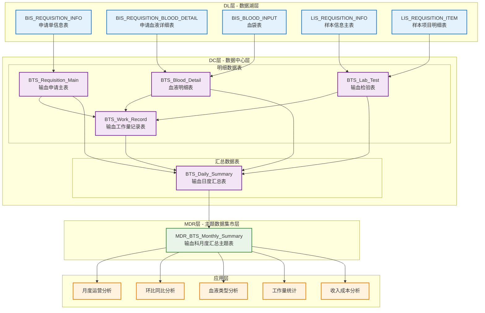
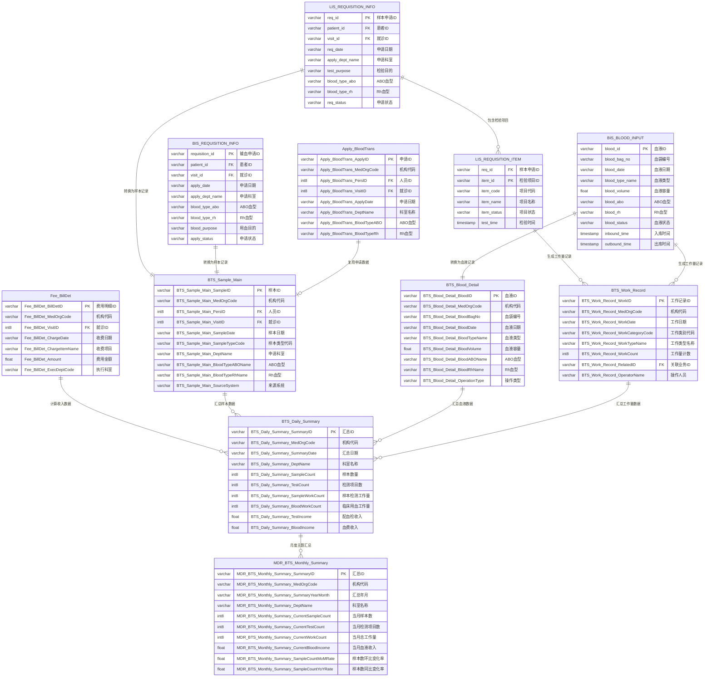

# 输血科报表主题数据架构设计方案

## 一、总体架构概述

基于现有DL -> DC -> MDR的三层架构，针对输血科运营分析业务需求设计完整的数据流向：



### 1.1 数据分层说明

| 数据层级 | 数据类型 | 表名举例 | 数据来源 | 数据特点 |
|---------|----------|----------|----------|----------|
| **DL层** | 贴源数据 | BIS_REQUISITION_INFO、BIS_BLOOD_INPUT | 输血管理系统直接复制 | 保持源系统原始结构 |
| **DC层-明细** | 明细数据 | BTS_Requisition_Main、BTS_Blood_Detail | DL层集成处理 | 标准化字段、多医院统一 |
| **DC层-汇总** | 汇总数据 | BTS_Daily_Summary | DC明细表聚合 | 按维度预聚合，提升查询性能 |
| **MDR层** | 主题数据 | MDR_BTS_Monthly_Summary | DC层数据整合 | 面向业务分析的宽表结构 |

### 1.2 核心业务需求

**目标**：通过对比输血科2024-08与2024-07、本年同期（2023-08）关键指标，评估科室运营效率及成本结构
**使用人群**：院领导、输血科主任、运营管理组、财务分析组
**时间粒度**：月度对比，包括当月、环比、同比

### 1.3 核心指标体系

| 指标类别 | 指标名称 | 指标内涵 | 最小粒度 | 计算方式 |
|---------|----------|----------|----------|----------|
| **样本数** | 申请样本数 | 接收的所有要检测的样本和输血申请 | 单个申请单 | 按检验目的统计 |
| **检测项目数** | 检验项目数 | 血型检测、抗体筛查、交叉配血等 | 单个检测项目 | 按检验目的明细统计 |
| **工作量** | 样本检测工作量 | 血型检测、抗体筛查、交叉配血等 | 单次检测操作 | 检测操作计数 |
| **工作量** | 临床用血工作量 | 血液预约、入库、出库、盘存等 | 单次血液操作 | 血液操作计数 |
| **工作量** | 输血治疗工作量 | 全血采集、血浆置换、血液单采 | 单次治疗操作 | 治疗操作计数 |
| **工作量** | 血液管理工作量 | 输血管理、合理用血评估等 | 单次管理操作 | 管理操作计数 |
| **收入** | 配血检收入 | 样本检测收入 | 单笔收费记录 | 总收入-血费收入 |
| **收入** | 血费收入 | 血液收入 | 单笔血液费用 | 血液出库总费用 |
| **收入** | 输血治疗收入 | 输血治疗项目收入 | 单笔治疗费用 | 治疗项目费用 |
| **支出** | 血费支出 | 血液成本支出 | 单笔血液成本 | 血站结算费用 |
| **支出** | 试剂支出 | 试剂支出 | 单笔试剂费用 | 试剂库订单费用 |

## 二、DC层原子指标设计原则

### 2.1 设计理念对标现有DC架构

通过分析现有datacenter设计，输血科主题遵循以下设计风格：

1. **命名规范一致性**：`BTS_表名_字段名`格式，如`BTS_Requisition_Main_ApplyID`
2. **字段类型标准化**：ID统一使用VARCHAR(60)，金额使用FLOAT8，时间使用timestamp
3. **数据完整性**：每个事实表都包含完整的维度信息（机构、人员、就诊等）
4. **扩展性设计**：预留扩展字段(ExtStr1-6, ExtNum1-2, ExtDate1-2)
5. **元数据管理**：包含数据来源标识、创建时间、更新时间等字段

### 2.2 原子指标最小粒度说明

| 业务域 | 原子指标 | 最小统计粒度 | 支持聚合维度 | 设计原因 |
|--------|----------|-------------|-------------|----------|
| **申请域** | 申请数量 | 单个申请单(申请单ID) | 日期/科室/血液类型/申请状态 | 每个申请单是输血业务的基础单元 |
| **血液域** | 血液数量 | 单个血袋(血袋编号) | 日期/血液类型/血液状态/来源机构 | 每个血袋是血液管理的最小单位 |
| **检验域** | 检验项目数 | 单个检验项目(检验ID+项目ID) | 日期/检验类型/检验人员/检验状态 | 每个检验项目是独立的检测单元 |
| **工作量域** | 操作次数 | 单次操作行为(操作ID) | 日期/操作类型/操作人员/工作内容 | 每次操作都是独立的工作量单元 |
| **收入域** | 收费金额 | 单笔收费记录(Fee_BillDet_BillDetID) | 日期/收费项目/收费类型/科室 | 每笔收费都是独立的会计核算单元 |

### 2.3 DC层设计优势

- **原子性**：每个事实都可以拆解到最小业务单元，支持任意粒度聚合
- **一致性**：统一的数据模型确保跨域指标计算的准确性  
- **完整性**：保留完整的业务上下文信息，支持复杂分析需求
- **扩展性**：标准化设计便于后续业务拓展和维护 

## 三、数据血缘关系设计

### 3.1 DL层数据源（已有）

#### 3.1.1 输血管理系统表
- **BIS_REQUISITION_INFO**（申请单信息表）- 输血申请数据源
- **BIS_REQUISITION_BLOOD_DETAIL**（申请血液详细表）- 血液需求数据源  
- **BIS_BLOOD_INPUT**（血袋表）- 血液库存数据源
- **BIS_TAKE_BLOOD**（取血表）- 血液发放数据源
- **BIS_TRANSBLOOD_PROCESS_LIST**（输注记录表）- 输血执行数据源

#### 3.1.2 LIS检验系统表
- **LIS_REQUISITION_INFO**（样本信息主表）- 检验申请数据源
- **LIS_REQUISITION_ITEM**（样本项目明细表）- 检验项目数据源
- **LIS_INSPECTION_RESULT**（样本检验结果信息表）- 检验结果数据源

#### 3.1.3 现有DC层表
- **Apply_BloodTrans**（申请_输血表）- 已有的输血申请统一数据模型
- **Fee_BillDet**（费用_账单明细表）- 已有的收费统一数据模型

### 3.2 DC层设计（符合现有DC架构风格）

#### 3.2.1 明细数据表设计（DL->DC直接集成）

##### A. BTS_Requisition_Main（输血申请主表）

**字段映射表**：

| DC字段名 | 字段类型 | 源表 | 源字段 | 字段说明 | 业务规则 |
|---------|----------|------|--------|----------|----------|
| BTS_Requisition_Main_MedOrgCode | VARCHAR(60) | BIS_REQUISITION_INFO | hospital_id | 医疗机构代码 | 支持多医院统一编码 |
| BTS_Requisition_Main_ApplyID | VARCHAR(60) | BIS_REQUISITION_INFO | requisition_id | 申请单ID | 业务主键，全局唯一 |
| BTS_Requisition_Main_ApplyDate | VARCHAR(10) | BIS_REQUISITION_INFO | apply_date | 申请日期 | 格式：YYYYMMDD |
| BTS_Requisition_Main_PersID | INT8 | BIS_REQUISITION_INFO | patient_id | 人员ID | 关联患者信息 |
| BTS_Requisition_Main_VisitID | INT8 | BIS_REQUISITION_INFO | visit_id | 就诊ID | 关联就诊信息 |
| BTS_Requisition_Main_VisitTypeName | VARCHAR(60) | BIS_REQUISITION_INFO | visit_type | 就诊类型名称 | 门诊/住院 |
| BTS_Requisition_Main_DeptID | VARCHAR(60) | BIS_REQUISITION_INFO | apply_dept_id | 申请科室ID | 关联科室维度 |
| BTS_Requisition_Main_DeptName | VARCHAR(100) | BIS_REQUISITION_INFO | apply_dept_name | 申请科室名称 | 用于分析统计 |
| BTS_Requisition_Main_BloodTypeABO | VARCHAR(100) | BIS_REQUISITION_INFO | blood_type_abo | ABO血型 | 血型匹配分析 |
| BTS_Requisition_Main_BloodTypeRh | VARCHAR(100) | BIS_REQUISITION_INFO | blood_type_rh | Rh血型 | 血型匹配分析 |
| BTS_Requisition_Main_BloodPurpose | VARCHAR(200) | BIS_REQUISITION_INFO | blood_purpose | 输血目的 | 业务分析 |
| BTS_Requisition_Main_ApplyPersName | VARCHAR(100) | BIS_REQUISITION_INFO | apply_doctor | 申请医生姓名 | 工作量统计 |
| BTS_Requisition_Main_ApplyDtTm | timestamp | BIS_REQUISITION_INFO | apply_time | 申请时间 | 业务时间轴 |
| BTS_Requisition_Main_ApplyStatusName | VARCHAR(100) | BIS_REQUISITION_INFO | apply_status | 申请状态名称 | 业务状态跟踪 |

**建表语句**：
```sql
-- 输血申请主表 - 对标现有DC架构命名和结构
CREATE TABLE BTS_Requisition_Main (
    -- 基础标识信息
    BTS_Requisition_Main_MedOrgCode VARCHAR(60) NOT NULL,        -- 医疗机构代码
    BTS_Requisition_Main_MedOrgName VARCHAR(100),                -- 医疗机构名称
    BTS_Requisition_Main_EmpiID INT8,                            -- 人员唯一标识ID
    BTS_Requisition_Main_EmpiNo VARCHAR(60),                     -- 人员唯一号
    BTS_Requisition_Main_PersID INT8,                            -- 人员ID
    BTS_Requisition_Main_PersNo VARCHAR(60),                     -- 人员号
    BTS_Requisition_Main_VisitID INT8,                           -- 就诊ID
    BTS_Requisition_Main_VisitNo VARCHAR(60),                    -- 就诊号
    BTS_Requisition_Main_VisitTypeID VARCHAR(60),                -- 就诊类型ID
    BTS_Requisition_Main_VisitTypeCode VARCHAR(60),              -- 就诊类型代码
    BTS_Requisition_Main_VisitTypeName VARCHAR(60),              -- 就诊类型名称
    
    -- 申请核心信息
    BTS_Requisition_Main_ApplyID VARCHAR(60) PRIMARY KEY,        -- 申请单ID
    BTS_Requisition_Main_ApplyNo VARCHAR(60),                    -- 申请单号
    BTS_Requisition_Main_ApplyTypeID VARCHAR(60),                -- 申请类型ID
    BTS_Requisition_Main_ApplyTypeCode VARCHAR(60),              -- 申请类型代码
    BTS_Requisition_Main_ApplyTypeName VARCHAR(100),             -- 申请类型名称
    BTS_Requisition_Main_ApplyStatusID VARCHAR(60),              -- 申请状态ID
    BTS_Requisition_Main_ApplyStatusCode VARCHAR(60),            -- 申请状态代码
    BTS_Requisition_Main_ApplyStatusName VARCHAR(100),           -- 申请状态名称
    
    -- 科室信息
    BTS_Requisition_Main_DeptID VARCHAR(60),                     -- 申请科室ID
    BTS_Requisition_Main_DeptCode VARCHAR(60),                   -- 申请科室代码
    BTS_Requisition_Main_DeptName VARCHAR(100),                  -- 申请科室名称
    
    -- 血型信息
    BTS_Requisition_Main_BloodTypeABOID VARCHAR(60),             -- ABO血型ID
    BTS_Requisition_Main_BloodTypeABOCode VARCHAR(60),           -- ABO血型代码
    BTS_Requisition_Main_BloodTypeABOName VARCHAR(100),          -- ABO血型名称
    BTS_Requisition_Main_BloodTypeRhID VARCHAR(60),              -- Rh血型ID
    BTS_Requisition_Main_BloodTypeRhCode VARCHAR(60),            -- Rh血型代码
    BTS_Requisition_Main_BloodTypeRhName VARCHAR(100),           -- Rh血型名称
    
    -- 输血信息
    BTS_Requisition_Main_BloodPurpose VARCHAR(200),              -- 输血目的
    BTS_Requisition_Main_BloodPastHistory VARCHAR(200),          -- 既往输血史
    BTS_Requisition_Main_PregHistoryFlag VARCHAR(10),            -- 妊娠史标识
    BTS_Requisition_Main_PlanBloodDtTm timestamp,                -- 预计用血时间
    BTS_Requisition_Main_BloodTransProperty VARCHAR(100),        -- 输血性质
    
    -- 时间信息
    BTS_Requisition_Main_ApplyDate VARCHAR(10),                  -- 申请日期(YYYYMMDD)
    BTS_Requisition_Main_ApplyDtTm timestamp,                    -- 申请时间
    BTS_Requisition_Main_AuditDtTm timestamp,                    -- 审核时间
    BTS_Requisition_Main_ApproveDtTm timestamp,                  -- 批准时间
    
    -- 人员信息
    BTS_Requisition_Main_ApplyPersID VARCHAR(60),                -- 申请人员ID
    BTS_Requisition_Main_ApplyPersCode VARCHAR(60),              -- 申请人员代码
    BTS_Requisition_Main_ApplyPersName VARCHAR(100),             -- 申请人员姓名
    BTS_Requisition_Main_AuditPersID VARCHAR(60),                -- 审核人员ID
    BTS_Requisition_Main_AuditPersCode VARCHAR(60),              -- 审核人员代码
    BTS_Requisition_Main_AuditPersName VARCHAR(100),             -- 审核人员姓名
    
    -- 标准扩展字段
    BTS_Requisition_Main_ExtStr1 VARCHAR(200),                   -- 扩展1(字符类型)
    BTS_Requisition_Main_ExtStr2 VARCHAR(200),                   -- 扩展2(字符类型)
    BTS_Requisition_Main_ExtStr3 VARCHAR(200),                   -- 扩展3(字符类型)
    BTS_Requisition_Main_ExtStr4 VARCHAR(200),                   -- 扩展4(字符类型)
    BTS_Requisition_Main_ExtStr5 VARCHAR(200),                   -- 扩展5(字符类型)
    BTS_Requisition_Main_ExtStr6 VARCHAR(200),                   -- 扩展6(字符类型)
    BTS_Requisition_Main_ExtNum1 FLOAT8,                         -- 扩展7(数值类型)
    BTS_Requisition_Main_ExtNum2 FLOAT8,                         -- 扩展8(数值类型)
    BTS_Requisition_Main_ExtDate1 timestamp,                     -- 扩展9(时间类型)
    BTS_Requisition_Main_ExtDate2 timestamp,                     -- 扩展10(时间类型)
    
    -- 数据管理字段
    BTS_Requisition_Main_DataSourceFlag VARCHAR(10),             -- 数据来源标识
    BTS_Requisition_Main_DSTable VARCHAR(60),                    -- 接入数据源的表
    BTS_Requisition_Main_DSTableKey VARCHAR(200),                -- 接入数据源的key
    BTS_Requisition_Main_DSTableValue VARCHAR(200),              -- 接入数据源的key值
    BTS_Requisition_Main_IsDeleted INT8 DEFAULT 0,               -- 数据物理删除标识
    BTS_Requisition_Main_LastUpdateDtTm timestamp DEFAULT GETDATE(), -- 最后更新时间
    BTS_Requisition_Main_DataCreateDtTm timestamp DEFAULT GETDATE()  -- 数据创建时间
);
```

##### B. BTS_Blood_Detail（血液明细表）

**字段映射表**：

| DC字段名 | 字段类型 | 源表 | 源字段 | 字段说明 | 业务规则 |
|---------|----------|------|--------|----------|----------|
| BTS_Blood_Detail_MedOrgCode | VARCHAR(60) | BIS_BLOOD_INPUT | hospital_id | 医疗机构代码 | 支持多医院统一编码 |
| BTS_Blood_Detail_BloodID | VARCHAR(60) | BIS_BLOOD_INPUT | blood_id | 血液ID | 业务主键，全局唯一 |
| BTS_Blood_Detail_BloodBagNo | VARCHAR(60) | BIS_BLOOD_INPUT | blood_bag_no | 血袋编号 | 血袋唯一标识 |
| BTS_Blood_Detail_BloodDate | VARCHAR(10) | BIS_BLOOD_INPUT | blood_date | 血液日期 | 格式：YYYYMMDD |
| BTS_Blood_Detail_BloodTypeCode | VARCHAR(60) | BIS_BLOOD_INPUT | blood_type | 血液类型代码 | 红细胞、血浆等 |
| BTS_Blood_Detail_BloodTypeName | VARCHAR(100) | BIS_BLOOD_INPUT | blood_type_name | 血液类型名称 | 中文描述 |
| BTS_Blood_Detail_BloodVolume | FLOAT8 | BIS_BLOOD_INPUT | blood_volume | 血液容量 | 毫升 |
| BTS_Blood_Detail_BloodABO | VARCHAR(100) | BIS_BLOOD_INPUT | blood_abo | ABO血型 | 血型匹配 |
| BTS_Blood_Detail_BloodRh | VARCHAR(100) | BIS_BLOOD_INPUT | blood_rh | Rh血型 | 血型匹配 |
| BTS_Blood_Detail_BloodStatusName | VARCHAR(100) | BIS_BLOOD_INPUT | blood_status | 血液状态名称 | 在库、出库等 |
| BTS_Blood_Detail_InboundDtTm | timestamp | BIS_BLOOD_INPUT | inbound_time | 入库时间 | 业务时间轴 |
| BTS_Blood_Detail_OutboundDtTm | timestamp | BIS_BLOOD_INPUT | outbound_time | 出库时间 | 业务时间轴 |
| BTS_Blood_Detail_BloodSource | VARCHAR(100) | BIS_BLOOD_INPUT | blood_source | 血液来源 | 血站机构 |

**建表语句**：
```sql
-- 血液明细表
CREATE TABLE BTS_Blood_Detail (
    -- 基础标识信息
    BTS_Blood_Detail_MedOrgCode VARCHAR(60) NOT NULL,            -- 医疗机构代码
    BTS_Blood_Detail_MedOrgName VARCHAR(100),                    -- 医疗机构名称
    
    -- 血液核心信息
    BTS_Blood_Detail_BloodID VARCHAR(60) PRIMARY KEY,            -- 血液ID
    BTS_Blood_Detail_BloodBagNo VARCHAR(60),                     -- 血袋编号
    BTS_Blood_Detail_BloodCode VARCHAR(60),                      -- 血液编码
    BTS_Blood_Detail_BloodTypeID VARCHAR(60),                    -- 血液类型ID
    BTS_Blood_Detail_BloodTypeCode VARCHAR(60),                  -- 血液类型代码
    BTS_Blood_Detail_BloodTypeName VARCHAR(100),                 -- 血液类型名称
    BTS_Blood_Detail_BloodStatusID VARCHAR(60),                  -- 血液状态ID
    BTS_Blood_Detail_BloodStatusCode VARCHAR(60),                -- 血液状态代码
    BTS_Blood_Detail_BloodStatusName VARCHAR(100),               -- 血液状态名称
    
    -- 血液属性信息
    BTS_Blood_Detail_BloodABOID VARCHAR(60),                     -- ABO血型ID
    BTS_Blood_Detail_BloodABOCode VARCHAR(60),                   -- ABO血型代码
    BTS_Blood_Detail_BloodABOName VARCHAR(100),                  -- ABO血型名称
    BTS_Blood_Detail_BloodRhID VARCHAR(60),                      -- Rh血型ID
    BTS_Blood_Detail_BloodRhCode VARCHAR(60),                    -- Rh血型代码
    BTS_Blood_Detail_BloodRhName VARCHAR(100),                   -- Rh血型名称
    BTS_Blood_Detail_BloodVolume FLOAT8,                         -- 血液容量(毫升)
    BTS_Blood_Detail_BloodVolumeUnit VARCHAR(60),                -- 血液容量单位
    BTS_Blood_Detail_BloodSource VARCHAR(100),                   -- 血液来源
    BTS_Blood_Detail_BloodLotNo VARCHAR(60),                     -- 血液批号
    BTS_Blood_Detail_BloodExpireDtTm timestamp,                  -- 血液过期时间
    
    -- 时间信息
    BTS_Blood_Detail_BloodDate VARCHAR(10),                      -- 血液日期(YYYYMMDD)
    BTS_Blood_Detail_InboundDtTm timestamp,                      -- 入库时间
    BTS_Blood_Detail_OutboundDtTm timestamp,                     -- 出库时间
    BTS_Blood_Detail_TransfusionDtTm timestamp,                  -- 输注时间
    
    -- 人员信息
    BTS_Blood_Detail_InboundPersID VARCHAR(60),                  -- 入库人员ID
    BTS_Blood_Detail_InboundPersCode VARCHAR(60),                -- 入库人员代码
    BTS_Blood_Detail_InboundPersName VARCHAR(100),               -- 入库人员姓名
    BTS_Blood_Detail_OutboundPersID VARCHAR(60),                 -- 出库人员ID
    BTS_Blood_Detail_OutboundPersCode VARCHAR(60),               -- 出库人员代码
    BTS_Blood_Detail_OutboundPersName VARCHAR(100),              -- 出库人员姓名
    
    -- 标准扩展字段
    BTS_Blood_Detail_ExtStr1 VARCHAR(200),                       -- 扩展1(字符类型)
    BTS_Blood_Detail_ExtStr2 VARCHAR(200),                       -- 扩展2(字符类型)
    BTS_Blood_Detail_ExtStr3 VARCHAR(200),                       -- 扩展3(字符类型)
    BTS_Blood_Detail_ExtStr4 VARCHAR(200),                       -- 扩展4(字符类型)
    BTS_Blood_Detail_ExtStr5 VARCHAR(200),                       -- 扩展5(字符类型)
    BTS_Blood_Detail_ExtStr6 VARCHAR(200),                       -- 扩展6(字符类型)
    BTS_Blood_Detail_ExtNum1 FLOAT8,                             -- 扩展7(数值类型)
    BTS_Blood_Detail_ExtNum2 FLOAT8,                             -- 扩展8(数值类型)
    BTS_Blood_Detail_ExtDate1 timestamp,                         -- 扩展9(时间类型)
    BTS_Blood_Detail_ExtDate2 timestamp,                         -- 扩展10(时间类型)
    
    -- 数据管理字段
    BTS_Blood_Detail_DataSourceFlag VARCHAR(10),                 -- 数据来源标识
    BTS_Blood_Detail_DSTable VARCHAR(60),                        -- 接入数据源的表
    BTS_Blood_Detail_DSTableKey VARCHAR(200),                    -- 接入数据源的key
    BTS_Blood_Detail_DSTableValue VARCHAR(200),                  -- 接入数据源的key值
    BTS_Blood_Detail_IsDeleted INT8 DEFAULT 0,                   -- 数据物理删除标识
    BTS_Blood_Detail_LastUpdateDtTm timestamp DEFAULT GETDATE(), -- 最后更新时间
    BTS_Blood_Detail_DataCreateDtTm timestamp DEFAULT GETDATE()  -- 数据创建时间
);
```

##### C. BTS_Lab_Test（输血检验表）

**字段映射表**：

| DC字段名 | 字段类型 | 源表 | 源字段 | 字段说明 | 业务规则 |
|---------|----------|------|--------|----------|----------|
| BTS_Lab_Test_MedOrgCode | VARCHAR(60) | LIS_REQUISITION_INFO | hospital_id | 医疗机构代码 | 支持多医院统一编码 |
| BTS_Lab_Test_TestID | VARCHAR(60) | LIS_REQUISITION_INFO + LIS_REQUISITION_ITEM | requisition_id + item_id | 检验ID | 主键，req_id + "_" + item_id |
| BTS_Lab_Test_TestDate | VARCHAR(10) | LIS_REQUISITION_INFO | test_date | 检验日期 | 格式：YYYYMMDD |
| BTS_Lab_Test_TestItemCode | VARCHAR(60) | LIS_REQUISITION_ITEM | item_code | 检验项目代码 | 血型检测、抗体筛查等 |
| BTS_Lab_Test_TestItemName | VARCHAR(100) | LIS_REQUISITION_ITEM | item_name | 检验项目名称 | 中文描述 |
| BTS_Lab_Test_TestTypeCode | VARCHAR(60) | 业务分类 | 血型检测/抗体筛查/交叉配血 | 检验类型代码 | 按业务分类 |
| BTS_Lab_Test_TestCount | INT8 | 固定值 | 1 | 检验数量 | 每个项目计数1 |
| BTS_Lab_Test_TestResult | VARCHAR(200) | LIS_INSPECTION_RESULT | test_result | 检验结果 | 结果描述 |
| BTS_Lab_Test_TestPersName | VARCHAR(100) | LIS_INSPECTION_RESULT | test_person | 检验人员姓名 | 工作量统计 |
| BTS_Lab_Test_TestDtTm | timestamp | LIS_INSPECTION_RESULT | test_time | 检验时间 | 业务时间轴 |

##### D. BTS_Work_Record（输血工作量记录表）

**字段映射表**：

| DC字段名 | 字段类型 | 源表 | 源字段 | 字段说明 | 业务规则 |
|---------|----------|------|--------|----------|----------|
| BTS_Work_Record_MedOrgCode | VARCHAR(60) | 多表集成 | hospital_id | 医疗机构代码 | 支持多医院统一编码 |
| BTS_Work_Record_WorkID | VARCHAR(60) | 业务生成 | 业务ID + 工作类型 | 工作记录ID | 主键，全局唯一 |
| BTS_Work_Record_WorkDate | VARCHAR(10) | 多表集成 | work_date | 工作日期 | 格式：YYYYMMDD |
| BTS_Work_Record_WorkTypeCode | VARCHAR(60) | 业务逻辑 | SAMPLE/BLOOD/TREATMENT/MANAGE | 工作类型代码 | 4类工作量 |
| BTS_Work_Record_WorkTypeName | VARCHAR(100) | 业务逻辑 | 样本检测/临床用血/输血治疗/血液管理 | 工作类型名称 | 中文描述 |
| BTS_Work_Record_WorkSubTypeCode | VARCHAR(60) | 业务逻辑 | 具体子类型 | 工作子类型代码 | 细分类型 |
| BTS_Work_Record_WorkSubTypeName | VARCHAR(100) | 业务逻辑 | 具体子类型名称 | 工作子类型名称 | 中文描述 |
| BTS_Work_Record_WorkCount | INT8 | 固定值 | 1 | 工作量计数 | 每次操作计数1 |
| BTS_Work_Record_OperatorName | VARCHAR(100) | 多表集成 | operator_name | 操作人员姓名 | 工作量统计 |
| BTS_Work_Record_WorkDtTm | timestamp | 多表集成 | work_time | 工作时间 | 业务时间轴 |

#### 3.2.2 汇总数据表设计（DC明细表->DC汇总表）

##### E. BTS_Daily_Summary（输血日度汇总表）

**建表语句**：
```sql
-- 输血日度汇总表
CREATE TABLE BTS_Daily_Summary (
    -- 基础标识信息
    BTS_Daily_Summary_MedOrgCode VARCHAR(60) NOT NULL,           -- 医疗机构代码
    BTS_Daily_Summary_MedOrgName VARCHAR(100),                   -- 医疗机构名称
    BTS_Daily_Summary_SummaryID VARCHAR(60) PRIMARY KEY,         -- 汇总ID
    
    -- 时间维度
    BTS_Daily_Summary_SummaryDate VARCHAR(10),                   -- 汇总日期(YYYYMMDD)
    BTS_Daily_Summary_SummaryYear VARCHAR(4),                    -- 汇总年份
    BTS_Daily_Summary_SummaryMonth VARCHAR(2),                   -- 汇总月份
    BTS_Daily_Summary_SummaryDay VARCHAR(2),                     -- 汇总日
    BTS_Daily_Summary_SummaryWeekday VARCHAR(1),                 -- 星期几(1-7)
    
    -- 科室维度
    BTS_Daily_Summary_DeptID VARCHAR(60),                        -- 科室ID
    BTS_Daily_Summary_DeptCode VARCHAR(60),                      -- 科室代码
    BTS_Daily_Summary_DeptName VARCHAR(100),                     -- 科室名称
    
    -- 血液类型维度
    BTS_Daily_Summary_BloodTypeID VARCHAR(60),                   -- 血液类型ID
    BTS_Daily_Summary_BloodTypeCode VARCHAR(60),                 -- 血液类型代码
    BTS_Daily_Summary_BloodTypeName VARCHAR(100),                -- 血液类型名称
    
    -- 核心指标汇总
    BTS_Daily_Summary_ApplyCount INT8 DEFAULT 0,                 -- 申请数量
    BTS_Daily_Summary_SampleCount INT8 DEFAULT 0,                -- 样本数量
    BTS_Daily_Summary_TestCount INT8 DEFAULT 0,                  -- 检测项目数
    BTS_Daily_Summary_BloodInCount INT8 DEFAULT 0,               -- 血液入库数
    BTS_Daily_Summary_BloodOutCount INT8 DEFAULT 0,              -- 血液出库数
    BTS_Daily_Summary_BloodVolume FLOAT8 DEFAULT 0,              -- 血液容量(毫升)
    
    -- 工作量汇总
    BTS_Daily_Summary_SampleWorkCount INT8 DEFAULT 0,            -- 样本检测工作量
    BTS_Daily_Summary_BloodWorkCount INT8 DEFAULT 0,             -- 临床用血工作量
    BTS_Daily_Summary_TreatmentWorkCount INT8 DEFAULT 0,         -- 输血治疗工作量
    BTS_Daily_Summary_ManageWorkCount INT8 DEFAULT 0,            -- 血液管理工作量
    BTS_Daily_Summary_TotalWorkCount INT8 DEFAULT 0,             -- 总工作量
    
    -- 收入汇总
    BTS_Daily_Summary_TestIncome FLOAT8 DEFAULT 0,               -- 配血检收入
    BTS_Daily_Summary_BloodIncome FLOAT8 DEFAULT 0,              -- 血费收入
    BTS_Daily_Summary_TreatmentIncome FLOAT8 DEFAULT 0,          -- 输血治疗收入
    BTS_Daily_Summary_TotalIncome FLOAT8 DEFAULT 0,              -- 总收入
    
    -- 支出汇总
    BTS_Daily_Summary_BloodCost FLOAT8 DEFAULT 0,                -- 血费支出
    BTS_Daily_Summary_ReagentCost FLOAT8 DEFAULT 0,              -- 试剂支出
    BTS_Daily_Summary_MaterialCost FLOAT8 DEFAULT 0,             -- 输血治疗耗材
    BTS_Daily_Summary_TotalCost FLOAT8 DEFAULT 0,                -- 总支出
    
    -- 标准扩展字段
    BTS_Daily_Summary_ExtStr1 VARCHAR(200),                      -- 扩展1(字符类型)
    BTS_Daily_Summary_ExtStr2 VARCHAR(200),                      -- 扩展2(字符类型)
    BTS_Daily_Summary_ExtStr3 VARCHAR(200),                      -- 扩展3(字符类型)
    BTS_Daily_Summary_ExtNum1 FLOAT8,                            -- 扩展4(数值类型)
    BTS_Daily_Summary_ExtNum2 FLOAT8,                            -- 扩展5(数值类型)
    BTS_Daily_Summary_ExtDate1 timestamp,                        -- 扩展6(时间类型)
    
    -- 数据管理字段
    BTS_Daily_Summary_DataSourceFlag VARCHAR(10),                -- 数据来源标识
    BTS_Daily_Summary_IsDeleted INT8 DEFAULT 0,                  -- 数据物理删除标识
    BTS_Daily_Summary_LastUpdateDtTm timestamp DEFAULT GETDATE(), -- 最后更新时间
    BTS_Daily_Summary_DataCreateDtTm timestamp DEFAULT GETDATE()  -- 数据创建时间
);
```

### 3.3 MDR层设计（DC->MDR主题集市）

#### MDR_BTS_Monthly_Summary（输血科月度汇总主题表）

**建表语句**：
```sql
-- 输血科月度汇总主题表
CREATE TABLE MDR_BTS_Monthly_Summary (
    -- 基础标识信息
    MDR_BTS_Monthly_Summary_MedOrgCode VARCHAR(60) NOT NULL,     -- 医疗机构代码
    MDR_BTS_Monthly_Summary_MedOrgName VARCHAR(100),             -- 医疗机构名称
    MDR_BTS_Monthly_Summary_SummaryID VARCHAR(60) PRIMARY KEY,   -- 汇总ID
    
    -- 时间维度
    MDR_BTS_Monthly_Summary_SummaryYearMonth VARCHAR(6),         -- 汇总年月(YYYYMM)
    MDR_BTS_Monthly_Summary_SummaryYear VARCHAR(4),              -- 汇总年份
    MDR_BTS_Monthly_Summary_SummaryMonth VARCHAR(2),             -- 汇总月份
    
    -- 科室维度
    MDR_BTS_Monthly_Summary_DeptID VARCHAR(60),                  -- 科室ID
    MDR_BTS_Monthly_Summary_DeptCode VARCHAR(60),                -- 科室代码
    MDR_BTS_Monthly_Summary_DeptName VARCHAR(100),               -- 科室名称
    
    -- 血液类型维度
    MDR_BTS_Monthly_Summary_BloodTypeID VARCHAR(60),             -- 血液类型ID
    MDR_BTS_Monthly_Summary_BloodTypeCode VARCHAR(60),           -- 血液类型代码
    MDR_BTS_Monthly_Summary_BloodTypeName VARCHAR(100),          -- 血液类型名称
    
    -- 当月核心指标
    MDR_BTS_Monthly_Summary_CurrentSampleCount INT8,             -- 当月样本数
    MDR_BTS_Monthly_Summary_CurrentTestCount INT8,               -- 当月检测项目数
    MDR_BTS_Monthly_Summary_CurrentWorkCount INT8,               -- 当月工作量
    MDR_BTS_Monthly_Summary_CurrentBloodIncome FLOAT8,           -- 当月血液收入
    MDR_BTS_Monthly_Summary_CurrentReagentCost FLOAT8,           -- 当月试剂支出
    MDR_BTS_Monthly_Summary_CurrentTotalIncome FLOAT8,           -- 当月总收入
    
    -- 环比数据（与上月对比）
    MDR_BTS_Monthly_Summary_LastSampleCount INT8,                -- 上月样本数
    MDR_BTS_Monthly_Summary_LastTestCount INT8,                  -- 上月检测项目数
    MDR_BTS_Monthly_Summary_LastWorkCount INT8,                  -- 上月工作量
    MDR_BTS_Monthly_Summary_LastBloodIncome FLOAT8,              -- 上月血液收入
    MDR_BTS_Monthly_Summary_LastReagentCost FLOAT8,              -- 上月试剂支出
    MDR_BTS_Monthly_Summary_LastTotalIncome FLOAT8,              -- 上月总收入
    
    -- 环比变化率
    MDR_BTS_Monthly_Summary_SampleCountMoMRate FLOAT8,           -- 样本数环比变化率
    MDR_BTS_Monthly_Summary_TestCountMoMRate FLOAT8,             -- 检测项目数环比变化率
    MDR_BTS_Monthly_Summary_WorkCountMoMRate FLOAT8,             -- 工作量环比变化率
    MDR_BTS_Monthly_Summary_BloodIncomeMoMRate FLOAT8,           -- 血液收入环比变化率
    MDR_BTS_Monthly_Summary_ReagentCostMoMRate FLOAT8,           -- 试剂支出环比变化率
    MDR_BTS_Monthly_Summary_TotalIncomeMoMRate FLOAT8,           -- 总收入环比变化率
    
    -- 同比数据（与去年同期对比）
    MDR_BTS_Monthly_Summary_YoYSampleCount INT8,                 -- 去年同期样本数
    MDR_BTS_Monthly_Summary_YoYTestCount INT8,                   -- 去年同期检测项目数
    MDR_BTS_Monthly_Summary_YoYWorkCount INT8,                   -- 去年同期工作量
    MDR_BTS_Monthly_Summary_YoYBloodIncome FLOAT8,               -- 去年同期血液收入
    MDR_BTS_Monthly_Summary_YoYReagentCost FLOAT8,               -- 去年同期试剂支出
    MDR_BTS_Monthly_Summary_YoYTotalIncome FLOAT8,               -- 去年同期总收入
    
    -- 同比变化率
    MDR_BTS_Monthly_Summary_SampleCountYoYRate FLOAT8,           -- 样本数同比变化率
    MDR_BTS_Monthly_Summary_TestCountYoYRate FLOAT8,             -- 检测项目数同比变化率
    MDR_BTS_Monthly_Summary_WorkCountYoYRate FLOAT8,             -- 工作量同比变化率
    MDR_BTS_Monthly_Summary_BloodIncomeYoYRate FLOAT8,           -- 血液收入同比变化率
    MDR_BTS_Monthly_Summary_ReagentCostYoYRate FLOAT8,           -- 试剂支出同比变化率
    MDR_BTS_Monthly_Summary_TotalIncomeYoYRate FLOAT8,           -- 总收入同比变化率
    
    -- 细分工作量指标
    MDR_BTS_Monthly_Summary_BloodTestWorkCount INT8,             -- 血型检测工作量
    MDR_BTS_Monthly_Summary_AntibodyScreenWorkCount INT8,        -- 抗体筛查工作量
    MDR_BTS_Monthly_Summary_CrossMatchWorkCount INT8,            -- 交叉配血工作量
    MDR_BTS_Monthly_Summary_BloodReserveWorkCount INT8,          -- 血液预约工作量
    MDR_BTS_Monthly_Summary_BloodInOutWorkCount INT8,            -- 血液出入库工作量
    MDR_BTS_Monthly_Summary_BloodInventoryWorkCount INT8,        -- 血液盘存工作量
    MDR_BTS_Monthly_Summary_TreatmentProcedureWorkCount INT8,    -- 输血治疗操作工作量
    MDR_BTS_Monthly_Summary_BloodManageWorkCount INT8,           -- 血液管理工作量
    
    -- 备注字段
    MDR_BTS_Monthly_Summary_AnalysisNote VARCHAR(500),           -- 分析备注
    MDR_BTS_Monthly_Summary_RemarkInfo VARCHAR(500),             -- 备注信息
    
    -- 数据管理字段
    MDR_BTS_Monthly_Summary_DataSourceFlag VARCHAR(10),          -- 数据来源标识
    MDR_BTS_Monthly_Summary_IsDeleted INT8 DEFAULT 0,            -- 数据物理删除标识
    MDR_BTS_Monthly_Summary_LastUpdateDtTm timestamp DEFAULT GETDATE(), -- 最后更新时间
    MDR_BTS_Monthly_Summary_DataCreateDtTm timestamp DEFAULT GETDATE()  -- 数据创建时间
);
```

## 四、数据处理逻辑设计

### 4.1 DL->DC数据集成逻辑

#### 4.1.1 输血申请数据集成（BIS_REQUISITION_INFO -> BTS_Requisition_Main）

```sql
-- 输血申请数据集成示例SQL
INSERT INTO BTS_Requisition_Main (
    BTS_Requisition_Main_MedOrgCode,
    BTS_Requisition_Main_ApplyID,
    BTS_Requisition_Main_ApplyDate,
    BTS_Requisition_Main_PersID,
    BTS_Requisition_Main_VisitID,
    BTS_Requisition_Main_DeptName,
    BTS_Requisition_Main_BloodTypeABOName,
    BTS_Requisition_Main_BloodTypeRhName,
    BTS_Requisition_Main_BloodPurpose,
    BTS_Requisition_Main_ApplyPersName,
    BTS_Requisition_Main_ApplyDtTm,
    BTS_Requisition_Main_ApplyStatusName,
    BTS_Requisition_Main_DataSourceFlag,
    BTS_Requisition_Main_DSTable
)
SELECT 
    hospital_id,
    requisition_id,
    FORMAT(apply_date, 'yyyyMMdd'),
    patient_id,
    visit_id,
    apply_dept_name,
    blood_type_abo,
    blood_type_rh,
    blood_purpose,
    apply_doctor,
    apply_time,
    apply_status,
    'BIS',
    'BIS_REQUISITION_INFO'
FROM BIS_REQUISITION_INFO
WHERE apply_date >= DATEADD(month, -13, GETDATE());
```

#### 4.1.2 血液数据集成（BIS_BLOOD_INPUT -> BTS_Blood_Detail）

```sql
-- 血液数据集成示例SQL  
INSERT INTO BTS_Blood_Detail (
    BTS_Blood_Detail_MedOrgCode,
    BTS_Blood_Detail_BloodID,
    BTS_Blood_Detail_BloodBagNo,
    BTS_Blood_Detail_BloodDate,
    BTS_Blood_Detail_BloodTypeName,
    BTS_Blood_Detail_BloodVolume,
    BTS_Blood_Detail_BloodABOName,
    BTS_Blood_Detail_BloodRhName,
    BTS_Blood_Detail_BloodStatusName,
    BTS_Blood_Detail_InboundDtTm,
    BTS_Blood_Detail_OutboundDtTm,
    BTS_Blood_Detail_BloodSource,
    BTS_Blood_Detail_DataSourceFlag,
    BTS_Blood_Detail_DSTable
)
SELECT 
    hospital_id,
    blood_id,
    blood_bag_no,
    FORMAT(blood_date, 'yyyyMMdd'),
    blood_type_name,
    blood_volume,
    blood_abo,
    blood_rh,
    blood_status,
    inbound_time,
    outbound_time,
    blood_source,
    'BIS',
    'BIS_BLOOD_INPUT'
FROM BIS_BLOOD_INPUT
WHERE blood_date >= DATEADD(month, -13, GETDATE());
```

### 4.2 DC->MDR数据聚合逻辑

#### 4.2.1 日度汇总数据生成

```sql
-- 日度汇总数据生成示例SQL
INSERT INTO BTS_Daily_Summary (
    BTS_Daily_Summary_SummaryID,
    BTS_Daily_Summary_SummaryDate,
    BTS_Daily_Summary_DeptName,
    BTS_Daily_Summary_BloodTypeName,
    BTS_Daily_Summary_ApplyCount,
    BTS_Daily_Summary_SampleCount,
    BTS_Daily_Summary_TestCount,
    BTS_Daily_Summary_BloodIncome,
    BTS_Daily_Summary_TotalIncome
)
SELECT 
    CONCAT(req.BTS_Requisition_Main_ApplyDate, '_', req.BTS_Requisition_Main_DeptID, '_', req.BTS_Requisition_Main_BloodTypeCode),
    req.BTS_Requisition_Main_ApplyDate,
    req.BTS_Requisition_Main_DeptName,
    req.BTS_Requisition_Main_BloodTypeABOName,
    COUNT(DISTINCT req.BTS_Requisition_Main_ApplyID) as apply_count,
    COUNT(DISTINCT blood.BTS_Blood_Detail_BloodID) as sample_count,
    COUNT(DISTINCT test.BTS_Lab_Test_TestID) as test_count,
    SUM(charge.血费收入) as blood_income,
    SUM(charge.总收入) as total_income
FROM BTS_Requisition_Main req
LEFT JOIN BTS_Blood_Detail blood ON req.BTS_Requisition_Main_ApplyID = blood.关联申请ID
LEFT JOIN BTS_Lab_Test test ON req.BTS_Requisition_Main_ApplyID = test.关联申请ID  
LEFT JOIN (收入汇总子查询) charge ON req.BTS_Requisition_Main_ApplyID = charge.申请ID
WHERE req.BTS_Requisition_Main_ApplyDate = '目标日期'
GROUP BY 
    req.BTS_Requisition_Main_ApplyDate,
    req.BTS_Requisition_Main_DeptID,
    req.BTS_Requisition_Main_DeptName,
    req.BTS_Requisition_Main_BloodTypeCode,
    req.BTS_Requisition_Main_BloodTypeABOName;
```

#### 4.2.2 月度主题数据生成

```sql
-- 月度主题数据生成示例SQL
INSERT INTO MDR_BTS_Monthly_Summary (
    MDR_BTS_Monthly_Summary_SummaryID,
    MDR_BTS_Monthly_Summary_SummaryYearMonth,
    MDR_BTS_Monthly_Summary_DeptName,
    MDR_BTS_Monthly_Summary_BloodTypeName,
    MDR_BTS_Monthly_Summary_CurrentSampleCount,
    MDR_BTS_Monthly_Summary_CurrentTestCount,
    MDR_BTS_Monthly_Summary_CurrentWorkCount,
    MDR_BTS_Monthly_Summary_CurrentBloodIncome,
    MDR_BTS_Monthly_Summary_CurrentTotalIncome,
    -- 环比计算
    MDR_BTS_Monthly_Summary_SampleCountMoMRate,
    MDR_BTS_Monthly_Summary_BloodIncomeMoMRate,
    -- 同比计算
    MDR_BTS_Monthly_Summary_SampleCountYoYRate,
    MDR_BTS_Monthly_Summary_BloodIncomeYoYRate
)
SELECT 
    CONCAT(LEFT(curr.BTS_Daily_Summary_SummaryDate, 6), '_', curr.BTS_Daily_Summary_DeptID),
    LEFT(curr.BTS_Daily_Summary_SummaryDate, 6),
    curr.BTS_Daily_Summary_DeptName,
    curr.BTS_Daily_Summary_BloodTypeName,
    SUM(curr.BTS_Daily_Summary_SampleCount),
    SUM(curr.BTS_Daily_Summary_TestCount), 
    SUM(curr.BTS_Daily_Summary_TotalWorkCount),
    SUM(curr.BTS_Daily_Summary_BloodIncome),
    SUM(curr.BTS_Daily_Summary_TotalIncome),
    -- 环比计算 (当月-上月)/上月*100
    CASE WHEN SUM(last_month.BTS_Daily_Summary_SampleCount) > 0 
         THEN (SUM(curr.BTS_Daily_Summary_SampleCount) - SUM(last_month.BTS_Daily_Summary_SampleCount)) * 100.0 / SUM(last_month.BTS_Daily_Summary_SampleCount)
         ELSE 0 END,
    CASE WHEN SUM(last_month.BTS_Daily_Summary_BloodIncome) > 0 
         THEN (SUM(curr.BTS_Daily_Summary_BloodIncome) - SUM(last_month.BTS_Daily_Summary_BloodIncome)) * 100.0 / SUM(last_month.BTS_Daily_Summary_BloodIncome)
         ELSE 0 END,
    -- 同比计算 (当月-去年同期)/去年同期*100
    CASE WHEN SUM(last_year.BTS_Daily_Summary_SampleCount) > 0 
         THEN (SUM(curr.BTS_Daily_Summary_SampleCount) - SUM(last_year.BTS_Daily_Summary_SampleCount)) * 100.0 / SUM(last_year.BTS_Daily_Summary_SampleCount)
         ELSE 0 END,
    CASE WHEN SUM(last_year.BTS_Daily_Summary_BloodIncome) > 0 
         THEN (SUM(curr.BTS_Daily_Summary_BloodIncome) - SUM(last_year.BTS_Daily_Summary_BloodIncome)) * 100.0 / SUM(last_year.BTS_Daily_Summary_BloodIncome)
         ELSE 0 END
FROM BTS_Daily_Summary curr
LEFT JOIN BTS_Daily_Summary last_month 
    ON curr.BTS_Daily_Summary_DeptID = last_month.BTS_Daily_Summary_DeptID
    AND curr.BTS_Daily_Summary_BloodTypeCode = last_month.BTS_Daily_Summary_BloodTypeCode
    AND LEFT(last_month.BTS_Daily_Summary_SummaryDate, 6) = FORMAT(DATEADD(month, -1, CAST(LEFT(curr.BTS_Daily_Summary_SummaryDate, 6) + '01' AS DATE)), 'yyyyMM')
LEFT JOIN BTS_Daily_Summary last_year
    ON curr.BTS_Daily_Summary_DeptID = last_year.BTS_Daily_Summary_DeptID  
    AND curr.BTS_Daily_Summary_BloodTypeCode = last_year.BTS_Daily_Summary_BloodTypeCode
    AND LEFT(last_year.BTS_Daily_Summary_SummaryDate, 6) = FORMAT(DATEADD(year, -1, CAST(LEFT(curr.BTS_Daily_Summary_SummaryDate, 6) + '01' AS DATE)), 'yyyyMM')
WHERE LEFT(curr.BTS_Daily_Summary_SummaryDate, 6) = '202408'  -- 目标月份
GROUP BY 
    LEFT(curr.BTS_Daily_Summary_SummaryDate, 6),
    curr.BTS_Daily_Summary_DeptID,
    curr.BTS_Daily_Summary_DeptName,
    curr.BTS_Daily_Summary_BloodTypeCode,
    curr.BTS_Daily_Summary_BloodTypeName;
``` 

### 4.3 收入数据集成逻辑

#### 4.3.1 收入数据关联方式

根据现有DC架构，收入数据通过以下血缘关系集成：

```
Fee_BillDet → 输血系统收费表 → BTS相关表
```

**关联字段**：`Fee_BillDet.Fee_BillDet_ChargeItemID = 输血收费项目ID`

#### 4.3.2 收入数据分类统计

```sql
-- 收入数据集成示例SQL
WITH BTS_Income_Summary AS (
    SELECT 
        apply.BTS_Requisition_Main_ApplyID,
        apply.BTS_Requisition_Main_ApplyDate,
        apply.BTS_Requisition_Main_DeptID,
        apply.BTS_Requisition_Main_DeptName,
        
        -- 配血检收入（总收入-血费收入）
        SUM(CASE WHEN charge.Fee_BillDet_ChargeItemName NOT LIKE '%血液%' 
                 AND charge.Fee_BillDet_ChargeItemName NOT LIKE '%血袋%'
                 THEN charge.Fee_BillDet_Amount ELSE 0 END) as test_income,
        
        -- 血费收入
        SUM(CASE WHEN charge.Fee_BillDet_ChargeItemName LIKE '%血液%' 
                 OR charge.Fee_BillDet_ChargeItemName LIKE '%血袋%'
                 THEN charge.Fee_BillDet_Amount ELSE 0 END) as blood_income,
        
        -- 输血治疗收入
        SUM(CASE WHEN charge.Fee_BillDet_ChargeItemName LIKE '%血浆置换%' 
                 OR charge.Fee_BillDet_ChargeItemName LIKE '%红细胞单采%'
                 OR charge.Fee_BillDet_ChargeItemName LIKE '%全血采集%'
                 THEN charge.Fee_BillDet_Amount ELSE 0 END) as treatment_income,
        
        -- 总收入
        SUM(charge.Fee_BillDet_Amount) as total_income
        
    FROM BTS_Requisition_Main apply
    LEFT JOIN Fee_BillDet charge 
        ON apply.BTS_Requisition_Main_VisitID = charge.Fee_BillDet_VisitID
        AND charge.Fee_BillDet_ChargeDate = apply.BTS_Requisition_Main_ApplyDate
        AND (charge.Fee_BillDet_ExecDeptCode = '输血科' 
             OR charge.Fee_BillDet_ChargeItemName LIKE '%输血%'
             OR charge.Fee_BillDet_ChargeItemName LIKE '%血液%'
             OR charge.Fee_BillDet_ChargeItemName LIKE '%血型%'
             OR charge.Fee_BillDet_ChargeItemName LIKE '%配血%')
    WHERE apply.BTS_Requisition_Main_ApplyDate >= FORMAT(DATEADD(month, -13, GETDATE()), 'yyyyMMdd')
    GROUP BY 
        apply.BTS_Requisition_Main_ApplyID,
        apply.BTS_Requisition_Main_ApplyDate,
        apply.BTS_Requisition_Main_DeptID,
        apply.BTS_Requisition_Main_DeptName
)
SELECT * FROM BTS_Income_Summary;
```

### 4.4 支出数据集成逻辑

#### 4.4.1 支出数据分类

```sql
-- 支出数据集成示例SQL
WITH BTS_Cost_Summary AS (
    SELECT 
        cost_date,
        
        -- 血费支出（血站结算费用）
        SUM(CASE WHEN cost_type = '血液成本' THEN cost_amount ELSE 0 END) as blood_cost,
        
        -- 试剂支出
        SUM(CASE WHEN cost_type = '试剂费用' THEN cost_amount ELSE 0 END) as reagent_cost,
        
        -- 输血治疗耗材
        SUM(CASE WHEN cost_type = '治疗耗材' THEN cost_amount ELSE 0 END) as material_cost,
        
        -- 总支出
        SUM(cost_amount) as total_cost
        
    FROM (
        -- 血液成本（血站结算清单）
        SELECT 
            blood_date as cost_date,
            '血液成本' as cost_type,
            blood_cost as cost_amount
        FROM blood_station_settlement
        WHERE blood_date >= FORMAT(DATEADD(month, -13, GETDATE()), 'yyyyMMdd')
        
        UNION ALL
        
        -- 试剂费用（试剂库订单）
        SELECT 
            order_date as cost_date,
            '试剂费用' as cost_type,
            order_amount as cost_amount
        FROM reagent_library_order
        WHERE order_date >= FORMAT(DATEADD(month, -13, GETDATE()), 'yyyyMMdd')
        AND dept_name = '输血科'
        
        UNION ALL
        
        -- 治疗耗材
        SELECT 
            material_date as cost_date,
            '治疗耗材' as cost_type,
            material_cost as cost_amount
        FROM treatment_material_cost
        WHERE material_date >= FORMAT(DATEADD(month, -13, GETDATE()), 'yyyyMMdd')
        AND dept_name = '输血科'
        
    ) cost_detail
    GROUP BY cost_date
)
SELECT * FROM BTS_Cost_Summary;
```

## 五、工作量统计详细设计

### 5.1 样本检测工作量统计

基于输血科业务需求，样本检测工作量包含以下子项目：

| 子项目 | 指标内涵 | 计算方式 | 数据来源 |
|--------|----------|----------|----------|
| 血型检测 | ABO血型鉴定、Rh血型检测 | 按检验项目代码统计 | LIS系统项目代码LIS07068、LIS05等 |
| 抗体筛查 | 患者抗体筛查 | 按检验项目代码统计 | LIS系统项目代码LIS07073 |
| 交叉配血 | 盐水介质、凝聚胺配血等 | 按检验项目代码统计 | LIS系统项目代码LIS07156、LIS07157、LIS07153 |
| 直接抗人球蛋白试验 | 直抗检测 | 按检验项目代码统计 | LIS系统项目代码LIS07079 |
| 疑难样本 | 疑难血型及抗筛阳性鉴定 | 按疑难登记样本数统计 | LIS系统疑难登记样本数 |
| 血小板交叉配血 | 血小板交叉配合试验 | 按检验项目代码统计 | LIS系统项目代码LIS026801 |
| 血小板抗体检测 | HLA抗体检测 | 按检验项目代码统计 | LIS系统项目代码LIS026797 |
| 抗体效价 | 血型抗体效价测定 | 按检验项目代码统计 | LIS系统项目代码LIS030072、LIS030073、LIS030075 |
| Rh分型 | Rh血型系统抗原检测 | 按检验项目代码统计 | LIS系统项目代码LIS028043 |

### 5.2 临床用血工作量统计

| 子项目 | 指标内涵 | 计算方式 | 数据来源 |
|--------|----------|----------|----------|
| 血液预约次数 | 血液预约 | 血站约血系统订单记录 | 网上订血订单记录 |
| 血液入库(袋) | 血液验收、入库、存放库位 | 输血系统统计入库袋数 | 输血系统入库记录 |
| 血液出库(袋) | 血液出库、外观检测、核对 | 输血系统统计出库袋数 | 输血系统出库记录 |
| 血液盘存(袋) | 每周血液库存盘点 | 每周一早上8点库存量 | 输血系统库存统计 |
| 血浆/冷沉淀融化(袋) | 发放前水浴融解处理 | 血浆及冷沉淀出库数量 | 输血系统出库记录 |
| 周六加班手术台次 | 周六加班手术支持 | 手术台次统计 | 手术排程系统 |

### 5.3 输血治疗工作量统计

| 子项目 | 指标内涵 | 计算方式 | 数据来源 |
|--------|----------|----------|----------|
| 全血采集 | 血液稀释疗法及自体全血储存 | 收费项目666600613、666000570、666000571 | HIS系统医嘱记录 |
| 血浆置换 | 全血置换、淋巴血浆置换等 | 收费项目666600598 | HIS系统医嘱记录 |
| 血液单采 | PRP采集、红细胞单采、血小板单采 | 收费项目666000510 | HIS系统医嘱记录 |

### 5.4 血液管理工作量统计

| 子项目 | 指标内涵 | 计算方式 | 数据来源 |
|--------|----------|----------|----------|
| 输血管理 | 全院合理用血评估 | 质控岗考核指标 | 质控记录系统 |
| 输血病历抽查 | 全院输血病历抽查 | 抽查病历数量 | 质控记录系统 |
| 输血不良反应调查 | 输血不良反应调查处理 | 不良反应案例数 | 不良反应系统 |

## 六、数据质量监控设计

### 6.1 数据完整性监控

```sql
-- 数据完整性监控SQL示例
SELECT 
    '输血申请数据' as table_name,
    COUNT(*) as total_count,
    COUNT(BTS_Requisition_Main_ApplyID) as id_count,
    COUNT(BTS_Requisition_Main_PersID) as person_count,
    COUNT(BTS_Requisition_Main_DeptID) as dept_count,
    (COUNT(BTS_Requisition_Main_ApplyID) * 100.0 / COUNT(*)) as id_completeness_rate,
    (COUNT(BTS_Requisition_Main_PersID) * 100.0 / COUNT(*)) as person_completeness_rate,
    (COUNT(BTS_Requisition_Main_DeptID) * 100.0 / COUNT(*)) as dept_completeness_rate
FROM BTS_Requisition_Main
WHERE BTS_Requisition_Main_ApplyDate >= FORMAT(DATEADD(day, -7, GETDATE()), 'yyyyMMdd')

UNION ALL

SELECT 
    '血液明细数据' as table_name,
    COUNT(*) as total_count,
    COUNT(BTS_Blood_Detail_BloodID) as id_count,
    COUNT(BTS_Blood_Detail_BloodBagNo) as bag_count,
    COUNT(BTS_Blood_Detail_BloodTypeName) as type_count,
    (COUNT(BTS_Blood_Detail_BloodID) * 100.0 / COUNT(*)) as id_completeness_rate,
    (COUNT(BTS_Blood_Detail_BloodBagNo) * 100.0 / COUNT(*)) as bag_completeness_rate,
    (COUNT(BTS_Blood_Detail_BloodTypeName) * 100.0 / COUNT(*)) as type_completeness_rate
FROM BTS_Blood_Detail
WHERE BTS_Blood_Detail_BloodDate >= FORMAT(DATEADD(day, -7, GETDATE()), 'yyyyMMdd');
```

### 6.2 数据一致性监控

```sql
-- 数据一致性监控SQL示例
SELECT 
    'DC-MDR数据一致性检查' as check_type,
    dc_summary.summary_date,
    dc_summary.dept_name,
    dc_summary.dc_sample_count,
    mdr_summary.mdr_sample_count,
    ABS(dc_summary.dc_sample_count - mdr_summary.mdr_sample_count) as diff_count,
    CASE WHEN dc_summary.dc_sample_count = 0 THEN 0
         ELSE ABS(dc_summary.dc_sample_count - mdr_summary.mdr_sample_count) * 100.0 / dc_summary.dc_sample_count 
    END as diff_rate
FROM (
    SELECT 
        LEFT(BTS_Daily_Summary_SummaryDate, 6) as summary_date,
        BTS_Daily_Summary_DeptName as dept_name,
        SUM(BTS_Daily_Summary_SampleCount) as dc_sample_count
    FROM BTS_Daily_Summary
    WHERE LEFT(BTS_Daily_Summary_SummaryDate, 6) = FORMAT(DATEADD(month, -1, GETDATE()), 'yyyyMM')
    GROUP BY LEFT(BTS_Daily_Summary_SummaryDate, 6), BTS_Daily_Summary_DeptName
) dc_summary
FULL OUTER JOIN (
    SELECT 
        MDR_BTS_Monthly_Summary_SummaryYearMonth as summary_date,
        MDR_BTS_Monthly_Summary_DeptName as dept_name,
        MDR_BTS_Monthly_Summary_CurrentSampleCount as mdr_sample_count
    FROM MDR_BTS_Monthly_Summary
    WHERE MDR_BTS_Monthly_Summary_SummaryYearMonth = FORMAT(DATEADD(month, -1, GETDATE()), 'yyyyMM')
) mdr_summary ON dc_summary.summary_date = mdr_summary.summary_date AND dc_summary.dept_name = mdr_summary.dept_name
WHERE ABS(ISNULL(dc_summary.dc_sample_count, 0) - ISNULL(mdr_summary.mdr_sample_count, 0)) > 0;
```

## 七、实施计划与里程碑

### 7.1 实施阶段规划

| 阶段 | 主要任务 | 预计工期 | 交付物 | 成功标准 |
|------|----------|----------|--------|----------|
| **第一阶段** | DC层核心明细表建设 | 2周 | BTS_Requisition_Main、BTS_Blood_Detail | 数据完整性>95%，关键字段覆盖率100% |
| **第二阶段** | 检验和工作量表建设 | 2周 | BTS_Lab_Test、BTS_Work_Record | 工作量统计准确率>98%，检验数据完整性>95% |
| **第三阶段** | 汇总表和MDR主题表 | 2周 | BTS_Daily_Summary、MDR_BTS_Monthly_Summary | 汇总数据与明细数据一致性>99% |
| **第四阶段** | 收入集成和报表应用 | 1周 | 收入数据集成、报表原型 | 收入数据准确性>99%，报表响应时间<5秒 |

### 7.2 关键里程碑

- **里程碑1**：DC层明细数据表上线，支持基础数据查询
- **里程碑2**：工作量统计功能完成，支持4类工作量统计
- **里程碑3**：月度汇总主题表上线，支持环比同比分析
- **里程碑4**：完整报表系统上线，支持输血科运营分析

### 7.3 风险控制

| 风险类型 | 风险描述 | 影响程度 | 应对措施 |
|---------|----------|----------|----------|
| **数据质量风险** | 源系统数据质量问题导致统计偏差 | 高 | 建立数据质量监控机制，设置数据异常告警 |
| **性能风险** | 大数据量查询导致系统响应慢 | 中 | 合理设计索引，采用分批处理和增量更新 |
| **业务理解风险** | 工作量统计逻辑理解偏差 | 中 | 与业务方深度沟通，制定详细测试用例 |
| **技术风险** | 多系统集成复杂度高 | 中 | 采用标准化接口，建立完善的错误处理机制 |

### 7.4 成功验收标准

1. **数据准确性**：与财务系统核对误差<±0.5%
2. **系统性能**：完整页面加载<5秒，明细筛选<2秒
3. **功能完整性**：支持环比、同比分析，支持按科室、血液类型、时间维度筛选
4. **用户体验**：UI与设计稿一致，筛选、导出、告警功能正常
5. **系统稳定性**：刷新任务稳定执行，数据更新及时准确

通过本设计方案，将建立完整的输血科运营分析数据架构，支持院领导和科室管理层进行科学的运营决策，提升输血科的运营效率和服务质量。 


### 核心实体关系图



###  关键实体说明

#### 源系统实体(DL层)
- **LIS_REQUISITION_INFO**: LIS检验系统样本信息主表，记录输血相关检验申请
- **LIS_REQUISITION_ITEM**: LIS检验项目明细表，记录血型检测、抗体筛查等具体检验项目
- **BIS_REQUISITION_INFO**: 输血管理系统申请信息表，记录输血申请基础信息
- **BIS_BLOOD_INPUT**: 输血管理系统血袋信息表，记录血液入库出库管理信息
- **Apply_BloodTrans**: 现有DC层输血申请表，已标准化的输血申请数据
- **Fee_BillDet**: 现有DC层费用明细表，用于计算收入指标

####  数据中心实体(DC层)
- **BTS_Sample_Main**: 输血检验样本主表，整合LIS和输血系统样本数据
- **BTS_Blood_Detail**: 血液明细表，管理血液入库出库操作记录
- **BTS_Work_Record**: 工作量记录表，记录四大类工作量操作明细
- **BTS_Daily_Summary**: 日度汇总表，按日期维度预汇总核心指标

#### 主题数据实体(MDR层)
- **MDR_BTS_Monthly_Summary**: 月度汇总主题表，支持环比同比分析的宽表结构

###  核心关系类型

| 关系类型 | 说明 | 示例 |
|---------|------|------|
| **一对多(1:N)** | 一个样本申请包含多个检验项目 | LIS_REQUISITION_INFO → LIS_REQUISITION_ITEM |
| **一对一(1:1)** | 源系统记录转换为DC层记录 | BIS_REQUISITION_INFO → BTS_Sample_Main |
| **多对一(N:1)** | 多个明细记录汇总为一个汇总记录 | BTS_Sample_Main → BTS_Daily_Summary |
| **关联关系** | 通过业务字段建立的逻辑关联 | Fee_BillDet → BTS_Daily_Summary(收入计算) |

###  数据流向说明

1. **DL→DC转换**: 源系统数据通过ETL过程转换为标准化的DC层明细表
2. **DC内部聚合**: DC层明细表按维度聚合生成日度汇总表
3. **DC→MDR提升**: DC层汇总表进一步整合形成面向业务的主题宽表
4. **外部关联**: 复用现有DC表(Apply_BloodTrans、Fee_BillDet)避免重复建设
