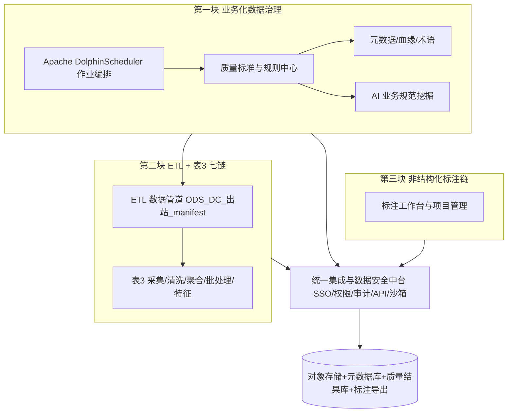

# 四川大学华西医院：AI 数据治理与医疗大模型数据工具链建设方案（总预算 450 万元）

> **建设主体**：**四川大学华西医院**（以下简称「**我院**」）。  
> **文档目的**：在固定总预算 **450 万元（含税及服务）** 前提下，建设三大能力——  
> ① **面向业务的数据治理**（院级标准库 + **Apache DolphinScheduler** + 质量标准 + **AI 业务规范挖掘**），支撑我院**多院区、高复杂度临床与运营**数据贯通与质效闭环；  
> ② **表 3「智能工具链」**与 **§1.2.1 ETL 数据管道（系统支撑）**，为下游工具链**统一供料**；  
> ③ **非结构化多模态标注工具链**，服务大模型训练与院内科研/转化场景。  
> 并设计 **统一集成层**，将②③类工具以「可管理、可审计、可复用」的方式纳管，并与**我院现有主数据/患者主索引/伦理与数据安全**要求对齐。  
> **重要说明**：下文中**金额均依据「招采网三源」（[中国政府采购网 www.ccgp.gov.cn](https://www.ccgp.gov.cn/) + [中国招标投标公共服务平台 www.cebpubservice.com](http://www.cebpubservice.com/) + 千里马/比地招标等市场化招采订阅）**近 2 年同类项目**中标价**可比区间测算**，实施前以**我院正式招标中标价**为准，允许**上下浮动**调差（见 §1.1「预算口径」、§八）。

---

## 一、建设范围与业务目标

### 1.1 第一块：数据治理服务于业务（标准 → AI 规范挖掘 → 业务问题单）

**治理方向**：以**国家/行业与院内标准发文**为治理标尺，将数据治理与**华西业务过程达标**挂钩——从数据中**发掘不符合规范的情形**，转译为**可处置的业务问题**，推动诊疗、病案、互联互通报送、运营与国家考核指标等**对齐标准**。AI 替代不了制度与流程，承担**规模化「异常 — 证据 — 解释 — 工单」**的输出。

**院级治理标尺（规则化入库，与质量中心版本联动）**：**电子病历应用水平分级评价**、**互联互通标准化成熟度测评**、三级公立医院绩效考核（**国考**）数据来源、**DRG/DIP** 与结算清单字段、**病案首页 HQMS / 上报规范**及院内主数据/术语。**AI 挖掘**侧重：必填缺项、编码与病程矛盾、数据集/CDA 类互联要求对应字段断层、国考与 DRG 关键字段漂移、文本与结构化**不一致**等；结果与 **§1.2.1 ETL** 出站数据对齐，可追溯至源系统字段级。

**医院场景**：多院区、**急诊—住院—手麻/重症—影像/病理—随访**链路长；以 **Apache DolphinScheduler** 编排跨系统作业；在「清洗后 / 聚合后 /（经 ETL）标注前后」挂载 **AI 业务规范挖掘** 探针。

**目标效果**：**标准条文 → 可执行规则（SQL/DSL/模板）→ AI 佐证与解释 → 业务问题单 → 闭环整改 → 规则迭代**；副产品支撑评级申报摘要、国考与专项质析等**业务信息挖掘**。传统手段仍保留：**元数据、主数据/术语、血缘、安全分级**；调度中枢采用 [Apache DolphinScheduler](https://dolphinscheduler.apache.org/)。

**预算口径（招采网对标，可调差）**：金额上下浮动须在招采公开渠道有可参中标区间。可比样本（单院 / 分项，不作为厂商承诺）：北肿 AI 建设≈488 万、广安门大模型服务平台一期≈295 万、河北儿童 CDSS≈184 万、台州肿瘤 AI 质控等≈100 万、[电子病历五级评审咨询服务两类分别约 74.8 / 74.98 万](https://www.nhfyyy.com/dzb/zixun/zhaocai/zhongbiao/detail/5164.html)；数据集成类比：重庆巴南区人民医院「数据集成平台软件系统」≈698 万、[宽城区中医院新址信息系统](http://www.jl.gov.cn/ggzy/zfcg/zbgg/202507/t20250707_9274671.html) 中标约 988.68 万（内含数据治理≈35 万、临床数据中心≈40 万等子项）。

---

### 1.2 第二块：结构化数据工具链（表 3，序号 1–7）→ 结构化标注 + 大模型训练集

依据**本建设需求**所附**《表 3 智能工具链》**（**结构化业务数据采集、非结构化文本采集、图片采集、数据清洗、数据聚合、批处理、特征创建**），与华西**重大疾病手术、植入与综合治疗**等方向的**数据工程与模型训练**前置相衔接。  
> **注**：下表**名称与功能**与**需求材料截图**一致；本文件内文为**我院建设方案**而非产品验收承诺。

| 序号 | 工具链（截图） | 主要功能（截图） | 与「结构化医疗训练集」的衔接 |
|------|----------------|------------------|------------------------------|
| 1 | 结构化业务数据采集 | ETL 批量、字段与标准映射、质控、增量接口/库表订阅 | 为标注提供「可对齐的」结构化事实表 |
| 2 | 非结构化文本采集 | 病历文书、报告类文本汇聚 | 文本进后续「标注/预标注/解析」管线 |
| 3 | 图片数据采集 | 检查影像+报告+关联图像汇聚 | 图像模态进标注或跨模态对齐 |
| 4 | 数据清洗 | 缺失/离群/重复/矛盾处理 & 可解释纠偏 | 降本、提升可训练性 |
| 5 | 数据聚合 | 以 PMI、诊疗事件、病程时间轴做统一组织，360 患者视图 | 统一主键/事件锚点，支撑多任务标签 |
| 6 | 批处理 | 离线 ETL、大规模并行、资源调度 | 与 DolphinScheduler/作业流联动 |
| 7 | 特征创建 | 文本语义/影像与病理视觉/时序与跨模态联合特征 | 向「监督信号/难例挖掘/课程学习」供料 |

> **与调度/标准的关系**：**批处理/特征创建** 应纳入 **1.1** 的 DolphinScheduler 作业流；**清洗/聚合** 的结果应**挂接质量标准**出账。  

---

### 1.2.1 ETL 数据管道（系统支撑）→ 为表 3 工具链与非结构化标注供料

在 **B 包**中单列为**显性子项**（见 §4.2）：作为**全院级数据入口与出站管道**，承接 **§1.1** 质量标准与 DolphinScheduler **调度节点**，向下游 **§1.2 表 3 七链**与 **§1.3 标注 8–20**提供**统一主键（PMI/就诊事件）与时间轴对齐**的可训练／可标注数据：

- **源侧接入**：HIS/EMR/LIS/PACS/RIS/手麻/重症等与院内现有接口策略一致，增量 + 批量；  
- **分层落地**：**ODS（贴源）→ DC（清洗对齐）→ 面向主题/导出区（manifest 出站）**，与院内既有分层命名可对齐验收；  
- **出站**：向标注与特征管线输出 **manifest（JSONL + 索引 + 血缘指纹）**，并与 **Hub** API 对齐，供「一键流水线」订阅；  

> **血缘要点**：标注侧不得直连生产库读写；须经本管道出站域与 **条目 19（脱敏）** 域隔离。

---

### 1.3 第三块：非结构化标注工具链（截图 8–20）→ 大模型多模态训练

依据**本建设需求**截图，**非结构化/多模态标注工具**覆盖以下项（**名称与能力描述与截图一致**；编号延续业务常用分段）：

| 编号 | 工具（截图） | 能力要点（截图） | 训练侧价值 |
|------|-------------|------------------|------------|
| 8 | 文本标注工具 | 实体/关系/事件/时序等 | NER/RE/事件抽取/时间轴类样本 |
| 10 | 图像标注 | 框/像素分割/关键点/细胞级/属性 | 检测分割类视觉任务 |
| 11 | 音频与语音标注 | 转写、说话人、语义段、关键词、事件 | 语音病历/肺音等 |
| 12 | 视频与管镜视频标注 | 帧/关键帧/时间线/多标签/步骤与并发症信号 | 手术与内镜时序理解 |
| 13 | 生理波形与设备时序 | 多波形、缩放拖拽、异常区间、事件起止 | ICU 监测与事件预测 |
| 14 | 电子病历智能解析与预标注 | 长文本拆字段、预标结构化要素 | 降标注成本、提高一致性 |
| 15 | 思维链（CoT）临床推理智能标注 | 问题—证据—中间推理—结论，可审可改 | 医疗推理链 SFT/RL 数据 |
| 16 | 多轮对话式标注 | 多轮需求澄清→子任务→规则与样例，对接任务 | 低代码配置标注任务 |
| 17 | 长上下文医疗文本标注 | 超长住院/跨周期随访/多批次报告、证据链 | 与长文模型/检索增强对齐 |
| 18 | 跨模态对齐辅助 | 图-文-视频-音-监测波形等多模态映射与纠偏 | 多模态对齐/Report Generation |
| 19 | 数据自动脱敏 | 敏感信息识别/擦除/匿名化/ROI 脱敏 | 合规训练必备 |
| 20 | 数据集质检 | 完整/准确/一致/规范/时效等全流程质检 | 保障「优质训练集」定义可度量 |

> **与第二块、§1.2.1 关系**：**第二块表 3**偏「数据工程与特征工厂」；**§1.2.1** 偏「**系统级 ETL 供料管道**」；**第三块**偏「人机协同标注与数据产品化」；**统一集成层**对三者做账号、项目、元数据、血缘、**脱敏前/脱敏后**数据域隔离。输出数据须满足**我院**科研、算法训练及对外合作中的**脱敏、伦理与授权**管理要求。

---

## 二、总体架构与集成设计（系统建设，华西医院落地方案）

**集成要点（预算内必须落地）**：

1. **身份与项目空间**：按「**科室/院区/课题/数据域**」隔离；**脱敏后**与**可识别科研副本**分域；**§1.2.1** 出站域名与标注域通过 Hub ACL 管控。  
2. **API 级编排**：DolphinScheduler 对「**ETL 出站** → 清洗-聚合-出特征-导出训练 **manifest（JSONL+索引）**」一键流水线；**失败重跑**、**对账**、**出账签章**（元数据+哈希）。  
3. **模型辅助标注**：`14/15/16/17/18` 与**院内**或**合规**第三方大模型通过 **内网 API** 连接，**全链路留痕**（提示词/输出/人审结果），符合我院安全域划分。  
4. **与块一闭环**：**质检结果（20）** 回写**质量分**，**不达标**在 DolphinScheduler 产**数据缺陷工单**到我院业务/信息质控流程。  

---

## 三、预算总表（450 万元）

| 大项 | 金额（万元） | 主要构成 | 与招采对标（方法说明） |
|------|-------------|----------|------------------------|
| A. 业务化数据治理（标准库 + 调度 + 质控 + **AI 业务规范挖掘** + 元数据） | **145** | DolphinScheduler 高可用、院级标尺规则与血缘、「条文→规则」条目、境内可审计模型与日志、首年驻场+培训 | 对照招采可比区间：**单院 AI** / 病历质控 / 咨询服务等**百万量级**分项（详见 §1.1）；**可调差 ±** 以内 |
| B. **ETL 数据管道（显式）** + 表 3 七类定制、与 DS/质量衔接 | **115** | **§1.2.1 管道**，七链模块授权或自研+集成；对接 PMI/主索引；manifest 出站 | 对照招采：**数据集成/临床数据中心类**子包或全院信息化总包分项（详见 §4.2）；**可调差 ±** |
| C. 非结构化/多模态标注套件（8–20）+ GPU 推理（脱敏/预标） | **145** | 标注平台许可、视频/波形/CoT/长文 模块、合规算力 | 医疗多模态+合规通常为软件溢价品类；与大模型一体机类招采可比（见 §八）；**可调差 ±** |
| D. 统一集成中台、安全、一年运维、监理与测评预留 | **45** | SSO、API 网关、审计、灾备、等保/密评配合 | 常为总集成 **约 10%±**经验区间 |
| **合计** | **450** | — | 以 **[ccgp.gov.cn](https://www.ccgp.gov.cn/) + [cebpubservice](http://www.cebpubservice.com/) +** 千里马/比地招标等检索**「数据治理」「数据标注」「集成平台」「EMR」「互联互通」「DRG」**近 **2 年中标公告**，取**分位数区间**定为上下浮动护栏；**最终以我院标段中标为准** |

> **调差方法（写入采购附件）**：以招采公开**中标单价/总价**为中位锚点；**±**浮动幅度在项目策划阶段一般不超过同类项目成交价 **25%±**（非法律强制）；**软件**以厂商盖章价目+折扣函；**人天**以省内与我院历史成交均值。

---

## 四、分项预算明细（可展开至合同附件）

### 4.1 A 包：业务化数据治理 **145** 万

| 子项 | 万元 | 说明 |
|------|------|------|
| DS 高可用+监控+告警+灾备 | 28 | 双活/主备视现有基础设施 |
| 院级标准库+质量规则+血缘+术语映射 | **42** | 电子病历评级/互联互通/国考报送/ DRG·DIP·病案首页 等标尺落地；模板 **≥200 条**（可增购） |
| AI 业务规范挖掘（条文违规/语义解释/工单证据） | **35** | 境内可审计；与 **§1.2.1** 出站对齐 |
| 元数据&数据目录&权限 | 25 | 与 19/20 质检**联动** |
| 实施、培训、首年驻场人天 | **15** | 含驻场封顶以标段为准 |

### 4.2 B 包：**ETL 管道（显式）** + 表 3 七链 **115** 万

| 子项 | 万元 | 与需求对应 |
|------|------|-----------|
| **ETL 数据管道（系统支撑，§1.2.1）** | **35** | ODS→DC→主题/出站 manifest；调度节点；与 A 质量标准签章 |
| 结构化业务数据采集 + 接口/订阅 | **18** | 表 3 第 1 项（与管道衔接） |
| 非结构化文本 + 图片采集 | **14** | 表 3 第 2、3 项 |
| 清洗 + 聚合 + 与 PMI/事件轴 | **17** | 表 3 第 4、5 项 |
| 批处理/离线计算与资源池对接 | **9** | 表 3 第 6 项 |
| 特征创建/画像与导出接口 | **12** | 表 3 第 7 项 |
| 与 A 包联调与验收 | **10** | 集成 |

*若分项招采比价显示其中某一子模块显著高于表中区间，须在**不超 B 包 115 万**前提下**内部调剂**或单列增购标段。*

### 4.3 C 包：非结构化标注 8–20 项 145 万

| 子项 | 万元 | 与截图 |
|------|------|--------|
| 文本 8、图像 10、音频 11 | 40 | 基础三模态 |
| 视频/内镜 12、波形 13 | 50 | 播放与同步**溢价**项 |
| EMR 预标注 14、CoT 15 | 25 | 模型依赖 |
| 多轮 16、长文 17、跨模态 18 | 18 | 高阶工作流 |
| 脱敏 19、质检 20、GPU 预标 | 12 | 合规与**出口关** |
| 与 B 包**主键对齐**、验收 | 0 | 含在 D 或 B 的联调（若需可加） |

*若 C 包在招标中**分包**，建议「**视频+波形+CoT**」独立子包，便于**专家验收**与招采**单价比对**（中标波动大）。

### 4.4 D 包：集成与运维 45 万

| 子项 | 万元 |
|------|------|
| 统一门户、SSO、API、审计、沙箱 | 22 |
| 等保/密评**配合**与漏洞整改配合（不含测评费**全包**，若全包需另列） | 8 |
| 1 年运维、备份灾备、SLA 响应 | 15 |

---

## 五、与 DolphinScheduler、质量标准、AI 的**落地流程**（可写进建设方案正文）

1. **标尺入库**：卫健委/行业标准及院内制度中可归因条款录入**标准条目库**，映射为质量指标与 **DSL/SQL 模板**。  
2. **标准绑定**：在质量中心配置指标（**完整率、及时性、主键唯一、跨表一致、值域/术语、评级/互联互通/国考/ DRG·DIP相关字段**）→ 版本化。  
3. **作业绑定**：DolphinScheduler 中每个 **workflow** 节点产出质控子任务（**阻断/告警**）；**§1.2.1** 出站前执行签章。  
4. **AI 增强**：清洗后 / 聚合后 / 标注后不通过 → **AI 挖掘**不规范点（含病历文本不一致）→ **业务问题单**至业务侧。  
5. **达标闭账**：业务确认整改 → 回灌规则/术语 → 关闭工单 → PDCA。  

（流程图可在汇报 PPT 中另附。）

---

## 六、插图占位（与建设需求截图一一对应）

> 若将**需求方归档截图**纳入我院或项目知识库，建议复制到 `需求/figures/` 后取消下行注释。  

<!--

-->

| 图序 | 建议文件名 | 内容摘要 |
|------|------------|----------|
| 图 1 | 表 3 智能工具链 | 序号 1–7 功能列 |
| 图 2 | 标注 8/10/11… | 文本/图/音等 |
| 图 3 | 标注 11–15 | 视音波+EMR+CoT |
| 图 4 | 标注 16–20 | 多轮/长文/跨模态/脱敏/质检 |

---

## 七、风险与实施前提

- **算力与网络**：C 包若含**大模型预标注**与**长视频/波形**同步，**GPU、带宽、存储 IOPS** 须单独立项或**沿用现有**机房，否则 145 万**仅够软件授权+轻量算力**（需在招标前**现场勘察**确认）。  
- **伦理与法律**：**训练数据**须完成 **19 脱敏** 与 **20 质检** 双签；**跨模态 18** 需**专家共识**的**金标准**才可规模化。  
- **采购合规**：**450 万** 通常触发**公开招标**等程序，具体以**四川省/成都市**当年限额与**我院内控、国资及科研经费**管理要求为准；意向公开/公告以 [四川省政府采购网](https://www.ccgp-sichuan.gov.cn/)、[中国政府采购网](https://www.ccgp.gov.cn/) 等渠道为准。  

---

## 八、主要参考文献与检索入口（招采三源）

1. **[中国政府采购网](https://www.ccgp.gov.cn/)**、[四川省政府采购网](https://www.ccgp-sichuan.gov.cn/)（省内主检索入口）  
2. **[中国招标投标公共服务平台](http://www.cebpubservice.com/)**（全国性招标/中标检索）  
3. **市场化招采订阅**（千里马招标、比地招标、剑鱼等）：补充「数据治理」「标注平台」「病历」「互联互通」等关键字中标索引  
4. **[Apache DolphinScheduler](https://dolphinscheduler.apache.org/)**（编排组件官方）  
5. **对标中标摘录（节选，随招采刷新以公告为准）**  
   - 电子病历五级评审咨询服务（两家中标）[南方医院揭阳医院门户网站 · 中标公示](https://www.nhfyyy.com/dzb/zixun/zhaocai/zhongbiao/detail/5164.html)  
   - 宽城区中医院新址信息系统**成交**约 **988.68 万元**（含分项单价）[吉林省公共资源交易信息网](http://www.jl.gov.cn/ggzy/zfcg/zbgg/202507/t20250707_9274671.html)  
   - 济宁第一人民医院「数据治理平台采购」等单位招标/中标信息公开页（比价时以**官方 PDF 金额页**为准）：[济宁第一人民医院门户](https://www.jnrmyy.com/) 检索「数据治理」  
6. **本方案工具链条目**仍以建设需求附图为准；对外招标附**厂商逐项应答矩阵**。

---

## 附录：**AI 驱动的数据治理及高质量数据集质检平台** — 院内预算申报表（2027）填写稿（合计 **361** 万元）

> **口径说明**：正文 **§一–§四** 为全院「治理 + ETL + 标注工具链」**总体规划（450 万元）**；**本附录为 2027 年度立项申报子项**，金额与人月以本节为准（**361 万元 / 172 人月**）。ETL 管道、多模态标注等若单独立项，按后续批次续报。

与「申报预算」类页面字段对齐的**填报文本**；费用按 **172 人月 × 2.10 万元/人月** 测算。

| 表单项（示意） | 填写内容 |
|----------------|----------|
| **预算名称** | AI 驱动的数据治理及高质量数据集质检平台 |
| **预算年度** | 2027 |
| **用途** | 管理 |
| **预算来源** | 年度预算 |
| **预算类型** | 软件 |
| **采购类型** | 新购 |
| **预算金额（元）** | **3,610,000.00** |
| **费用测算依据** | **172 人月 × 2.10 万元/人月 = 361.2 万元**，取整 **361 万元**；人月拆分见下表；辅以本院业务调研与招采网三源同类项目比价；最终以招标与合同为准。 |

### 人月与费用拆分

| 阶段 | 人月 | 主要内容 | 折合金额（万元） |
|------|------|----------|------------------|
| 需求分析与建模 | **28** | 业务数据治理与 **AI 规则库**建设；**电子病历评级 / 互联互通**等标准文书梳理；**AI 不规范数据挖掘**建模 | 58.8 |
| 程序开发 | **114** | **高质量数据集质检平台**：数据质量检测、缺失值识别、异常值识别、一致性校验、质检结果管理与**问题闭环** | 239.4 |
| 软件测试 | **30** | 功能/性能/回归测试；与业务场景联调验收 | 63.0 |
| **合计** | **172** | — | **361.2 → 取整 361** |

### 「申报理由」（可贴入长文本框）

我院**多院区、多业务系统**并存，临床/病案/医技/运营等核心数据**口径与标准不统一**，对账与质量问题长期累积；**电子病历评级、互联互通、国家三级公立医院绩效考核、DRG/DIP、病案首页**等上报与达标场景仍依赖**人工核对与临时取数**。同时医院围绕重大疾病、植入与综合治疗等方向已启动**医疗大模型与多模态科研**项目，亟需**优质医疗训练数据**与可复用的质检能力。

拟新购 **「AI 驱动的数据治理及高质量数据集质检平台」**（**361 万元**）：以**人工智能**自动挖掘本院业务数据与**各类国家标准、规范**之间的差距，提供**策略支持**，协同推进业务改造，**持续提升业务数据质量**；并实现对**结构化、非结构化及多模态数据集**的**自动化质量检测与闭环管理**，围绕**完整性、准确性、一致性、规范性、可追溯性**等维度识别数据缺陷，支撑**训练语料入库前质检、问题整改、版本固化**和**高质量数据集持续迭代**。与正文 **§1.1** 院级标尺、「条文→规则→AI 挖掘→工单闭环」及 **§1.3 条目 20（数据集质检）** 能力对齐；**ETL 供料管道、多模态标注工具链**按总体规划 **§1.2 / §1.3** 分阶段建设，**不含在本 361 万子项金额内**（另批或后续年度）。

### 「核心功能及参数」（**361 万元**，按实施阶段 3 项）

**（1）需求分析与建模（28 人月）**  
- 梳理 **电子病历应用水平分级评价、互联互通标准化成熟度、国考、DRG/DIP、病案首页 HQMS** 等标准文书与院内可执行指标；  
- 建设 **AI 规则库** 与「**国标/行标 — 院内数据**」差距挖掘模型（含必填缺项、编码矛盾、互联字段断层、文本与结构化不一致等）；  
- 输出需求规格、数据字典映射、质检规则清单与验收口径。  

**（2）程序开发（114 人月）**  
建设 **高质量数据集质检平台**，至少包括：  
- **数据质量检测**（主题域/批次/版本维度）；  
- **缺失值识别、异常值识别、一致性校验**（跨表、跨院区、跨时间）；  
- **规范性**（值域、术语、编码）与 **可追溯性**（血缘指纹、源字段回指）；  
- **质检结果管理**与**问题闭环**（缺陷单、整改、复验、版本固化）；  
- 对接 **§1.1** 规则中心 / DolphinScheduler 质控节点（可选集成，以招标方案为准）；  
- 支撑 **结构化、非结构化、多模态** 数据集入库前质检与训练语料出口签章。  

**（3）软件测试（30 人月）**  
- 功能、性能、安全与回归测试；  
- 与 **评级/互联/国考/DRG·DIP/病案首页** 等抽检场景联调；  
- 出具测试报告与上线验收材料。  

*三项合计 **172 人月**；**172 × 2.10 = 361.2 万元**，取整 **361 万元**。*

### 与正文规划勾稽（供财务/立项备查）

| 口径 | 金额（万元） | 说明 |
|------|-------------|------|
| **2027 申报子项（本附录）** | **361** | AI 治理 + 数据集质检平台（172 人月） |
| **总体规划（§三，参考）** | **450** | A145 + B115 + C145 + D45；含 ETL、标注链等全栈 |
| **差额 / 后续** | **89 + 分阶段** | 标注工具链、ETL 深化、集成运维等按 **另批 / 后续年度** 续列 |

---

### 附录补充：立项页「战略对齐」等字段（可与上一节合并粘贴）

以下为院内**项目申报/立项**表单常见区块，与截图字段一一对应。

#### 需求对标（多选，建议全选）

| 选项 | 勾选 |
|------|------|
| 评级达标 | ✓ |
| **医院「十四五」规划** | ✓ |
| 行业要求 | ✓ |

#### 涉及评级（多选，建议全选）

| 选项 | 勾选 |
|------|------|
| 电子病历评级 | ✓ |
| 智慧服务 | ✓ |
| 智慧管理 | ✓ |
| 互联互通 | ✓ |

#### 对标详细内容（长文本）

建设高质量医疗数据资产。以**《电子病历系统应用水平分级评价》（六级及以上）**为总体目标导向，**统一全院核心业务指标口径与主数据/数据字典**，保障多院区、多系统间**数据一致性**与业务数据**全链路可追溯**；与本方案 **§1.1** 院级标尺、「条文→规则→AI 规范挖掘」闭环及 **§1.2.1 ETL/manifest**一致。

#### 制度保障（长文本）

项目在现有医院管理制度框架下实施，执行**《医院数据安全与隐私保护管理制度》**及**《医院医疗数据分类分级保护规范》**等要求，配套 **§1.3 条目 19（脱敏）/20（质检）** 与本文 **§七** 风险条款，确保建设与使用过程**合规、可审计**。

#### 预期成效（可分条或合并为一段）

**（一）数据质量与资产：** 多院区 **HIS/EMR**等历史数据**自动化清洗与入库**；全院重点关注的**「百强」/核心业务指标体系**实现**口径定义 100% 归一**（以业务确认版为准）；在不降低业务真实性的前提下，关键主题域**准确性与一致性抽检达标率≥99%**（以立项阶段确认的**质量指标字典与抽检方案**为准）；沉淀**高质量医疗数据资产中心**能力并服务科研与管理。

**（二）效率与服务能力：** 依托 **AI 驱动治理智能体**（含 **NL2SQL/NL2DQ（自然语言问数/问质）**等与授权域内安全策略绑定的能力），将**编写 SQL、对照字典与口径澄清**等高频人工环节时间成本**综合降低 70% 以上**（以基线调研与上线后抽样统计为准）；建成覆盖**科研、运营、质控等不少于 50 类**场景的**统一数据服务 API/主题出口**（与本方案 **§二 Hub**一致）。

#### 预计建设周期（月）

**30.0** 个月。*说明：本条目**建设周期**指全周期实施与持续优化；**2027 年度本次申报子项预算 361 万元**（172 人月，见附录人月拆分）；全院 **450 万元** 总体规划见 **§三**；ETL、多模态标注等后续按医院年度预算**分阶段续列**。*

#### 申请人信息（按实际登记者维护）

| 字段 | 示例（来自院内申报页，**以人事/工号系统为准**） |
|------|----------------------------------------|
| **申请科室** | 信息与数据管理部 / 数据统计分析科 |
| **申请人** | 李仕凯 |
| **工号** | 20230061 |
| **申请日期** | 以系统提交日为准（示例：2024-04-16） |
| **联系电话** | 15638055197 |

---

**文档结束。**  
*编制说明：本文面向**四川大学华西医院**立项与内审；本页金额均为**可研/立项**用途的**结构化解算**，**不作为**对任何厂商报价的承诺；最终**以我院采购文件与中标合同**为准。*
