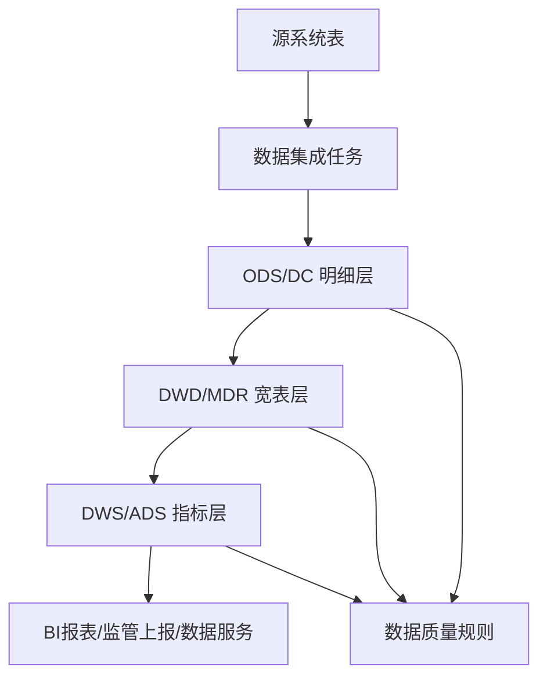

# 数据管理规范---数据治理---数据血缘管理规范

## 1. 总则

### 1.1 目的

为规范大数据平台的数据血缘采集、维护、变更审批和影响评估工作，保证数据从源系统进入大数据平台后，在集成、清洗、建模、汇总、服务、报表和对外使用过程中的来源可查、加工可追、变更可控、影响可评估、问题可回溯，制定本规范。

本规范重点管理大数据平台内的数据血缘，不替代数据安全、数据质量、主数据、元数据和数据标准等制度，但与上述制度保持联动。

### 1.2 适用范围

本规范适用于以下范围：

1. 大数据平台内的生产数据链路。
2. 数据集成任务、离线计算任务、实时计算任务、调度任务。
3. ODS、DC、DWD、DWS、ADS、MDR、指标宽表、专题库、报表库等数据层。
4. BI 报表、监管上报、经营分析、数据服务接口、数据导出、算法训练数据集等下游应用。
5. SQL、Spark、Presto、Hive、StarRocks、DataX、DolphinScheduler、脚本任务、物化视图等加工过程。

### 1.3 管理目标

数据血缘管理应达到以下目标：

1. 生产表具备表级血缘。
2. 核心指标、核心宽表、监管上报、经营分析、对外接口具备字段级血缘。
3. 数据变更上线前完成影响评估。
4. 数据口径、过滤条件、关联逻辑、默认值、异常分支可追溯。
5. 数据问题发生后能够定位到源表、任务、SQL、字段、调度日期和责任人。
6. 血缘文档与实际代码、任务、表结构保持一致。

### 1.4 管理原则

1. **源头可查**：每个目标表、目标字段应能追溯到源系统、源表、源字段或生成规则。
2. **过程可见**：关键 SQL、JOIN、WHERE、CASE、GROUP BY、窗口函数、时间窗口和默认值必须记录。
3. **变更可控**：涉及口径、字段、任务、调度、目标表的变更必须审批。
4. **影响可评估**：变更前必须识别上游、当前层和下游影响。
5. **异常可定位**：空值、待归、字典未命中、过滤剔除、重复放大、时间偏移必须纳入血缘。
6. **记录从简但可定位**：血缘记录不写空话，必须能定位到具体文件、任务、表、字段和链路。

## 2. 术语定义

| 术语 | 定义 |
| --- | --- |
| 数据血缘 | 数据从源头到目标的流转、加工、转换、引用和消费关系 |
| 表级血缘 | 表与表之间的输入输出关系 |
| 字段级血缘 | 目标字段与源字段、计算逻辑、默认值之间的关系 |
| 任务血缘 | 调度任务、同步任务、计算任务之间的依赖关系 |
| 指标血缘 | 指标与来源表、来源字段、过滤条件、计算公式、统计周期之间的关系 |
| 报表血缘 | 报表、数据集、指标、查询 SQL、底层表之间的关系 |
| 异常血缘 | 因空值、默认值、待归、过滤、字典未命中、类型转换失败等产生的非正常路径 |
| 影响评估 | 在变更前识别受影响的数据对象、任务、报表、接口和业务口径 |
| 血缘基线 | 当前生产链路认可的血缘版本，用于变更对比和问题回溯 |

## 3. 血缘采集范围

### 3.1 系统范围

| 类型 | 采集对象 |
| --- | --- |
| 源系统 | HIS、EMR、LIS、PIS、手麻、病理、输血、医保、主数据、财务、第三方系统 |
| 集成层 | DataX、CDC、接口同步、文件导入、手工补数、批量脚本 |
| 调度层 | DolphinScheduler、定时任务、依赖任务、补跑任务 |
| 计算层 | Hive、Presto、Spark、StarRocks、物化视图、临时中间表 |
| 数据层 | ODS、DC、DWD、DWS、ADS、MDR、指标库、专题库 |
| 应用层 | BI 报表、监管上报、经营分析、数据服务 API、导出数据、算法数据集 |
| 治理层 | 数据质量规则、元数据、主数据映射、数据标准映射 |

### 3.2 对象范围

| 血缘对象 | 是否必须采集 | 采集要求 |
| --- | --- | --- |
| 生产表 | 是 | 记录来源表、目标表、加工任务、主键、分区、负责人 |
| 核心字段 | 是 | 记录源字段、计算逻辑、默认值、异常处理 |
| 指标字段 | 是 | 记录计算公式、统计周期、过滤条件、分组维度 |
| 调度任务 | 是 | 记录上游任务、下游任务、周期、依赖、失败影响 |
| SQL 文件 | 是 | 记录文件路径、输入表、输出表、核心 CTE、JOIN、WHERE |
| 物化视图 | 是 | 记录基表、刷新周期、刷新方式、下游引用 |
| 报表数据集 | 是 | 记录数据集 SQL、底层表、报表字段、刷新周期 |
| 临时表 | 条件采集 | 影响生产链路或跨任务复用时必须采集 |
| 手工脚本 | 条件采集 | 影响生产数据时必须采集 |
| 一次性分析 SQL | 可选 | 不进入生产链路时可简化记录 |

### 3.3 字段级采集范围

以下字段必须采集字段级血缘：

1. 主键、唯一键、业务流水号、就诊号、登记号、申请单号、医嘱号。
2. 患者、机构、院区、科室、医生、护理单元等关键维度字段。
3. 金额、收入、费用、数量、人数、工作量、时长等指标字段。
4. 日期、时间、统计月份、业务日期、调度日期、入出院日期、申请日期、执行日期。
5. 状态码、删除标识、有效标识、类型码、来源系统标识。
6. 报表展示字段、监管上报字段、对外接口字段。
7. 默认值、待归值、异常归类字段。

## 4. 血缘分层管理

### 4.1 分层模型



### 4.2 分层采集要求

| 层级 | 管理重点 | 必填血缘 |
| --- | --- | --- |
| 源系统层 | 原始业务含义、删除标识、状态字段、业务时间 | 源库、源表、源字段、抽取条件 |
| 集成层 | 抽取范围、增量字段、调度日期、重跑策略 | 同步任务、输入输出、过滤条件 |
| 明细层 | 清洗、类型转换、字段映射 | 来源字段、目标字段、转换规则 |
| 宽表层 | 多表关联、字典映射、默认值、异常分支 | JOIN、CASE、COALESCE、字典表 |
| 指标层 | 聚合口径、去重口径、统计周期 | GROUP BY、COUNT/SUM、时间窗口 |
| 应用层 | 报表展示、接口输出、导出范围 | 报表字段、接口字段、数据集 SQL |
| 质量层 | 完整性、准确性、时效性、一致性 | 质量规则、检测对象、异常影响 |

## 5. 血缘记录标准

### 5.1 表级血缘记录内容

表级血缘至少记录：

1. 目标库、目标表、中文名称、业务域。
2. 来源库、来源表、来源系统。
3. 加工任务名称、SQL 文件路径、调度周期。
4. 主键、分区字段、增量字段。
5. 上游任务、下游任务、下游报表或接口。
6. 数据负责人、开发负责人、业务负责人。
7. 最近变更时间、变更原因、审批记录。

### 5.2 字段级血缘记录内容

字段级血缘至少记录：

1. 目标字段、字段中文名、字段类型。
2. 源表、源字段、源字段含义。
3. 字段生成方式：直接映射、类型转换、CASE 计算、聚合、拼接、字典映射、默认值。
4. 关联条件、过滤条件、时间窗口。
5. 空值、待归、异常值处理方式。
6. 下游引用对象。

### 5.3 SQL 血缘记录内容

SQL 血缘应覆盖以下结构：

| SQL 结构 | 记录要求 |
| --- | --- |
| FROM | 主源表、业务含义 |
| JOIN | 关联表、关联键、JOIN 类型、是否可能放大 |
| WHERE | 过滤条件、业务含义、剔除范围 |
| GROUP BY | 聚合维度 |
| HAVING | 聚合后过滤条件 |
| CASE WHEN | 派生字段逻辑和优先级 |
| COALESCE | 默认值和待归逻辑 |
| 窗口函数 | 分区字段、排序字段、取数规则 |
| 时间函数 | 业务日期、调度日期、统计周期 |
| UNION | 多来源合并口径、字段对齐方式 |
| INSERT/CREATE | 目标表、分区、刷新方式 |

### 5.4 异常血缘记录内容

异常血缘必须记录：

| 异常类型 | 记录内容 |
| --- | --- |
| 源字段为空 | 空字段、影响字段、处理规则 |
| 字典未命中 | 关联键、字典表、默认值、待归编码 |
| 数据被过滤 | WHERE 条件、剔除业务含义 |
| JOIN 放大 | 关联键唯一性、重复风险、控制方式 |
| 时间窗口异常 | 业务日期、调度日期、统计日期关系 |
| 类型转换失败 | 原类型、目标类型、失败处理方式 |
| 任务延迟 | 上游任务、目标表、下游报表影响 |
| 指标突变 | 变更原因、对比结果、确认人 |

## 6. 血缘采集方式

### 6.1 自动采集

具备条件的系统应优先自动采集：

1. 通过 SQL 解析采集表级、字段级血缘。
2. 通过调度系统 API 采集任务依赖血缘。
3. 通过元数据系统采集库表字段、分区、注释。
4. 通过 BI 平台采集报表、数据集、字段引用。
5. 通过质量平台采集规则与检测对象关系。

### 6.2 人工补充

以下内容必须人工补充或复核：

1. 业务口径说明。
2. 字段中文含义。
3. CASE 分支的业务解释。
4. 默认值、待归值、异常分支的含义。
5. 监管报表、经营指标的口径确认。
6. 自动解析无法识别的动态 SQL、脚本逻辑、手工补数逻辑。

### 6.3 项目级血缘文件

项目应维护统一血缘追踪文件，例如 `.trace`，采用时间线方式记录功能、文件和核心链路。

推荐结构：

```text
项目介绍
└── 时间线
    ├── 功能或需求名称
    │   ├── 文件列表
    │   ├── 源表和目标表
    │   ├── 核心加工血缘
    │   └── 异常血缘
    └── 扩展分支
        ├── 修改文件
        └── 扩展血缘
```

记录要求：

1. 每次生产 SQL、调度、指标、报表口径变更必须更新。
2. 同一功能反复修改时，应更新到该功能最后一次变更节点。
3. 在原功能基础上扩展时，应作为该功能的分支记录。
4. 血缘记录应简洁，可定位文件和链路，不堆砌细节。

## 7. 变更审批流程

### 7.1 必须审批的变更

以下变更必须履行审批流程：

1. 源表、目标表、字段名、字段类型、字段含义变更。
2. SQL 中 `WHERE`、`JOIN`、`GROUP BY`、`CASE`、`COALESCE`、窗口函数变更。
3. 指标公式、统计周期、去重规则、分组维度变更。
4. 调度周期、任务依赖、增量字段、分区逻辑变更。
5. 默认值、待归逻辑、异常剔除逻辑变更。
6. 数据质量规则、告警阈值、检测周期变更。
7. 影响 BI 报表、监管上报、经营分析、对外接口的数据变更。
8. 影响 StarRocks 物化视图、DataX 写入目标、宽表落地表的变更。

### 7.2 可简化审批的变更

以下变更可简化审批，但仍需记录：

1. 注释补充、文档补充。
2. 非生产临时 SQL。
3. 不改变数据结果的格式调整。
4. 已废弃链路的归档说明。

### 7.3 审批流程


### 7.4 审批材料

变更申请必须包含：

| 材料 | 要求 |
| --- | --- |
| 变更名称 | 简明说明变更对象和目的 |
| 业务背景 | 说明为什么变更，不得只写优化、调整 |
| 涉及文件 | 精确到 SQL、脚本、配置、调度任务 |
| 涉及对象 | 源表、目标表、字段、指标、报表 |
| 变更内容 | 说明字段、条件、关联、口径变化 |
| 血缘变化 | 说明上游、当前层、下游变化 |
| 影响评估 | 说明影响范围和风险等级 |
| 数据对比 | 提供变更前后行数、空值、待归、指标对比 |
| 测试结果 | 提供测试 SQL、样本结果或验证日志 |
| 回退方案 | 说明代码回退、任务回退、数据回补方案 |
| 审批记录 | 记录审批人、审批时间、审批意见 |

## 8. 影响评估规范

### 8.1 评估对象

影响评估必须覆盖：

| 对象 | 评估内容 |
| --- | --- |
| 上游源表 | 字段是否存在、类型是否变化、数据是否延迟、删除标识是否变化 |
| 当前 SQL | JOIN 是否放大、过滤是否收窄、CASE 优先级是否改变 |
| 目标表 | 字段是否兼容、主键是否稳定、分区是否正确 |
| 下游任务 | 是否依赖该字段、是否会空值、是否会重复 |
| 报表指标 | 数值是否变化、趋势是否突变、维度是否缺失 |
| 数据接口 | 返回字段、字段类型、默认值是否变化 |
| 质量规则 | 原有规则是否失效，是否需要新增规则 |
| 调度链路 | 上游完成时间、失败重跑范围、补数范围 |
| 数据安全 | 是否新增敏感字段，是否扩大数据出口 |

### 8.2 影响等级

| 等级 | 定义 | 审批要求 |
| --- | --- | --- |
| P1 高影响 | 影响监管上报、院级经营指标、核心 BI、对外接口、主链路宽表 | 业务负责人、数据治理负责人、开发负责人共同审批 |
| P2 中影响 | 影响部门报表、公共指标、主题宽表、质量规则 | 数据治理负责人、开发负责人审批 |
| P3 低影响 | 影响单个内部分析、非核心临时链路 | 开发负责人审批 |
| P4 无生产影响 | 注释、文档、非生产文件 | 记录即可 |

### 8.3 必做对比

P1、P2 变更上线前必须完成以下对比：

| 对比项 | 要求 |
| --- | --- |
| 总行数 | 变更前后总行数、分机构行数、分日期行数 |
| 主键 | 新增、减少、重复主键数量 |
| 空值 | 关键字段空值率变化 |
| 待归 | 默认值、待归编码、未知分类数量变化 |
| 指标 | 人数、金额、项目数、工作量等核心指标变化 |
| 时间 | 业务日期、调度日期、统计月份是否一致 |
| 下游 | 报表、接口、物化视图刷新是否正常 |

### 8.4 影响评估结论

影响评估结论必须明确：

1. 是否允许上线。
2. 是否需要业务确认。
3. 是否需要补数。
4. 是否需要通知下游使用方。
5. 是否需要新增质量规则。
6. 是否存在回退风险。

## 9. 上线后检查

变更上线后应至少检查：

1. 调度任务是否成功。
2. 目标表是否正常产出。
3. 行数是否在预期范围。
4. 主键是否重复。
5. 关键字段空值率是否异常。
6. 默认值、待归值是否异常增加。
7. 核心指标是否突变。
8. 下游报表、接口、物化视图是否正常刷新。
9. 血缘记录是否同步更新。
10. 是否需要补数、重跑或回滚。

## 10. 职责分工

| 角色 | 职责 |
| --- | --- |
| 数据开发人员 | 维护 SQL 血缘、字段血缘、变更说明、测试对比 |
| 调度负责人 | 维护任务依赖、调度周期、失败重跑和补数范围 |
| 数据治理负责人 | 审核血缘完整性、影响评估和制度执行 |
| 业务负责人 | 确认指标口径、异常处理和上线影响 |
| 数据质量负责人 | 维护质量规则、异常监控和质量影响评估 |
| 数据安全负责人 | 审核敏感字段、数据出口和权限影响 |
| 运维负责人 | 保障任务运行、日志、告警、回退执行 |

## 11. 审计与考核

### 11.1 审计内容

定期审计以下内容：

1. 生产表是否具备表级血缘。
2. 核心字段是否具备字段级血缘。
3. 变更是否具备审批记录。
4. 影响评估是否完整。
5. 血缘记录是否与实际 SQL、任务一致。
6. 异常血缘是否记录。
7. 下游报表和接口是否纳入血缘。

### 11.2 考核指标

| 指标 | 要求 |
| --- | --- |
| 生产表表级血缘覆盖率 | 100% |
| 核心字段字段级血缘覆盖率 | 100% |
| P1/P2 变更影响评估率 | 100% |
| 生产变更留痕率 | 100% |
| 血缘更新及时率 | 上线当天完成 |
| 数据问题回溯时效 | 1 个工作日内定位主链路 |
| 异常血缘记录率 | 核心链路 100% |

## 12. 已有工作参考

本规范可参考项目内已有血缘实践：

1. `.trace`：采用时间线方式记录需求、文件、核心血缘和异常分支。
2. `Datacenter/在院/在院.sql`：通过 CTE 展示源数据、字典关联、计算字段、默认值和最终输出。
3. `mdr/mdr转sql/血缘逻辑对比分析.md`：对 PySpark 与 Presto 的字段、关联、默认值、过滤条件进行对比。
4. `Datacenter/医嘱dc-*.sql`：记录多院区、多 catalog、HIS 回源和字段集成变更。
5. `更改区域/*`：记录 DataX 与 DolphinScheduler 业务日期、统计月份、补数口径。

## 13. 附录一：血缘记录模板

```text
一、血缘名称：
二、业务域：
三、负责人：
四、源系统：
五、源表：
六、源字段：
七、加工任务：
八、SQL 文件：
九、目标表：
十、目标字段：
十一、核心 JOIN：
十二、核心 WHERE：
十三、核心 CASE/默认值：
十四、异常血缘：
十五、下游对象：
十六、最近变更：
十七、审批记录：
```

## 14. 附录二：变更申请模板

```text
一、变更名称：
二、业务背景：
三、影响等级：P1 / P2 / P3 / P4
四、涉及文件：
五、涉及任务：
六、涉及源表：
七、涉及目标表：
八、涉及字段：
九、修改内容：
十、血缘变化：
十一、异常血缘：
十二、影响范围：
十三、变更前后对比：
十四、测试结果：
十五、上线时间：
十六、回退方案：
十七、审批人：
```

## 15. 附录三：影响评估模板

```text
一、上游影响
- 源系统：
- 源表：
- 源字段：
- 抽取条件：
- 增量字段：

二、当前加工影响
- SQL 文件：
- JOIN 变化：
- WHERE 变化：
- CASE/默认值变化：
- 聚合口径变化：
- 时间窗口变化：

三、下游影响
- 目标表：
- 报表：
- 指标：
- 接口：
- 质量规则：
- 物化视图：

四、数据对比
- 总行数：
- 主键重复：
- 关键字段空值率：
- 待归数量：
- 核心指标：
- 分机构/分日期对比：

五、风险结论
- 是否可上线：
- 是否需补数：
- 是否需通知业务：
- 是否需新增质量规则：
- 是否具备回退方案：
```

